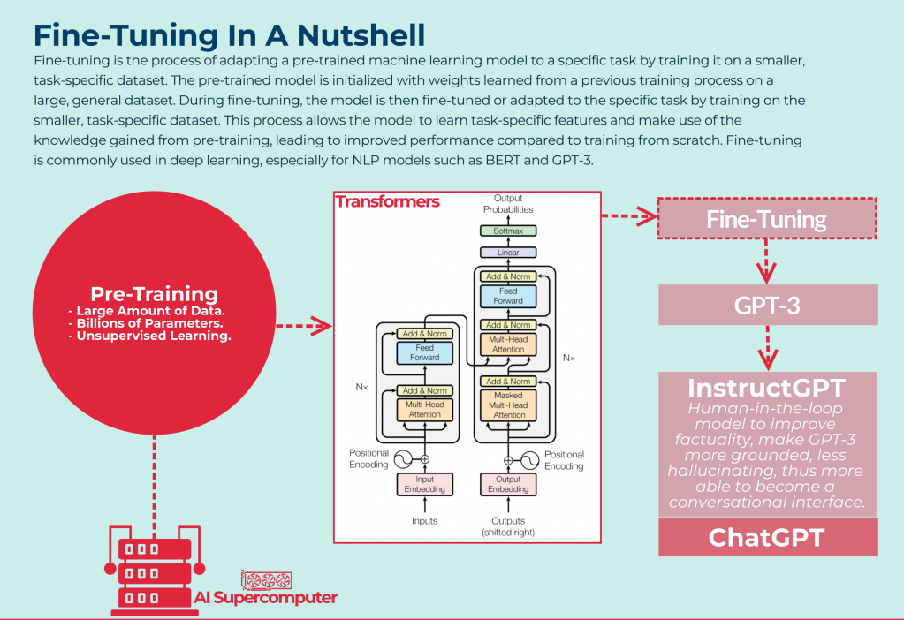

#### 1. Training vs Fine Tuning
   Training and fine-tuning are both processes involved in the development and improvement of machine learning and AI models, but they serve different purposes and occur at different stages:

  **Training:**

- **Purpose:** Training is the initial process where an AI model learns patterns and features from a dataset to understand relationships and make predictions or perform tasks. It involves adjusting the model's parameters (weights and biases) based on input data to minimize a predefined loss function.

- **Data:** During training, the model learns from a dataset that typically includes labeled examples, where the input data is associated with corresponding correct outputs or labels. This process helps the model learn to generalize and make accurate predictions on new, unseen data.

- **Initialization:** In the training phase, model parameters are often initialized randomly or with specific techniques before being optimized through iterations.

- **Outcome:** The goal of training is to create an initial model that performs reasonably well on a specific task or dataset. It results in a model with learned representations based on the initial training data.

 **Fine-Tuning:**

- **Purpose:** Fine-tuning, on the other hand, occurs after the initial training of a pre-existing model. It involves further training the already trained model, often on new or additional data, to adapt it to a different task, domain, or improve its performance on specific aspects.

- **Data:** Fine-tuning typically uses a smaller, task-specific dataset or additional data related to a specific domain. This process allows the model to adjust its learned representations to better fit the new data or task requirements.

- **Initialization:** The model being fine-tuned already has learned parameters from its initial training. Fine-tuning involves updating these existing parameters rather than starting from scratch.

- **Outcome:** The objective of fine-tuning is to make incremental adjustments to an existing model so that it becomes more proficient in a different task or domain without losing the previously learned knowledge.

#### When to use Fine Tuning?

