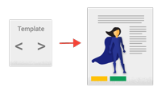
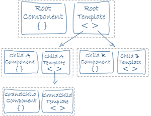
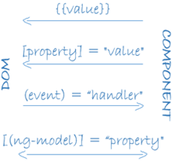
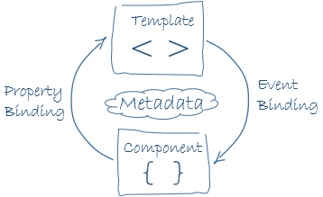
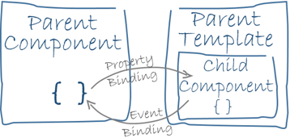

A _component_ controls a patch of screen called a **view**. It consists of a TypeScript class, an HTML template, and a CSS style sheet. The TypeScript class defines the interaction of the HTML template and the rendered DOM structure, while the style sheet describes its appearance.

An Angular application uses individual components to define and control different aspects of the application. For example, an application could include components to describe:
- The application root with the navigation links
- The list of heroes
- The hero editor

In the following example, the `HeroListComponent` class includes:

- A `heroes` property that holds an array of heroes.
- A `selectedHero` property that holds the last hero selected by the user.
- A `selectHero()` method sets a `selectedHero` property when the user clicks to choose a hero from that list.

The component initializes the `heroes` property by using the `HeroService` service, which is a TypeScript parameter property on the constructor. Angular's dependency injection system provides the `HeroService` service to the component.

```typescript
export class HeroListComponent implements OnInit {
  heroes: Hero[] = [];
  selectedHero: Hero | undefined;

  constructor(private service: HeroService) { }

  ngOnInit() {
    this.heroes = this.service.getHeroes();
  }

  selectHero(hero: Hero) { this.selectedHero = hero; }
}
```

Angular creates, updates, and destroys components as the user moves through the application. Your application can take action at each moment in this lifecycle through optional [lifecycle hooks](https://angular.io/guide/lifecycle-hooks), like `ngOnInit()`.

---
## Component metadata

The metadata for a component tells Angular where to get the major building blocks that it needs to create and present the component and its view. In particular, it associates a _template_ with the component**, either directly with inline code, or by reference**. Together, the component and its template describe a **_view_**.

In addition to containing or pointing to the template, the `@[Component](https://angular.io/api/core/Component)` metadata configures, for example, how the component can be referenced in HTML and what services it requires.

Here's an example of basic metadata for `HeroListComponent`.

```Typescript
@Component({
  selector:    'app-hero-list',
  templateUrl: './hero-list.component.html',
  providers:  [ HeroService ]
})
export class HeroListComponent implements OnInit {
  /* . . . */
}
```

|CONFIGURATION OPTIONS|DETAILS|
|:--|:--|
|`selector`|A CSS selector that tells Angular to create and insert an instance of this component wherever it finds the corresponding tag in template HTML. For example, if an application's HTML contains `<app-hero-list></app-hero-list>`, then Angular inserts an instance of the `HeroListComponent` view between those tags.|
|`templateUrl`|The module-relative address of this component's HTML template. Alternatively, you can provide the HTML template inline, as the value of the `template` property. This template defines the component's _host view_.|
|`providers`|An array of [providers](https://angular.io/guide/glossary#provider) for services that the component requires. In the example, this tells Angular how to provide the `HeroService` instance that the component's constructor uses to get the list of heroes to display.|

---
## Templates and views


You define a component's view with its companion template. A template is a form of HTML that tells Angular how to render the component.

Views are typically organized hierarchically, allowing you to modify or show and hide entire UI sections or pages as a unit. The template immediately associated with a component defines that component's _host view_. The component can also define a _view hierarchy_, which contains _embedded views_, hosted by other components.



A view hierarchy can include views from components in the same NgModule and from those in different NgModules.

---

### Template Syntax
A template looks like regular HTML, except that it also contains Angular [template syntax](https://angular.io/guide/template-syntax), which alters the HTML based on your application's logic and the state of application and DOM data. Your template can use  
- _data binding_ to coordinate the application and DOM data,
- _pipes_ to transform data before it is displayed,
- and _directives_ to apply application logic to what gets displayed.

For example, here is a template for the Tutorial's `HeroListComponent`.

```html
<h2>Hero List</h2>

<p><em>Select a hero from the list to see details.</em></p>
<ul>
  <li *ngFor="let hero of heroes">
    <button type="button" (click)="selectHero(hero)">
      {{hero.name}}
    </button>
  </li>
</ul>

<app-hero-detail *ngIf="selectedHero" [hero]="selectedHero"></app-hero-detail>
```
This template uses typical HTML elements like `<h2>` and `<p>`. It also includes Angular template-syntax elements, `*[ngFor](https://angular.io/api/common/NgFor)`, `{{hero.name}}`, `(click)`, `[hero]`, and `<app-hero-detail>`. The template-syntax elements tell Angular how to render the HTML to the screen, using program logic and data.

- The `*[ngFor](https://angular.io/api/common/NgFor)` directive tells Angular to iterate over a list
    
- `{{hero.name}}`, `(click)`, and `[hero]` bind program data to and from the DOM, responding to user input. See more about [data binding](https://angular.io/guide/architecture-components#data-binding) below.
    
- The `<app-hero-detail>` element tag in the example represents a new component, `HeroDetailComponent`. The `HeroDetailComponent` defines the `hero-detail` portion of the rendered DOM structure specified by the `HeroListComponent` component.
    
    Notice how these custom components mix with native HTML.

---

### Data binding

Without a framework, you would be responsible for pushing data values into the HTML controls and turning user responses into actions and value updates. Writing such push and pull logic by hand is tedious, error-prone, and a nightmare to read, as any experienced front-end JavaScript programmer can attest.

Angular supports _two-way data binding_, a mechanism for coordinating the parts of a template with the parts of a component. Add binding markup to the template HTML to tell Angular how to connect both sides.

The following diagram shows the four forms of data binding markup. Each form has a direction: to the DOM, from the DOM, or both.


This example from the `HeroListComponent` template uses three of these forms.

```HTML
<app-hero-detail [hero]="selectedHero"></app-hero-detail>
<button type="button" (click)="selectHero(hero)">
  {{hero.name}}
</button>
```


> **Binding to a property**
> To bind the `src` property of an `` element to a component's property, place `src` in square brackets followed by an equal sign and then the property.
> 
> Using the property itemImageUrl
>``
   Declare the `itemImageUrl` property in the class, in this case `AppComponent`. in .ts file
> itemImageUrl = '../assets/phone.svg'


|DATA BINDINGS|DETAILS|
|:--|:--|
|`[hero]` [property binding](https://angular.io/guide/property-binding)|Passes the value of `selectedHero` from the parent `HeroListComponent` to the `hero` property of the child `HeroDetailComponent`.|
|`(click)` [event binding](https://angular.io/guide/user-input#binding-to-user-input-events)|Calls the component's `selectHero` method when the user clicks a hero's name.|
|`{{hero.name}}` [interpolation](https://angular.io/guide/interpolation)|Displays the component's `hero.name` property value within the `<button>` element.|

Two-way data binding combines property and event binding in a single notation. Here's an example from the `HeroDetailComponent` template that uses two-way data binding with the `[ngModel](https://angular.io/api/forms/NgModel)` directive.

```HTML
<input type="text" id="hero-name" [(ngModel)]="hero.name">
```

In two-way binding, **a data property value flows to the input box from the component as with property binding**. The user's **changes also flow back to the component, resetting the property to the latest value, as with event binding**.



Data binding plays an important role in communication between a template and its component, and is also important for communication between parent and child components.




---
### Pipes

Angular pipes let you declare display-value transformations in your template HTML. A class with the `@[Pipe](https://angular.io/api/core/Pipe)` decorator defines a function that transforms input values to output values for display in a view.

Angular defines various pipes, such as the [date](https://angular.io/api/common/DatePipe) pipe and [currency](https://angular.io/api/common/CurrencyPipe) pipe. For a complete list, see the [Pipes API list](https://angular.io/api?type=pipe). You can also define new pipes.

To specify a value transformation in an HTML template, use the [pipe operator (`|`)](https://angular.io/guide/pipes).

```HTML
{{interpolated_value | pipe_name}}
```

You can chain pipes, sending the output of one pipe function to be transformed by another pipe function. A pipe can also take arguments that control how it performs its transformation. For example, you can pass the desired format to the `[date](https://angular.io/api/common/DatePipe)` pipe.


```HTMl
<!-- Default format: output 'Jun 15, 2015'-->
<p>Today is {{today | date}}</p>

<!-- fullDate format: output 'Monday, June 15, 2015'-->
<p>The date is {{today | date:'fullDate'}}</p>

<!-- shortTime format: output '9:43 AM'-->
<p>The time is {{today | date:'shortTime'}}</p>
```

Directives

Angular templates are _dynamic_. When Angular renders them, it transforms the DOM according to the instructions given by _directives_. A directive is a class with a `@[Directive](https://angular.io/api/core/Directive)()` decorator.

A component is technically a directive. However, components are so distinctive and central to Angular applications that Angular defines the `@[Component](https://angular.io/api/core/Component)()` decorator, which extends the `@[Directive](https://angular.io/api/core/Directive)()` decorator with template-oriented features.

#### Structural directives

_Structural directives_ alter layout by adding, removing, and replacing elements in the DOM. The example template uses two built-in structural directives to add application logic to how the view is rendered.

```HTML
<li *ngFor="let hero of heroes"></li>

<app-hero-detail *ngIf="selectedHero"></app-hero-detail>
```

|DIRECTIVES|DETAILS|
|:--|:--|
|[`*ngFor`](https://angular.io/guide/built-in-directives#ngFor)|An _iterative_, which tells Angular to create one `<li>` per hero in the `heroes` list.|
|[`*ngIf`](https://angular.io/guide/built-in-directives#ngIf)|A _conditional_, which includes the `HeroDetail` component only if a selected hero exists.|

#### Attribute directives

_Attribute directives_ alter the appearance or behaviour of an existing element. In templates they look like regular HTML attributes, hence the name. 

The `ngModel` directive, which implements two-way data binding, is an example of an attribute directive. `[ngModel](https://angular.io/api/forms/NgModel)` modifies the behaviour of an existing element (typically `<input>`) by setting its display value property and responding to change events.

```HTML
<input type="text" id="hero-name" [(ngModel)]="hero.name">
```

Angular includes pre-defined directives that change:
- The layout structure, such as **ngSwitch**.
- Aspects of DOM elements and components, such as **ngStyle** and **ngClass**.