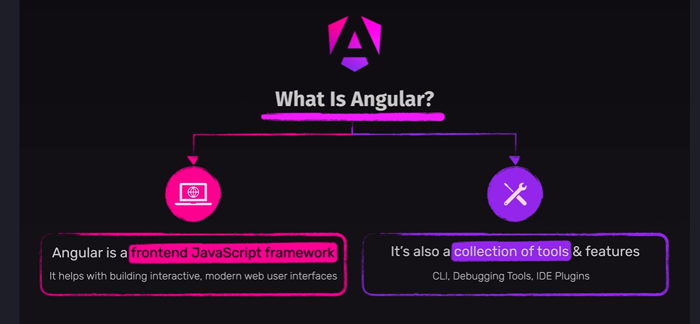
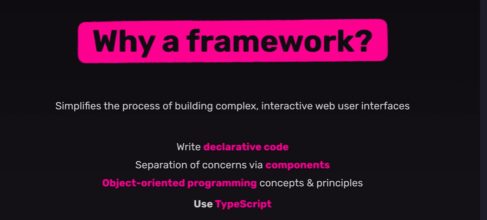

### **Introduction to Angular**

**Angular** is a **TypeScript-based, open-source** framework developed by **Google** for building **single-page applications (SPAs)**. It provides a complete ecosystem to develop web applications efficiently with features like **components, services, directives, dependency injection, and routing**.



---

### **Why is Angular Used?**

Angular is used because it offers:

✅ **Component-Based Architecture** – Breaks applications into reusable and manageable components.

✅ **Two-Way Data Binding** – Automatically syncs data between the model and view, reducing manual DOM manipulation.

✅ **Dependency Injection (DI)** – Manages dependencies efficiently, making code modular and testable.

✅ **Built-in Directives & Pipes** – Helps manipulate DOM elements dynamically.

✅ **Powerful Routing System** – Provides seamless navigation between different views.

✅ **State Management** – Works well with services and RxJS for managing application state.

✅ **Cross-Platform Development** – Supports **web, mobile (Ionic), and desktop applications**.

✅ **High Performance** – Uses **Ahead-of-Time (AOT) Compilation** to optimize applications before execution.

✅ **Large Community & Support** – Maintained by **Google** with strong industry adoption.




### **Installation Steps for Angular**

To set up Angular on your system, follow these steps:

---

## **1️⃣ Install Node.js and npm**

Angular requires **Node.js** because it provides npm (Node Package Manager), which is used to install Angular dependencies.

### **Check if Node.js is Installed**

Open the terminal or command prompt and run:

```sh
node -v
```

If Node.js is installed, it will display a version number (e.g., `v18.17.1`). If not, follow the steps below.

### **Download and Install Node.js**

- Go to [Node.js Official Website](https://nodejs.org/)
- Download the **LTS (Long-Term Support) version**
- Install it (keep default settings)
- Restart your terminal after installation

### **Verify npm Installation**

Run:

```sh
npm -v
```

It should show a version number (e.g., `9.6.0`).

---

## **2️⃣ Install Angular CLI (Command Line Interface)**

Angular CLI is a tool that helps create, build, and manage Angular projects efficiently.

Run this command to install Angular CLI globally:

```sh
npm install -g @angular/cli
```

### **Verify Angular CLI Installation**

Check the installed version:

```sh
ng version
```

If Angular CLI is installed, it will display details like:

```
Angular CLI: 17.0.1
Node: 18.17.1
OS: Windows/Linux/macOS
```

---

## **3️⃣ Create a New Angular Project**

Navigate to the folder where you want to create the project and run:

```sh
ng new my-angular-app
```

📌 **During setup, Angular will ask:**

- **Would you like to add Angular routing?** (Type `Y` for Yes, `N` for No)
- **Which CSS preprocessor would you like to use?** (Choose CSS, SCSS, SASS, or LESS)

Wait for the installation to complete.

---

## **4️⃣ Navigate to the Project Folder**

Move inside your newly created Angular project:

```sh
cd my-angular-app
```

---

## **5️⃣ Serve the Angular Application**

Start the development server by running:

```sh
ng serve
```

You will see output like:

```
✔ Compiled successfully.
✔ Angular application is running on http://localhost:4200/
```

👉 Open **[http://localhost:4200/](http://localhost:4200/)** in your browser to see your Angular app.

---

## **6️⃣ (Optional) Install Additional Dependencies**

If you need Bootstrap, Material UI, or any other library, you can install them using npm. Example:

```sh
npm install bootstrap
```

---

Some Important Packages you need to have on Visual Studio 
1. Angular Language Service
2. Angular Essentials