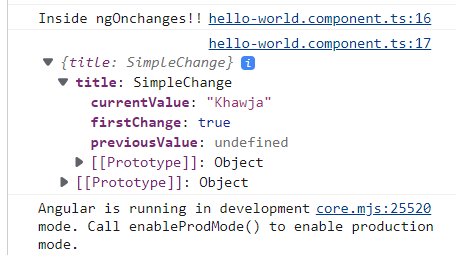
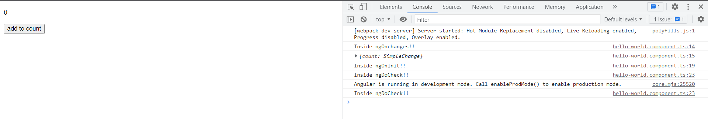
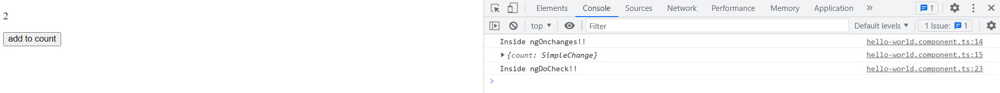

Component Lifecycle

- A component instance has a **lifecycle that starts when Angular instantiates the component** class and renders the component view along with its child views. 
- The lifecycle continues with change detection, as Angular checks to see when data-bound properties change, and updates both the view and the component instance as needed.
- The lifecycle ends when Angular destroys the component instance and removes its rendered template from the DOM.
Directives have a similar lifecycle, as Angular creates, updates, and destroys instances in the course of execution.
Your application can use [lifecycle hook methods](https://angular.io/guide/glossary#lifecycle-hook "Definition of lifecycle hook") to tap into key events in the lifecycle of a component or directive to initialize new instances, initiate change detection when needed, respond to updates during change detection, and clean up before deletion of instances.

## Responding to lifecycle events

Respond to **events in the lifecycle of a component or directive by implementing one or more of the _lifecycle hook_ interfaces in the Angular `core` library**. The hooks give you the opportunity to act on a component or directive instance at the appropriate moment, as Angular creates, updates, or destroys that instance.

Each interface defines the prototype for a single hook method, whose name is the interface name prefixed with `ng`. For example, the` OnInit` interface has a hook method named `ngOnInit()` . If you implement this method in your component or directive class, Angular calls it shortly after checking the input properties for that component or directive for the first time.

#### Lifecycle event sequence
After your application instantiates a component or directive by calling its constructor, Angular calls the hook methods you have implemented at the appropriate point in the lifecycle of that instance.

Angular executes hook methods in the following sequence. Use them to perform the following kinds of operations.


1. **ngOnChanges()**

   **Purpose**: Respond when Angular sets or resets data-bound **input** properties. The method receives a **SimpleChanges** object of current and previous property values. This happens frequently, so any operation you perform here impacts performance significantly
   **Timing**: Called before `ngOnInit()` (if the component has bound inputs) and whenever one or more ***data-bound input properties change***.
   If your component has no inputs or you use it without providing any inputs, the framework will not call `ngOnChanges()`.
   
```typescript
	@Input Decorator 
	 Input (`@Input()`) is one of the most used decorators in Angular apps. It is      used to pass data from the parent or host component to the child component.       This decorator has a relation with DOM property in the template where the         child component is used.
	
import { Component, Input, OnChanges,  SimpleChanges } from '@angular/core';

@Component({
  selector: 'app-hello-world',
  templateUrl: './hello-world.component.html',
  styleUrls: ['./hello-world.component.css']
})

export class HelloWorldComponent implements OnChanges { 
  constructor() { }
  @Input() title!: string;
  @Input() text!: string;

  ngOnChanges(changes: SimpleChanges) {
    console.log('Inside ngOnchanges!!')
    console.log(changes);
  }

}


// Parent Component sending input values to child 
@Component({
  selector: 'app',
  template: `
    <app-hello-world title="Khawja"></app-hello-world>
  `
})
class App {}
```



2. **ngOnInit()**
   **Purpose**: Initialize the directive or component after Angular first displays the data-bound properties and sets the directive or component's input properties. See details in [Initializing a component or directive](https://angular.io/guide/lifecycle-hooks#oninit) in this document.

	**Timing**: Called once, after the first `ngOnChanges()`. `ngOnInit()` is still called even when `ngOnChanges()` is not (which is the case when there are no template-bound inputs).

3. **ngDoCheck()**
   **Purpose:** Detect and act upon changes that Angular can't or won't detect on its own.
   **Timing**: Called immediately after `ngOnChanges()` on every change detection run, and immediately after `ngOnInit()` on the first run.
   ```typescript
App.ts
import { Component } from '@angular/core';
@Component({
  selector: 'app-root',
  templateUrl: '
		  <app-hello-world [count]="count"></app-hello-world> 
		  <button (click)="count = count + 1">add to count</button>',
  styleUrls: ['./app.component.css']
})

export class AppComponent {
  count = 0;
}

hello-world.ts

import { Component, DoCheck, Input, OnChanges,  OnInit,  SimpleChanges } from '@angular/core';

@Component({
  selector: 'app-hello-world',
  templateUrl: './hello-world.component.html',
  styleUrls: ['./hello-world.component.css']

})

export class HelloWorldComponent  implements OnChanges,OnInit, DoCheck  {

  constructor() { }

  @Input() count!: number;

  ngOnChanges(changes: SimpleChanges) {
    console.log('Inside ngOnchanges!!')
    console.log(changes);
  }
  
  ngOnInit() {
   console.log('Inside ngOnInit!!')
  }
  
  ngDoCheck() {
    console.log('Inside ngDoCheck!!');
  }
}

```





Content projection is an Angular concept that allows you to pass content (HTML, other Angular components) into another component, making it more reusable. It allows you to make more reusable components that focus more on functionality than on UI. Then you can use them in different applications with entirely different UIs

```Typescript
import { Component } from '@angular/core';

@Component({
  selector: 'app-root',
  template: `
    <app-child>
      <h3>Child Title</h3>
      <p>Child Content</p>
    </app-child>
  `
})
export class AppComponent {}

import { Component } from '@angular/core';

@Component({
  selector: 'app-root',
  template: `
	<p>app-child works !1 </p>
	<ng-content></ng-content> { This ng-content is completely replaced with the content coming from AppComponent }
  `
})
export class AppChild {}


```

4. **ngAfterContentInit**
   **Purpose**: Respond after Angular projects external content into the component's view, or into the view that a directive is in.
   **Timing**: Called _once_ after the first `ngDoCheck()`.
5. **ngAfterContentChecked**
   **Purpose**: Respond after Angular checks the content projected into the directive or component.
   **Timing**: Called after `ngAfterContentInit()` and every subsequent `ngDoCheck()`.
6. **ngAfterViewInit**:
  **Purpose**:  Respond after Angular initializes the component's views and child views, or the view that contains the directive.
  **Timing**: Called _once_ after the first `ngAfterContentChecked()`.
7. **ngAfterViewChecked**: 
   Purpose: Respond after Angular checks the component's views and child views, or the view that contains the directive.
   **Timing**:Called after the `ngAfterViewInit()` and every subsequent `ngAfterContentChecked()`.
8. **ngOnDestroy**
   **Purpose**: Cleanup just before Angular destroys the directive or component. Unsubscribe Observables and detach event handlers to avoid memory leaks.
   Timing: Called immediately before Angular destroys the directive or component.
   
   