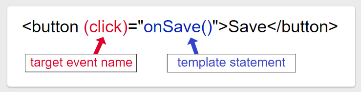

In an Angular template, a binding creates a live connection between a part of the UI created from a template (a DOM element, directive, or component) and the model (the component instance to which the template belongs). This connection can be used to synchronize the view with the model, to notify the model when an event or user action takes place in the view, or both.

--- 
**Understanding template variable**

In the template, you use the hash symbol, `#`, to declare a template variable. The following template variable, `#phone`, declares a `phone` variable with the `<input>` element as its value.

```HTML 
<input #phone placeholder="phone number" />
```

Refer to a template variable anywhere in the component's template. Here, a `<button>` further down the template refers to the `phone` variable.

```html
<input #phone placeholder="phone number" />

<!-- lots of other elements -->

<!-- phone refers to the input element; pass its `value` to an event handler -->
<button type="button" (click)="callPhone(phone.value)">Call</button>
```

## Variable specifying a name

- If the variable specifies a name on the right-hand side, such as `#var="[ngModel](https://angular.io/api/forms/NgModel)"`, the variable refers to the directive or component on the element with a matching `exportAs` name.

In most cases, Angular sets the template variable's value to the element on which it occurs. In the previous example, `phone` refers to the phone number `<input>`. The button's click handler passes the `<input>` value to the component's `callPhone()` method.

The `[NgForm](https://angular.io/api/forms/NgForm)` directive demonstrates getting a reference to a different value by referencing a directive's `exportAs` name. In the following example, the template variable, `itemForm`, appears three times separated by HTML.

```html
<form #myForm="ngForm">
  <input type="text" name="firstName" ngModel required>
  <input type="text" name="lastName" ngModel required>
  <button type="submit">Submit</button>
</form>

```

**ngForm** is a directive in Angular that creates a top-level **FormGroup** instance and binds it to a form to track aggregate form value and validation status. It is simply a directive exported from FormsModule which gets automatically added to all `<form>` tags in your Angular templates once you import the module. In this example, `ngForm` is used as an attribute selector on the `<form>` tag. The `#myForm` creates a reference variable for the form.

Without the `[ngForm](https://angular.io/api/forms/NgForm)` attribute value, the reference value of `itemForm` would be the [HTMLFormElement](https://developer.mozilla.org/en-US/docs/Web/API/HTMLFormElement), `<form>`. If an element is an Angular Component, a reference with no attribute value will automatically reference the component instance. Otherwise, a reference with no value will reference the DOM element, even if the element has one or more directives applied to it.

---
**Property Binding**
It is a way to pass data from a component to  a template. It allows you to set values for properties of html elements or directives. Property binding is used to do things such as toggle button feature, set paths programmatically and share values between component.

In Angular, you can bind to an element's property by enclosing it in square brackets [], which identifies the property as a target property. Here is an example of how to use property binding in angular;

```html


imageUrl = '../assets/phone.svg';
```
In this example, `imageUrl` is the component’s property that contains the URL of the image. The src attribute of the  `` tag is the target property that we want to bind to.

To set a property of a directive, type the following:
```html 
<p [ngClass]="classes">[ngClass] binding to the classes property making this blue</p>
```

**Attribute Binding**
Attribute binding syntax resembles [property binding](https://angular.io/guide/property-binding), but instead of an element property between brackets, you precede the name of the attribute with the prefix `attr`, followed by a dot. Then, you set the attribute value with an expression that resolves to a string.
Attribute binding in Angular helps you set values for attributes directly. With attribute binding, you can improve accessibility, style your application dynamically, and manage multiple CSS classes or styles simultaneously.
```html
<p [attr.attribute-you-are-targeting]="expression"></p>

<!-- create and set an aria attribute for assistive technology --> <button type="button" [attr.aria-label]="actionName">{{actionName}} with Aria</button>
```

**Class and Style binding**
You can use class binding to add and remove CSS class names from an element's `class` attribute.

**Binding Single Class**
To create a single class binding, use the prefix `class` followed by a dot and the name of the CSS class—for example, `[class.sale]="onSale"`. Angular adds the class when the bound expression, `onSale` is truthy, and it removes the class when the expression is **falsy**—with the exception of `undefined`. 

**Binding Multiple Class**
To bind to multiple classes, type the following:

`[class]="classExpression"`

The expression can be one of:

- A space-delimited string of class names.
- An object with class names as the keys and truthy or falsy expressions as the values.
- An array of class names.
With any object-like expression—such as `object`, `Array`, `Map`, or `Set`—the identity of the object must change for Angular to update the class list. Updating the property without changing object identity has no effect.

If there are multiple bindings to the same class name, Angular uses [styling precedence](https://docs.w3cub.com/angular~10/guide/style-precedence) to determine which binding to use.

The following table summarizes class binding syntax.

|   |   |   |   |
|---|---|---|---|
|Binding Type|Syntax|Input Type|Example Input Values|
|Single class binding|`[class.sale]="onSale"`|`boolean \| undefined \| null`|`true`, `false`|
|Multi-class binding|`[class]="classExpression"`|`string`|`"my-class-1 my-class-2 my-class-3"`|
|`{[key: string]: boolean \| undefined \| null}`|`{foo: true, bar: false}`|
|`Array`<`string`>|`['foo', 'bar']`|

**Binding Single Style**
To create a single style binding, use the prefix `[style]` followed by a dot and the name of the CSS style property—for example, `[style.width]="width"`. Angular sets the property to the value of the bound expression, which is usually a string. Optionally, you can add a unit extension like `em` or `%`, which requires a number type.

**Binding to multiple Styles**
To toggle multiple styles, bind to the `[[style](https://docs.w3cub.com/angular~10/api/animations/style)]` attribute—for example, `[[style](https://docs.w3cub.com/angular~10/api/animations/style)]="styleExpression"`. The expression is often a string list of styles such as `"width: 100px; height: 100px;"`.

You can also format the expression as an object with style names as the keys and style values as the values, such as `{width: '100px', height: '100px'}`.

> With any object-like expression—such as `object`, `Array`, `Map`, or `Set`—the identity of the object must change for Angular to update the class list. Updating the property without changing object identity has no effect.

If there are multiple bindings to the same style attribute, Angular uses [styling precedence](https://docs.w3cub.com/angular~10/guide/style-precedence) to determine which binding to use.

The following table summarizes style binding syntax.

|   |   |   |   |
|---|---|---|---|
|Binding Type|Syntax|Input Type|Example Input Values|
|Single style binding|`[style.width]="width"`|`string \| undefined \| null`|`"100px"`|
|Single style binding with units|`[style.width.px]="width"`|`number \| undefined \| null`|`100`|
|Multi-style binding|`[[style](https://docs.w3cub.com/angular~10/api/animations/style)]="styleExpression"`|`string`|`"width: 100px; height: 100px"`|
|`{[key: string]: string \| undefined \| null}`|`{width: '100px', height: '100px'}`|
|`Array`<`string`>|`['width', '100px']`|

**Event binding**
Event binding lets you listen for and respond to user actions such as keystrokes, mouse movements, clicks, and touches.
To bind to an event you use the Angular event binding syntax. This syntax consists of a target event name within parentheses to the left of an equal sign, and a quoted template statement to the right.

Create the following example; the target event name is `click` and the template statement is `onSave()`.

```Html
<button (click)="onSave()">Save</button>
```



**Two-way binding**
Two-way binding gives components in your application a way to share data. Use two-way binding to listen for events and update values simultaneously between parent and child components.

Angular's two-way binding syntax is a combination of square brackets and parentheses, `[()]`. The `[()]` syntax combines the brackets of property binding, `[]`, with the parentheses of event binding, `()`, as follows.

```html
<app-sizer [(size)]="fontSizePx"></app-sizer>
```

You could achieve the same result with separate bindings to the `<input>` element's value property and input event:
```html
<input [value]="userName" (input)="userName=$event.target.value">
or 
<input [ngModel]="userName" (ngModelChange)="userName=$event">
Using [(ngModel)] simplifies the two-way data binding with a shorter syntax. Note that, this [(ngModel)] syntax can only set a data-bound property. If you need to do something more, you can write the expanded form as shown above. For example, the following changes the <input> value to uppercase:

<input [ngModel]="userName" (ngModelChange)="setUppercaseName($event)">

<input type="text" [(ngModel)]="userName" />
```


