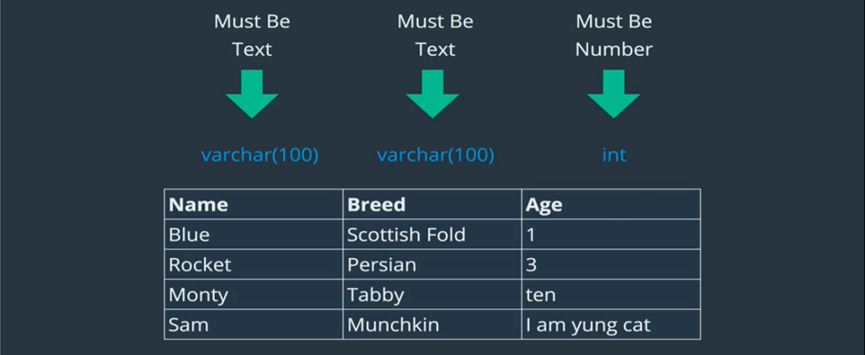

# Dealing with Database: Basic commands


Inside our database server we will be hosting our databases. If we have just one database to manage our things then there are a good chance of things getting mixed up.

In order to prevent this from happening there is a need for creating individual databases.

The command below is the one which can be used to display the databases present in our database server.

```mysql
show databases; 
```

The command below creates a database for us. 
For example we can use `create database hello_world;`

```mysql
create database <name>;
```

The command below will be used to delete a database. For example we could use `drop database hello_world`.

```mysql
drop database <name>;
``` 

The command below tells mysql server which database we want to work with. For example we can use `use hello_world`.

```mysql
use database <name>;
``` 

This command below will display which database we are currently working on.

```mysql
select database();
``` 

If we are selecting a database and we are working on it. Later we dropped that database. If we run `select database()` then as a response we will receive `null` as the current database in use has already been deleted.

# Dealing with Tables

A database is just a bunch of tables. We had created empty databases before but what really goes into those are tables. The data we store are stored in the form of tables in a MySQL database.

Tables are a related data hold in a structural format within a database.

For example, have a look at the table below:


When we are talking about tables and we are hearing columns we are referring to headers on that table which specifies the different component of data which we want to enlist. In this example ‘name’, ‘breed’, ‘age’.

On the other hand, the row contains our actual data.


# Data Types

While working with tables and while storing data onto tables MySQL enforces us to come up with a data type for each column in our table. This is done to eradicate the in consistency of data.


For example, in our table we are storing a text where we require to store a number then any arithmetic operation on that column will lead to unexpected results.


To avoid the above situations, we need to come up with data types when we are creating tables.


The number of datatypes in sql are huge. And practically not all of them are used. For the time being we will focus on `int` for dealing with integer type data and `varchar` for dealing with string type data.

1. `int` : is used to represent whole numbers. It has a max value of `4294967295`. Whenever there is a requirement of storing number falling out of this range then we can start to look out for other data types. Using `int` we can store negative integer too. Examples: 12, 0, -9999, 3145677, 42

2. `varchar` : is used to represent text or string which is variable in length. `char` datatype is used when we want our string in a column to be of equal width. But `varchar` is used when the string length per column is not fixed. The variable range for ‘varchar’ lies between ‘1 to 255’. Example: ‘coffee!’, ‘L’, ‘I am Anupam’, ‘-111’.



When using `varchar` we need to specify the range next to it within parenthesis. This range can be `1` to `255`. When we decide a string length within ‘varchar’, a string exceeding that limit will be **truncated**.

# Creating a table

A table can be created with the following syntax.

```mysql
Create table `tablename` (
   column_name_1 data_type,
   column_name_2, data_type
);
```

Apart from adding data types we can add other elements too, we will discuss on those later. Consider the example below:

```mysql
create table test_1 (
        id int,
        name varchar(3) # range is mandatory
)
```

In order to see the tables present in a database we can enter the following command:

```mysql
show tables;
```

```sh
mysql> show tables;
mysql> show tables;
+-------------------+
| Tables_in_picking |
+-------------------+
| confignode        |
| confignodedata    |
| customeraccount   |
| customersite      |
| domainadmin       |
| featuredeployment |
| featuremaster     |
| prettyurlmapping  |
| userdomain        |
+-------------------+
9 rows in set (0.00 sec)

```

# Describing Tables

In order to view the columns from a table we can enter the following command : 

```sh
mysql> show columns from userdomain;
+----------+-------------+------+-----+---------+----------------+
| Field    | Type        | Null | Key | Default | Extra          |
+----------+-------------+------+-----+---------+----------------+
| id       | int         | NO   | PRI | NULL    | auto_increment |
| username | varchar(50) | NO   |     | NULL    |                |
| domainid | int         | NO   | MUL | NULL    |                |
+----------+-------------+------+-----+---------+----------------+
3 rows in set (0.02 sec)
```

Instead of the above command we can use a shorter version of the command shown below
:

```sh
mysql> desc userdomain;
+----------+-------------+------+-----+---------+----------------+
| Field    | Type        | Null | Key | Default | Extra          |
+----------+-------------+------+-----+---------+----------------+
| id       | int         | NO   | PRI | NULL    | auto_increment |
| username | varchar(50) | NO   |     | NULL    |                |
| domainid | int         | NO   | MUL | NULL    |                |
+----------+-------------+------+-----+---------+----------------+
3 rows in set (0.00 sec)
```

Which yields the same output.

# Dropping a table

In order to drop a table we need to write the following command:

```mysql
drop table <table_name>
```

Consider the example below where we delete the ‘test_1’ table,

```sh
mysql> drop table test_1;
Query OK, 0 rows affected (6.95 sec)
```
