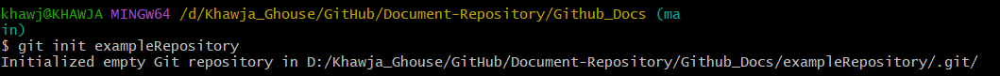
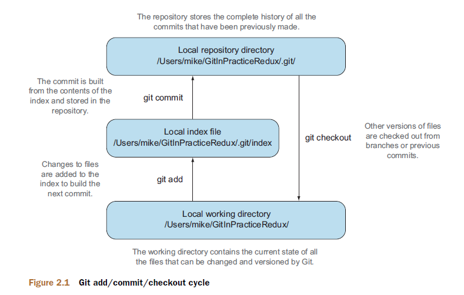
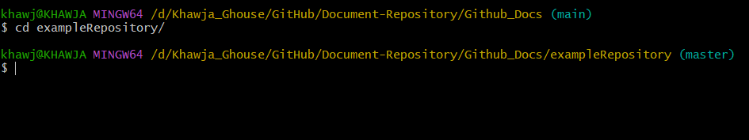
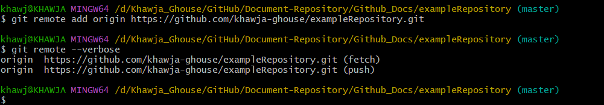

### Why programmers use Git?
Programmers use Git for several reasons, primarily related to version control, collaboration, and workflow efficiency.

### Chapter 1: Local Git
#### Initial setup
Install Git version 1.8 or above, the first
thing you need to do is to tell Git your name and email (particularly before creating
any commits). Rather than usernames, Git uses a name and an email address to identify
the author of a commit.

```
# git config --global user.name Khawja Ghouse
# git config --global user.email ghousekhawja2708@gmail.com
```
#### Creating a repository: git init
A Git repository is the local collection of all the files related to a particular Git version
control system and contains a **.git** subdirectory in its root. Git keeps track of the state
of the files in the repository’s directory on disk.

Typically, you create a new repository by downloading another repository that
already exists (known as cloning by Git and introduced in technique 8), but let’s start
by initializing an empty, new local repository.

#### Problem:
You wish to create a new local Git repository in a new subdirectory named exampleRepository.

#### Solution
1. Change to the directory you wish to contain your new repository directory.
2. Run `git init exampleRepository`<br>
Example:



History Output
`git log`

The git log output lists all the commits that have been made on the current branch in reverse chronological order (the most recent commit comes first)
1. Is the full 40-character commit reference.
2. Shows the name and email address set by the person who made the commit.
3. Shows the date and time when the commit was made.
4. Shows the commit message subject on the first line; the remaining lines are the commit message body.

### Chapter 2: Remote Git

**Adding a remote repository: git remote add**



Typically, when using version control, you’ll want to share your commits with other
people using other computers. With a traditional centralized version control system
(such as Subversion or CVS), the repository is usually stored on another machine.
As you make a commit, it’s sent over the network, checked to see whether it can apply (there may be other changes since you last checked), and then committed to
the version control system where others can see it.

With a distributed version control system like Git, every user has a complete repository
on their own computer. Although there may be a centralized repository to which people
send their commits, it isn’t accessed unless specifically requested. All commits,
branches, and history are stored offline unless users choose to send or receive commits
from another repository.

1. Files in the local working directory are modified and added with `git add` to the index staging area.
2. The contents of the index staging area are committed with `git commit` to form a new commit, which is stored in the local repository directory.
3. Later, this repository can be queried to view the differences between versions of files using `git diff`
4. how to use `git checkout` to change to different local branches

Figure 2.2 shows the remote Git cycle we’ll look at in this chapter. As in the local
workflow, files are modified, are added, are committed, and can be checked out. But
there are now two repositories: a local repository and a remote repository.

If your local repository needs to send data to or receive data from a repository on
another machine, it will need to add a remote repository. A remote repository is one
that’s typically stored on another computer. `git push` sends your new commits to it,
and `git fetch` retrieves from it any new commits made by others.

Problem
 You wish to add the new **exampleRepository** remote repository to your current repository.
 Solution
1. Change directory to the Git repository:<br>
2. Run git remote add origin with your repository URL appended. So if your username is `khawja-ghouse` and your repository is named exampleRepository, run `git remote add origin https://github.com/khawja-ghouse/ exampleRepository.git`. There will be no output.


### Pushing Changes to remote repository: git push
You’ll eventually wish to send commits made in the local repository to a remote. To do
this always requires an explicit action. Only changes specifically requested are sent,
and Git (which can operate over HTTP, SSH , or its own protocol [git://]) ensures that
only the differences between the repositories are sent. As a result, you can push small
changes from a large local repository to a large remote repository very quickly as long
as they have most commits in common.


