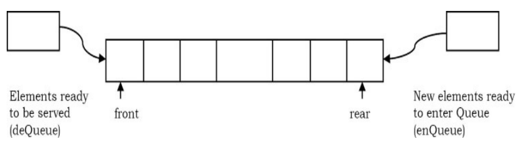

### What is a Queue?
A queue is a data structure used for storing data (similar to Linked Lists and Stacks). In queue, the order in which data arrives is important. In general, a queue is a line of people or things waiting to be served in sequential order starting at the beginning of the line or sequence.

**Definition**: A queue is an ordered list in which insertions are done at one end (rear) and deletions are done at other end (front). The first element to be inserted is the first one to be deleted. Hence, it is called **First in First out (FIFO)** or **Last in Last out (LILO)** list. Similar to Stacks, special names are given to the two changes that can be made to a queue. When an element is inserted in a queue, the concept is called ***EnQueue***, and when an element is removed from the queue, the concept is called ***DeQueue***. DeQueueing an empty queue is called underflow and EnQueuing an element in a full queue is called overflow. Generally, we treat them as exceptions. As an example, consider the snapshot of the queue.

### Queue ADT

>**MainQueue Operations**
> 	1. **enQueue(int data):** Insert an element at the end of the queue
> 	2. **int deQueue()**: Removes and returns the element at the front of the queue
>**Auxiliart Queue Operat**
> 	1. **int Front():** Returns the element at the front without removing it.
> 	2. **int QueueSize():** Returns the number of elements stored int the queue.
> 	3. **int isEmptyQueue():** Indicates whether no elements are stored int the queue or not

**Direct Applications**
- Operating systems schedule jobs (with equal priority) in the order of arrival (e.g., a print queue). 
- Simulation of real-world queues such as lines at a ticket counter, or any other firstcome first-served scenario requires a queue. 
-  Multiprogramming. 
-  Asynchronous data transfer (file IO, pipes, sockets). 
-  Waiting times of customers at call center. 
-  Determining number of cashiers to have at a supermarket.

### Simple Circular Array Implementation

This simple implementation of Queue ADT uses an array. In the array, we add elements circularly and use two variables to keep track of the start element and end element. Generally, front is used to indicate the start element and rear is used to indicate the end element in the queue. 
The array storing the queue elements may become full. An EnQueue operation will then throw a full queue exception. Similarly, if we try deleting an element from an empty queue it will throw empty queue exception. 
**Note:** Initially, both front and rear points to -1 which indicates that the queue is empty.

	

### Linked List Implementation
EnQueue operation is implemented by inserting an element at the end of the list. DeQueue operation is implemented by deleting an element from the beginning of the list.

 

