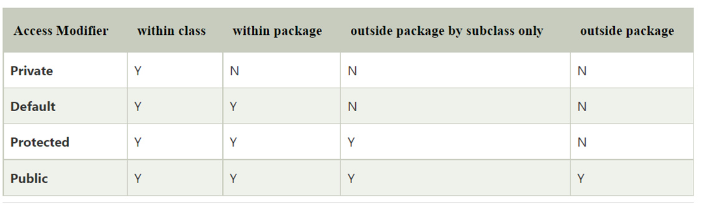
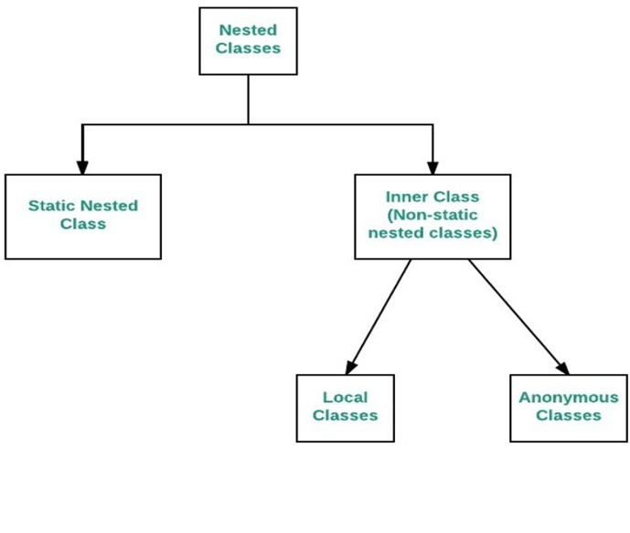

As the name suggests access modifiers in Java helps to restrict the scope of a class, constructor, variable, method, or data member. There are four types of access modifiers available in java: 
1.	Default – No keyword required
2.	Private
3.	Protected
4.	Public



1.	**Default:**  When no access modifier is specified for a class, method, or data member – It is said to be having the default access modifier by default. The data members, class or methods which are not declared using any access modifiers i.e. having default access modifier are accessible only within the same package.  
```java
    package p1;

//Class Geeks is having Default access modifier
class Geek
{
	void display()
	{
		System.out.println("Hello World!");
	}
}

```

```java
//Java program to illustrate error while
//using class from different package with
//default modifier
package p2;
import p1.*;

//This class is having default access modifier
class GeekNew
{
	public static void main(String args[])
	{
		// Accessing class Geek from package p1
		Geeks obj = new Geek();

		obj.display();
	}
       }
	
	Output:
	Compile time error
```
**NOTE:** When no access modifier is used, then by default the member of a class is public within its own package, but cannot be accessed outside of its package.

2.	**Private:**  The private access modifier is specified using the keyword private.
The methods or data members declared as private are accessible only within the class in which they are declared. Any other class of the same package will not be able to access these members.
Top-level classes or interfaces cannot be declared as private because
 * private means “only visible within the enclosing class”.
 * protected means “only visible within the enclosing class and any subclasses”  
Hence these modifiers in terms of application to classes, apply only to nested classes and not on top-level classes  
In this example, we will create two classes A and B within the same package p1. We will declare a method in class A as private and try to access this method from class B and see the result.


```java
//Java program to illustrate error while
//using class from different package with
//private modifier
package p1;

class A
{
private void display()
	{
		System.out.println("GeeksforGeeks");
	}
}

class B
{
public static void main(String args[])
	{
		A obj = new A();
		// Trying to access private method
		// of another class
		obj.display();
	}
}
Output:
error: display() has private access in A
        obj.display();

```
3. **Protected**: The protected access modifier is specified using the keyword protected.
The methods or data members declared as protected are accessible within the same package or subclasses in different packages.
In this example, we will create two packages p1 and p2. Class A in p1 is made public, to access it in p2. The method display in class A is protected and class B is inherited from class A and this protected method is then accessed by creating an object of class B.

```java
//Java program to illustrate
//protected modifier
package p1;

//Class A
public class A
{
protected void display()
	{
		System.out.println("GeeksforGeeks");
	}
}

//Java program to illustrate
//protected modifier
package p2;
import p1.*; // importing all classes in package p1

//Class B is subclass of A
class B extends A
{
public static void main(String args[])
{
	B obj = new B();
	obj.display();
}
	
}
Output:
GeeksforGeeks
```
4.	**Public**: The public access modifier is specified using the keyword **public**.
	The public access modifier has the widest scope among all other access modifiers.
	Classes, methods, or data members that are declared as public are accessible from everywhere in the program. There is no restriction on the scope of public data members.

### Understanding Static:
<hr>
There will be times when you will want to define a class member that will be used independently of any object of that class. To create such a member, precede its declaration with the keyword static. When a member is declared static, it can be accessed before any objects of its class are created, and without reference to any object. The most common example of a static member is main( ). main( ) is declared as static because it must be called before any objects exist.

Instance variables declared as static are, essentially, global variables. When objects of its class are declared, no copy of a static variable is made. Instead, all instances of the class share the same static variable.

Methods declared as static have several restrictions:
   1.	They can only directly call other static methods. 
   2.	They can only directly access static data.
   3.	They cannot refer to this or super in any way. (The keyword super relates to inheritance and is described in the next chapter.)  


If you need to do computation in order to initialize your static variables, you can declare a static block that gets executed exactly once, when the class is first loaded.

```java
//Demonstrate static variables, methods, and blocks.
class UseStatic {
	static int a = 3;
	static int b;

	static void meth(int x) {
		System.out.println("x = " + x);
		System.out.println("a = " + a);
		System.out.println("b = " + b);
	}

	static {
		System.out.println("Static block initialized.");
		b = a * 4;
	}

	public static void main(String args[]) {
		meth(42);
	}
}

```

As soon as the UseStatic class is loaded, all of the static statements are run. First, a is set to 3, then the static block executes, which prints a message and then initializes b to a*4 or 12. Then main( ) is called, which calls meth( ), passing 42 to x. The three println( ) statements refer to the two static variables a and b, as well as to the local variable x.

Here is the output of the program:   
Static block initialized.  
 x = 42  
a = 3  
b = 12  

Outside of the class in which they are defined, static methods and variables can be used independently of any object. To do so, you need only specify the name of their class followed by the dot operator. For example, if you wish to call a static method from outside its class, you can do so using the following general form:

`classname.method()`

**Introducing final:**

A field can be declared as final. Doing so prevents its contents from being modified, making it, essentially, a constant. This means that you must initialize a final field when it is declared. You can do this in one of two ways: First, you can give it a value when it is declared. Second, you can assign it a value within a constructor. The first approach is the most common. Here is an example:

final int FILE_NEW = 1;  
final int FILE_OPEN = 2;  
final int FILE_SAVE = 3;  
final int FILE_SAVEAS = 4;   
final int FILE_QUIT = 5;  

Subsequent parts of your program can now use FILE_OPEN, etc., as if they were constants, without fear that a value has been changed. It is a common coding convention to choose all uppercase identifiers for final fields, as this example shows. In addition to fields, both method parameters and local variables can be declared final. Declaring a parameter final prevents it from being changed within the method. Declaring a local variable final prevents it from being assigned a value more than once. 

### Nested Class in JAVA

In Java, it is possible to define a class within another class, such classes are known as nested classes. They enable you to logically group classes that are only used in one place, thus this increases the use of encapsulation, and creates more readable and maintainable code.
1.	The scope of a nested class is bounded by the scope of its enclosing class. Thus in below example, class _NestedClass_ does not exist independently of class _OuterClass_.
2.	A nested class has access to the members, including private members, of the class in which it is nested. The reverse is also true i.e., the enclosing class can access the members of the nested class.
3.	A nested class is also a member of its enclosing class.
4.	As a member of its enclosing class, a nested class can be declared private, public, protected, or package private(default).
5.	Nested classes are divided into two categories:  
      * static nested class: Nested classes that are declared static are called static nested classes.  
      * inner class: An inner class is a non-static nested class.  


**Static Nested Class:** In the case of static nested class, Without an outer class object existing, there may be a static nested class object. i.e., an object of a static nested class is not strongly associated with the outer class object.  



**Advantage of Java inner classes**

There are three advantages of inner classes in Java. They are as follows:
1.	Nested classes represent a particular type of relationship that is it can access all the members (data members and methods) of the outer class, including private.
2.	Nested classes are used to develop more readable and maintainable code because it logically group classes and interfaces in one place only.
3.	Code Optimization: It requires less code to write.

Types of Nested classes  
There are two types of nested classes non-static and static nested classes. The non-static nested classes are also known as inner classes.  
* Non-static nested class (inner class)  
  0.	Member inner class  
  1.	Anonymous inner class  
  2.	Local inner class  

1. Local inner class:  
   A class i.e., created inside a method, is called local inner class in java. Local Inner Classes are the inner classes that are defined inside a block. Generally, this block is a method body. Sometimes this block can be a for loop, or an if clause. Local Inner classes are not a member of any enclosing classes. They belong to the block they are defined within, due to which local inner classes cannot have any access modifiers associated with them. Therefore, it would be better if you include it within other classes.
	```java
 
   public class localInner1 {
	private int data = 30;// instance variable

	void display() {
		// inner local class 
		class Local {
			void msg() {
				System.out.println(data);
			}
		}
		Local l = new Local();
		l.msg();
	}

	public static void main(String args[]) {
		localInner1 obj = new localInner1();
		obj.display();
	}
     }
     Output: 30
   ```
2)	**Anonymous inner class:**  
It is an inner class without a name and for which only a single object is created. An anonymous inner class can be useful when making an instance of an object with certain “extras” such as overriding methods of a class or interface, without having to actually subclass a class.	

Syntax:
```java
// Test can be interface,abstract/concrete class
Test t = new Test() 
{
   // data members and methods
   public void test_method() 
   {
      ........
      ........
    }   
};

```

Now let us do discuss the difference between regular class(normal classes) and Anonymous Inner class  
* A normal class can implement any number of interfaces but the anonymous inner class can implement only one interface at a time.  
* A regular class can extend a class and implement any number of interfaces simultaneously. But anonymous Inner class can extend a class or can implement an interface but not both at a time.  
* For regular/normal class, we can write any number of constructors but we can’t write any constructor for anonymous Inner class because the anonymous class does not have any name and while defining constructor class name and constructor name must be same.  

Anonymous inner classes are generic created via below listed two ways as follows: 
1.	Class (may be abstract or concrete)
2.	Interface

Types of Anonymous Inner Class
Based on declaration and behavior, there are 3 types of anonymous Inner classes: 
1.	Anonymous Inner class that extends a class
2.	Anonymous Inner class that implements an interface
3.	Anonymous Inner class that defines inside method/constructor argument

**Type 1: Anonymous Inner class that extends a class**

We can have an anonymous inner class that extends a class. For example, we know that we can create a thread by extending a Thread class. Suppose we need an immediate thread but we don’t want to create a class that extends Thread class all the time. With the help of this type of Anonymous Inner class, we can define a ready thread.

```java
//Java program to illustrate creating an immediate thread
//Using Anonymous Inner class that extends a Class

//Main class
class MyThread {

	// Main driver method
	public static void main(String[] args) {
		// Using Anonymous Inner class that extends a class
		// Here a Thread class
		Thread t = new Thread() {

			// run() method for the thread
			public void run() {
				// Print statement for child thread
				// execution
				System.out.println("Child Thread");
			}
		};

		// Starting the thread
		t.start();

		// Displaying main thread only for readability
		System.out.println("Main Thread");
	}
}
	Output
Main Thread
Child Thread

```

**Type 2: Anonymous Inner class that implements an interface**
We can also have an anonymous inner class that implements an interface. For example, we also know that by implementing Runnable interface we can create a Thread. Here we use an anonymous Inner class that implements an interface.
**Example**

```java
//Java program to illustrate defining a thread
//Using Anonymous Inner class that implements an interface

//Main class
class MyThread {

	// Main driver method
	public static void main(String[] args) {
		// Here we are using Anonymous Inner class
		// that implements a interface i.e. Here Runnable
		// interface
		Runnable r = new Runnable() {

			// run() method for the thread
			public void run() {
				// Print statement when run() is invoked
				System.out.println("Child Thread");
			}
		};

		// Creating thread in main() using Thread class
		Thread t = new Thread(r);

		// Starting the thread using start() method
		// which invokes run() method automatically
		t.start();

		// Print statement only
		System.out.println("Main Thread");
	}
}

```

**Type 3:**  
Anonymous Inner class that defines inside method/constructor argument
Anonymous inner classes in method/constructor arguments are often used in graphical user interface (GUI) applications. To get you familiar with syntax lets have a look at the following program that creates a thread using this type of Anonymous Inner class  
Example

```java
//Java program to illustrate defining a thread
//Using Anonymous Inner class that define inside argument

//Main class
class MyThread {
	// Main driver method
	public static void main(String[] args)
	{
		// Using Anonymous Inner class that define inside
		// argument
		// Here constructor argument
		Thread t = new Thread(new Runnable() {
		
			public void run()
			{
				System.out.println("Child Thread");
			}
		});

		t.start();

		System.out.println("Main Thread");
	}
}
```
