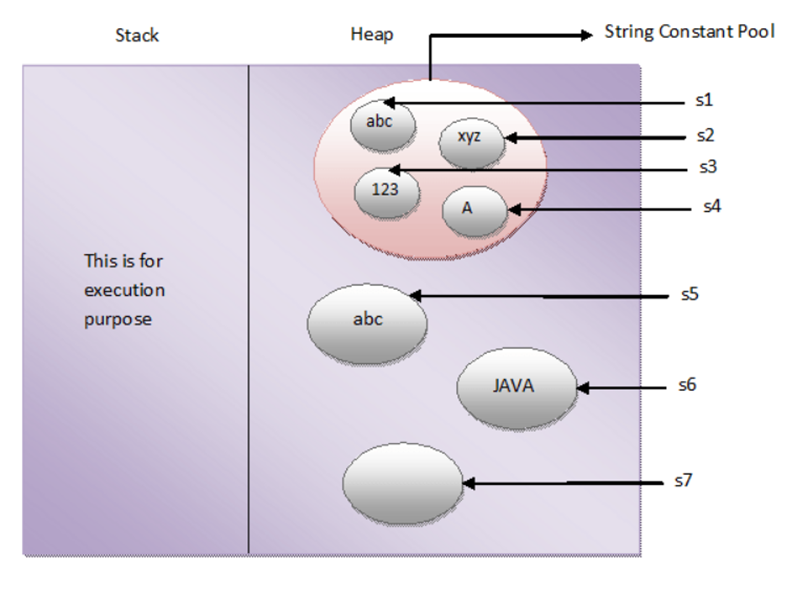

## Strings in java
Strings in Java are objects that are backed internally by a char array. Since arrays are immutable (cannot grow), Strings are immutable as well. Whenever a change to a string is made, an entirely new String is created.

```java 
Syntax:  
<String_Type> <string_variable> = "<sequence_of_string>"; 
Example: 
String str = "khwaja"; 
```

**Memory allotment of String**  
Whenever a String Object is created as a literal, the object will be created in String constant pool. This allows JVM to optimize the initialization of String literal.

The string can also be declared using new operator i.e. dynamically allocated. In case of String are dynamically allocated they are assigned a new memory location in heap. This string will not be added to String constant pool.  
For example:   
String str = new String("khawja");

If you want to store this string in the constant pool then you will need to “intern” it.  
For example:  
String internedString = str.intern();   
// this will add the string to string constant pool.  
It is preferred to use String literals as it allows JVM to optimize memory allocation.

```java
//Java code to illustrate String
import java.io.*;
import java.lang.*;

class Test {
	public static void main(String[] args)
	{
		// Declare String without using new operator
		String s = "GeeksforGeeks";

		// Prints the String.
		System.out.println("String s = " + s);

		// Declare String using new operator
		String s1 = new String("GeeksforGeeks");

		// Prints the String.
		System.out.println("String s1 = " + s1);
	}
}
Output: 
String s = GeeksforGeeks
String s1 = GeeksforGeeks

```

Creating a String  
There are two ways to create a string in Java:  
•	String literal  
           String s = “khawja”;  
•	Using new keyword  
String s = new String (“khawja”);  


How The Strings Are Stored In The Memory?  
In Java, strings are special. Java gives some special attention to string types that no other types enjoy such attention. For example, to create the string objects you need not to use ‘new‘ keyword. Where as to create other type of objects you have to use ‘new’ keyword. Like this, strings enjoy some special attention by the java. This attention is worth the while, because the strings are used almost everywhere while developing any kind of applications.  


We all know that JVM divides the allocated memory to a Java program into two parts. one is Stack and another one is heap. Stack is used for execution purpose and heap is used for storage purpose. In that heap memory, JVM allocates some memory specially meant for string literals. This part of the heap memory is called String Constant Pool.  


Whenever you create a string object using string literal, that object is stored in the string constant pool and whenever you create a string object using new keyword, such object is stored in the heap memory and SCP (If the string is not already present in SCP) pointing to the heap area created object.  

For example, when you create string objects like below, they will be stored in the String Constant Pool.
String s1 = “abc”;  
String s2 = “xyz”;  
String s3 = “123”;  
String s4 = “A”;  
And when you create string objects using new keyword like below, they will be stored in the heap memory.  
String s5 = new String(“abc”);  
char[] c = {'J', 'A', 'V', 'A'};   
String s6 = new String(c);  
String s7 = new String(new StringBuffer());  



One more interesting thing about String Constant Pool is that, pool space is allocated to an object depending upon it’s content. There will be no two objects in the pool having the same content.  
This is what happens when you create string objects using string literal,

**“When you create a string object using string literal, JVM first checks the content of to be created object. If there exist an object in the pool with the same content, then it returns the reference of that object. It doesn’t create new object. If the content is different from the existing objects then only it creates new object.”**

But, when you create string objects using new keyword, a new object is created whether the content is same or not.  


This can be proved by using “==” operator. As “==” operator returns true if two objects have same physical address in the memory otherwise it will return false. In the below example, s1 and s2 are created using string literal “abc”. So, s1 == s2 returns true. Where as s3 and s4 are created using new operator having the same content. But, s3 == s4 returns false.  

```java
public class StringExamples
{
    public static void main(String[] args)
    {
        //Creating string objects using literals
 
        String s1 = "abc";
 
        String s2 = "abc";
 
        System.out.println(s1 == s2); //Output : true
 
        //Creating string objects using new operator
 
        String s3 = new String("abc");
 
        String s4 = new String("abc");
 
        System.out.println(s3 == s4);        //Output : false
    }
}

```

In simple words, there cannot be two string objects with same content in the string constant pool. But, there can be two string objects with the same content in the heap memory.  


intern() method : In Java, when we perform any operation using intern() method, it returns a canonical representation for the string object. A pool is managed by String class.  

 * When the intern() method is executed then it checks whether the String equals to this String Object is in the pool or not.
 * If it is available, then the string from the pool is returned. Otherwise, this String object is added to the pool and a reference to this String object is returned.
 * It follows that for any two strings s and t, s.intern() == t.intern() is true if and only if s.equals(t) is true.  

It is advised to use equals(), not ==, to compare two strings. This is because == operator compares memory locations, while equals() method compares the content stored in two objects.

```java
// Java program to illustrate 
// intern() method 
class GFG { 
    public static void main(String[] args) 
    { 
        // S1 refers to Object in the Heap Area 
        String s1 = new String("GFG"); // Line-1 
  
        // S2 refers to Object in SCP Area
        String s2 = s1.intern(); // Line-2 
          
        // Comparing memory locations
        // s1 is in Heap
        // s2 is in SCP
        System.out.println(s1 == s2);
          
        // Comparing only values
        System.out.println(s1.equals(s2));
          
        // S3 refers to Object in the SCP Area 
        String s3 = "GFG"; // Line-3 
  
        System.out.println(s2 == s3); 
    } 
} 
Output:
false
true
true

```

**Explanation** : Whenever we create a String Object, two objects will be created i.e. One in the Heap Area and One in the String constant pool and the String object reference always points to heap area object. When line-1 execute, it will create two objects and pointing to the heap area created object. Now when line-2 executes, it will refer to the object which is in the SCP. Again when line-3 executes, it refers to the same object which is in the SCP area because the content is already available in the SCP area. No need to create a new one object.  

