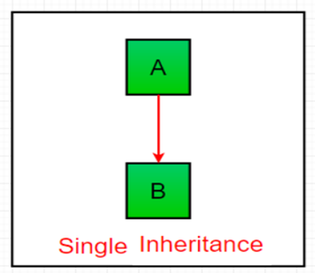
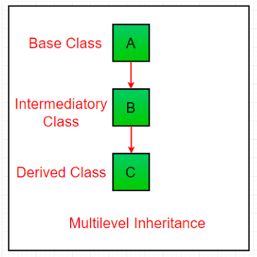
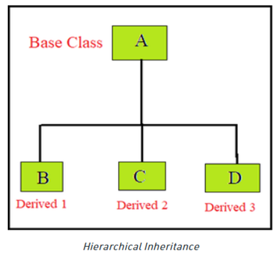
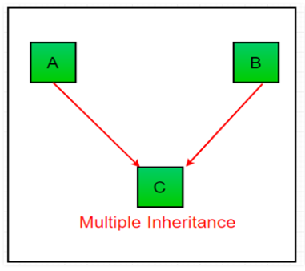
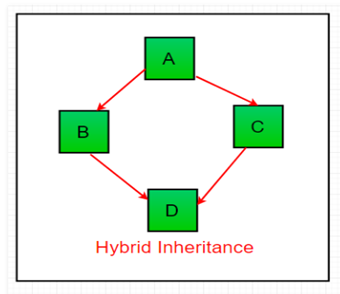
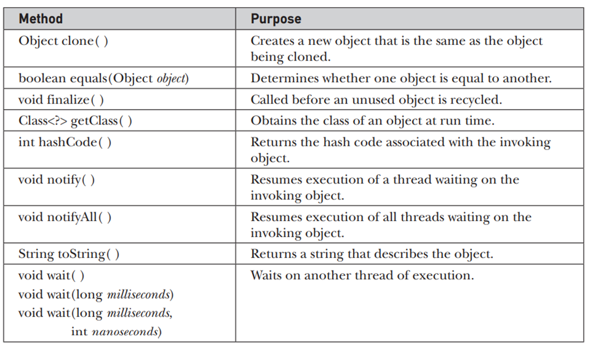

## Inheritance in Java

Inheritance is an important pillar of OOP (Object-Oriented Programming). It is the mechanism in java by which one class is allowed to inherit the features (fields and methods) of another class.   


Important terminology:  
* Super Class: The class whose features are inherited is known as superclass(or a base class or a parent class).  
* Sub Class: The class that inherits the other class is known as a subclass(or a derived class, extended class, or child class). The subclass can add its own fields and methods in addition to the superclass fields and methods.  
* Reusability: Inheritance supports the concept of “reusability”, i.e., when we want to create a new class and there is already a class that includes some of the code that we want, we can derive our new class from the existing class. By doing this, we are reusing the fields and methods of the existing class.  

How to use inheritance in Java  
The keyword used for inheritance is **extends**. 

```java
Syntax : 
class derived-class extends base-class  
{  
    //methods and fields  
}
```

**Example:** In the below example of inheritance, class Bicycle is a base class, class MountainBike is a derived class that extends Bicycle class and class Test is a driver class to run program.  

```java
// Java program to illustrate the concept of inheritance
// base class
class Bicycle {
    // the Bicycle class has two fields
    public int gear;
    public int speed;
  
    // the Bicycle class has one constructor
    public Bicycle(int gear, int speed)
    {
        this.gear = gear;
        this.speed = speed;
    }
  
    // the Bicycle class has three methods
    public void applyBrake(int decrement)
    {
        speed -= decrement;
    }
  
    public void speedUp(int increment)
    {
        speed += increment;
    }
  
    // toString() method to print info of Bicycle
    public String toString()
    {
        return ("No of gears are " + gear + "\n"
                + "speed of bicycle is " + speed);
    }
}
  
// derived class
class MountainBike extends Bicycle {
  
    // the MountainBike subclass adds one more field
    public int seatHeight;
  
    // the MountainBike subclass has one constructor
    public MountainBike(int gear, int speed,
                        int startHeight)
    {
        // invoking base-class(Bicycle) constructor
        super(gear, speed);
        seatHeight = startHeight;
    }
  
    // the MountainBike subclass adds one more method
    public void setHeight(int newValue)
    {
        seatHeight = newValue;
    }
  
    // overriding toString() method
    // of Bicycle to print more info
    @Override public String toString()
    {
        return (super.toString() + "\nseat height is "
                + seatHeight);
    }
}

public class Test {
    public static void main(String args[])
    {
  
        MountainBike mb = new MountainBike(3, 100, 25);
        System.out.println(mb.toString());
    }
}

Output
No of gears are 3
speed of bicycle is 100
seat height is 25

```

**Types of Inheritance in Java**
Below are the different types of inheritance which are supported by Java.  

1.	**Single Inheritance**:  In single inheritance, subclasses inherit the features of one superclass.
    
2. **Multilevel Inheritance**:  In Multilevel Inheritance, a derived class will be inheriting a base class and as well as the derived class also act as the base class to other class. 
    
3. **Hierarchical Inheritance**: In Hierarchical Inheritance, one class serves as a superclass (base class) for more than one subclass. In the below image, class A serves as a base class for the derived class B, C and D.  
   
4. **Multiple Inheritance (Through Interfaces):** In Multiple inheritances, one class can have more than one superclass and inherit features from all parent classes. Please note that Java does not support multiple inheritances with classes. In java, we can achieve multiple inheritances only through Interfaces. In the image below, Class C is derived from interface A and B.  
    
5. **Hybrid Inheritance (Through Interfaces):** It is a mix of two or more of the above types of inheritance. Since java doesn’t support multiple inheritances with classes, hybrid inheritance is also not possible with classes. In java, we can achieve hybrid inheritance only through Interfaces.  
    

Important facts about inheritance in Java  
* **Default superclass**: Except Object class, which has no superclass, every class has one and only one direct superclass (single inheritance). In the absence of any other explicit superclass, every class is implicitly a subclass of the Object class.    
* **Superclass can only be one**: A superclass can have any number of subclasses. But a subclass can have only one superclass. This is because Java does not support multiple inheritances with classes. Although with interfaces, multiple inheritances are supported by java.  
* **Inheriting Constructors**: A subclass inherits all the members (fields, methods, and nested classes) from its superclass. Constructors are not members, so they are not inherited by subclasses, but the constructor of the superclass can be invoked from the subclass.  
* **Private member inheritance**: A subclass does not inherit the private members of its parent class. However, if the superclass has public or protected methods (like getters and setters) for accessing its private fields, these can also be used by the subclass.  


**Java IS-A type of Relationship.**  
IS-A is a way of saying: This object is a type of that object. Let us see how the extends keyword is used to achieve inheritance.

public class SolarSystem {  
}  
public class Earth extends SolarSystem {  
}  
public class Mars extends SolarSystem {  
}  
public class Moon extends Earth {  
}  

Now, based on the above example, in Object-Oriented terms, the following are true:-  
SolarSystem the superclass of Earth class.  
SolarSystem the superclass of Mars class.  
Earth and Mars are subclasses of SolarSystem class.  
Moon is the subclass of both Earth and SolarSystem classes.  

What all can be done in a Subclass?  
In sub-classes we can inherit members as is, replace them, hide them, or supplement them with new members:   
The inherited fields can be used directly, just like any other fields.  
* We can declare new fields in the subclass that are not in the superclass.  
* The inherited methods can be used directly as they are.  
* We can write a new instance method in the subclass that has the same signature as the one in the superclass, thus overriding it (as in the example above, toString() method is overridden).  
* We can write a new static method in the subclass that has the same signature as the one in the superclass, thus hiding it.  

### Shadowing of the static function in java

Static Methods and Shadowing
* Static Methods are Class-Level: Static methods belong to the class, not instances of the class. They are called using the class name.
* Shadowing Static Methods: If a subclass defines a static method with the same name and parameter list as a static method in its superclass, the method in the subclass hides (or shadows) the one in the superclass.

```java
class SuperClass {
    static void staticMethod() {
        System.out.println("Static method in SuperClass");
    }
}

class SubClass extends SuperClass {
    static void staticMethod() {
        System.out.println("Static method in SubClass");
    }
}

public class Test {
    public static void main(String[] args) {
        SuperClass.staticMethod(); // Prints: Static method in SuperClass
        SubClass.staticMethod();   // Prints: Static method in SubClass

        SuperClass superClass = new SubClass();
        superClass.staticMethod(); // Prints: Static method in SuperClass
    }
}
```

Key Points
* When you call a static method on a class, it invokes the method defined in that class.
* When a static method is shadowed in a subclass, it does not override the superclass's method. Instead, it hides it.
* When you have an instance of a subclass, calling the static method using the superclass reference will still call the superclass's static method, because static methods are resolved at compile time based on the type of the reference, not the type of the object.

Dynamic Method Dispatch  
Dynamic method dispatch is the mechanism by which a call to an overridden method is resolved at run time, rather than compile time. Dynamic method dispatch is important because this is how Java implements run-time polymorphism. When an overridden method is called through a superclass reference, Java determines which version of that method to execute based upon the type of the object being referred to at the time the call occurs.

Using final with Inheritance:  
1)	Using final to Prevent Overriding: To disallow a method from being overridden, specify final as a modifier at the start of its declaration.
2)	Using final to Prevent Inheritance: Sometimes you will want to prevent a class from being inherited. To do this, precede the class declaration with final. Declaring a class as final implicitly declares all of its methods as final, too. As you might expect, it is illegal to declare a class as both abstract and final since an abstract class is incomplete by itself and relies upon its subclasses to provide complete implementations.

In Java, the Object class is the root of the class hierarchy. Every class in Java implicitly or explicitly inherits from the Object class. This means that Object is the superclass of all classes, and any instance of any class can be referred to as an instance of Object.  


The methods getClass( ), notify( ), notifyAll( ), and wait( ) are declared as final. You may override the others. These methods are described elsewhere in this book. However, notice two methods now: equals( ) and toString( ). The equals( ) method compares two objects. It returns true if the objects are equal, and false otherwise. The precise definition of equality can vary, depending on the type of objects being compared. The toString( ) method returns a string that contains a description of the object on which it is called. Also, this method is automatically called when an object is output using println( ). Many classes override this method. Doing so allows them to tailor a description specifically for the types of objects that they create.  
