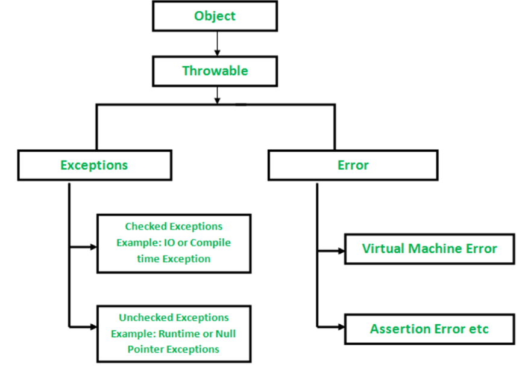
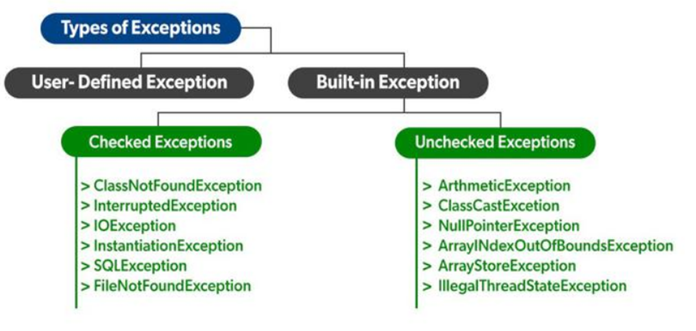
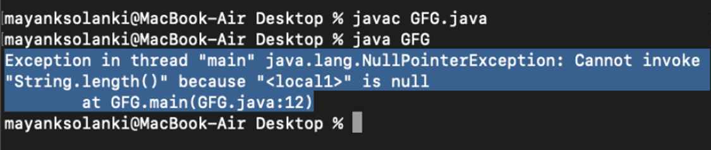
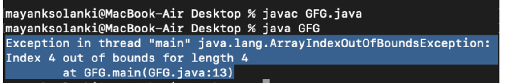

## Exception 

**Exception** is an unwanted or unexpected event, which occurs during the execution of a program i.e at run time, that disrupts the normal flow of the program’s instructions. Exceptions can be caught and handled by the program. When an exception occurs within a method, it creates an object. This object is called the exception object. It contains information about the exception such as the name and description of the exception and the state of the program when the exception occurred.  


**Exception Handling** in Java is one of the effective means to handle the runtime errors so that the regular flow of the application can be preserved. Java Exception Handling is a mechanism to handle runtime errors such as ClassNotFoundException, IOException, SQLException, RemoteException, etc.  

**Errors** represent irrecoverable conditions such as Java virtual machine (JVM) running out of memory, memory leaks, stack overflow errors, library incompatibility, infinite recursion, etc. Errors are usually beyond the control of the programmer and we should not try to handle errors.

Let us discuss the most important part which is the differences between Error and Exception that is as follows: 
* Error: An Error indicates a serious problem that a reasonable application should not try to catch.
* Exception: Exception indicates conditions that a reasonable application might try to catch.

**Exception Hierarchy**
All exception and error types are subclasses of class **Throwable**, which is the base class of the hierarchy. One branch is headed by **Exception**. This class is used for exceptional conditions that user programs should catch. **NullPointerException** is an example of such an exception. Another branch, **Error** is used by the Java run-time system(JVM) to indicate errors having to do with the run-time environment itself(JRE). **StackOverflowError** is an example of such an error.



**Types of Exceptions**   
Java defines several types of exceptions that relate to its various class libraries. Java also allows users to define their own exceptions.



Exceptions can be Categorized in two ways:
* Built-in Exceptions 
  * Checked Exception
   * Unchecked Exception 
* User-Defined Exceptions


**A. Built-in Exceptions:**  
Built-in exceptions are the exceptions that are available in Java libraries. These exceptions are suitable to explain certain error situations.  
* **Checked Exceptions:** Checked exceptions are called compile-time exceptions because these exceptions are checked at compile-time by the compiler. The exceptions which are checked by the compiler for the smooth running of the program are considered are checked exception.
 
* **Unchecked Exceptions**: The unchecked exceptions are just opposite to the checked exceptions. The compiler will not check these exceptions at compile time. In simple words, if a program throws an unchecked exception, and even if we didn’t handle or declare it, the program would not give a compilation error. All the exceptions which come under **RunTimeException** are unchecked exception and all other are checked exception.

How does JVM handles an Exception?  

**Default Exception Handling:** Whenever inside a method, if an exception has occurred, the method creates an Object known as an Exception Object and hands it off to the run-time system(JVM). The exception object contains the name and description of the exception and the current state of the program where the exception has occurred. Creating the Exception Object and handling it in the run-time system is called throwing an Exception. There might be a list of the methods that had been called to get to the method where an exception occurred. This ordered list of the methods is called Call Stack. Now the following procedure will happen.   
* The run-time system searches the call stack to find the method that contains a block of code that can handle the occurred exception. The block of the code is called an Exception handler.  
* The run-time system starts searching from the method in which the exception occurred, and proceeds through the call stack in the reverse order in which methods were called.  
* If it finds an appropriate handler then it passes the occurred exception to it. An appropriate handler means the type of the exception object thrown matches the type of the exception object it can handle.  
* If the run-time system searches all the methods on the call stack and couldn’t have found the appropriate handler then the run-time system handover the Exception Object to the default exception handler, which is part of the run-time system. This handler prints the exception information in the following format and terminates the program abnormally.  

Exception in thread "xxx" Name of Exception : Description  
... ...... ..  // Call Stack

```java
Example:
// Java Program to Demonstrate How Exception Is Thrown
 
// Class
// ThrowsExecp
class GFG {
 
    // Main driver method
    public static void main(String args[])
    {
        // Taking an empty string
        String str = null;
        // Getting length of a string
        System.out.println(str.length());
    }
}

```



Let us see an example that illustrates how a run-time system searches for appropriate exception handling code on the call stack.

```java
// Java Program to Demonstrate Exception is Thrown
// How the runTime System Searches Call-Stack
// to Find Appropriate Exception Handler
 
// Class
// ExceptionThrown
class GFG {
 
    // Method 1
    // It throws the Exception(ArithmeticException).
    // Appropriate Exception handler is not found
    // within this method.
    static int divideByZero(int a, int b)
    {
 
        // this statement will cause ArithmeticException
        // (/by zero)
        int i = a / b;
 
        return i;
    }
 
    // The runTime System searches the appropriate
    // Exception handler in method also but couldn't have
    // found. So looking forward on the call stack
    static int computeDivision(int a, int b)
    {
 
        int res = 0;
 
        // Try block to check for exceptions
        try {
 
            res = divideByZero(a, b);
        }
 
        // Catch block to handle NumberFormatException
        // exception Doesn't matches with
        // ArithmeticException
        catch (NumberFormatException ex) {
            // Display message when exception occurs
            System.out.println(
                "NumberFormatException is occurred");
        }
        return res;
    }
 
    // Method 2
    // Found appropriate Exception handler.
    // i.e. matching catch block.
    public static void main(String args[])
    {
 
        int a = 1;
        int b = 0;
 
        // Try block to check for exceptions
        try {
            int i = computeDivision(a, b);
        }
 
        // Catch block to handle ArithmeticException
        // exceptions
        catch (ArithmeticException ex) {
 
            // getMessage() will print description
            // of exception(here / by zero)
            System.out.println(ex.getMessage());
        }
    }
}

Output
/ by zero

```

Java exception handling is managed via five keywords: **try, catch, throw, throws, and finally**.
Need for try-catch clause (Customized Exception Handling)
Consider the below program in order to get a better understanding of the try-catch clause.

```java
// Java Program to Demonstrate
// Need of try-catch Clause
// Class
class GFG {
 
    // Main driver method
    public static void main(String[] args)
    {
        // Taking an array of size 4
        int[] arr = new int[4];
        // Now this statement will cause an exception
        int i = arr[4];
 
        // This statement will never execute
        // as above we caught with an exception
        System.out.println("Hi, I want to execute");
    }
}

```



Output explanation: In the above example, an array is defined with size i.e., you can access elements only from index 0 to 3. But you trying to access the elements at index 4(by mistake) that’s why it is throwing an exception. In this case, JVM terminates the program abnormally. The statement System.out.println(“Hi, I want to execute”); will never execute. To execute it, we must handle the exception using try-catch. Hence to continue the normal flow of the program, we need a try-catch clause. 

```java
How to Use the try-catch Clause?
try {
    // block of code to monitor for errors
    // the code you think can raise an exception
} catch (ExceptionType1 exOb) {
    // exception handler for ExceptionType1
} catch (ExceptionType2 exOb) {
    // exception handler for ExceptionType2
}
// optional
finally {  // block of code to be executed after try block ends 
}

```

Certain below key points are needed to be remembered that are as follows:     
* In a method, there can be more than one statement that might throw an exception, So put all these statements within their own try block and provide a separate exception handler within their own catch block for each of them.  
* If an exception occurs within the try block, that exception is handled by the exception handler associated with it. To associate the exception handler, we must put a catch block after it. There can be more than one exception handlers. Each catch block is an exception handler that handles the exception of the type indicated by its argument. The argument, ExceptionType declares the type of exception that it can handle and must be the name of the class that inherits from the Throwable class.  
* For each try block there can be zero or more catch blocks, but only one final block.  
* The finally block is optional. It always gets executed whether an exception occurred in try block or not. If an exception occurs, then it will be executed after try and catch blocks. And if an exception does not occur then it will be executed after the try block. The finally block in java is used to put important codes such as clean up code e.g. closing the file or closing the connection.  

### Java Throws KeyWord: 
The **_throws_** keyword in Java is used to declare exceptions that can occur during the execution of a program. For any method that can throw exceptions, it is mandatory to use the throws keyword to list the exceptions that can be thrown. The throws keyword provides information about the exceptions to the programmer as well as to the caller of the method that throws the exceptions.  

The **_throws_** keyword allows exceptions to be propagated in the call stack. When a method declares that it throws an exception, it is not required to handle the exception. The caller of a method that throws exceptions is required to handle the exceptions (or throw them to its caller and so on) so that the flow of the program can be maintained.  

Only checked exceptions are required to be thrown using the _**throws**_ keyword. Unchecked exceptions don’t need to be thrown or handled explicitly in code.

Syntax:

`type method(arguments) throws Exception1, Exception2,..{}`

As seen in the syntax above, all exceptions that can be thrown by a method should be declared in the method signature using the throws keyword. A method can throw multiple exceptions, which should be separated by a comma in the declaration.  

### Java Throw Keyword

The **_throw_** keyword in Java is used for explicitly throwing a single exception. This can be from within a method or any block of code. Both checked and unchecked exceptions can be thrown using the throw keyword.  

When an exception is thrown using the **_throw_** keyword, the flow of execution of the program is stopped and the control is transferred to the nearest enclosing try-catch block that matches the type of exception thrown. If no such match is found, the default exception handler terminates the program.  

The **_throw_** keyword is useful for throwing exceptions based on certain conditions e.g. if a user enters incorrect data. It is also useful for throwing custom exceptions specific to a program or application.  


Unchecked exceptions can be propagated in the call stack using the throw keyword in a method. Checked exceptions can be propagated using the throw keyword when the method that throws the exception declares it using the **_throws_** keyword.  

syntax: `throw throwableObject`
A throwable object can be an instance or subclass of the Throwable class. All exceptions defined in Java are subclasses of Throwable.

**Methods of exception:**
1.	**printStackTrace():** This method prints the name, description and stackTrace of the exception. StackTrace is a detailed info of where the exception occurred and where all the exception propagated.
2.	**getMessage():** This method return the description of the exception in the string.
3.	**toString():** This method return the name and description of the exception in the string format.
Handling Checked exception:

Checked exception can be handled in to ways:
1.	Using try-catch.
2.	By declaring the exception (Using throws keyword)  
Custom Exception:  
We can create our own exception classes by extending Exception and overriding the methods present inside the exception.

The try-with-resources statement  
The try-with-resources statement is a try statement, introduced in Java 1.7, which declares a number of resources. The resources are objects that must be closed, once an application stops processing them, in order to be collected by the Garbage Collector and for memory space to be reclaimed. A try-with-resources statement makes sure that all declared resources will be closed at the end of the statement. Thus, this statement aims to ensure proper release of resources, avoiding memory exhaustion and possible errors that may occur.  


Any object that implements the **_AutoCloseable_** interface can be considered as a resource. An example using the try-with-resources statement is shown below:

A large number of classes implements the AutoCloseable interface. In this section, we will describe some of them and we will demonstrate examples where multiple resources are declared inside a try-with-resources statement. Every class that implements the **_AutoCloseable_** interface must define the behaviour of the **close()** method.

```java
import java.io.BufferedReader;
import java.io.FileReader;
import java.io.IOException;
 
public class TryWithResourcesExample {
    private final static String FILENAME = "file1.txt";
 
    public static void main(String[] args) {
        try(BufferedReader rd = new BufferedReader(new FileReader(FILENAME))) {
            String inputLine = null;
             
            while((inputLine = rd.readLine()) != null)
                System.out.println(inputLine);
        }
        catch (IOException ex) {
            System.err.println("An IOException was caught: " + ex.getMessage());
            ex.printStackTrace();
        }
    }
}

```

There are many rules if we talk about method overriding with exception handling.
Some of the rules are listed below:  
* If the superclass method does not declare an exception  
  *	If the superclass method does not declare an exception, subclass overridden method cannot declare the checked exception but it can declare unchecked exception.  
* If the superclass method declares an exception  
  *	If the superclass method declares an exception, subclass overridden method can declare same exception, subclass exception or no exception but cannot declare parent exception.

NOTE:
1.	Try block can’t be alone it always depends on either catch or finally block.
2.	A checked exception must be handled either by re-throwing or with a try catch block, whereas an unchecked isn’t required to be handled.
3.	To create a checked custom exception, it must extend Exception or its child classes.
4.	Unchecked custom exception extends RuntimeException or its child classes.
5.	For single try block we can have only one finally() block. Finally block should always be at the last.
6.	The primary reason of the finally block is to close all the opened resources.
7.	finally block overrides the value returned by try block.
