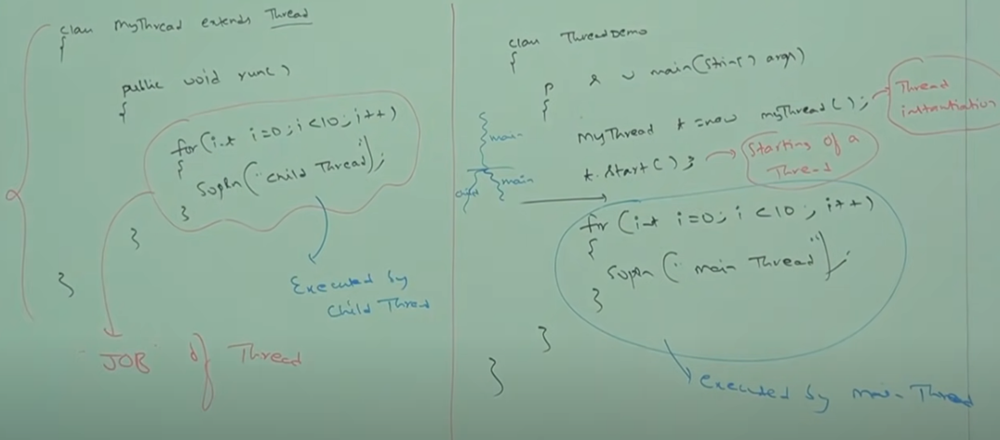
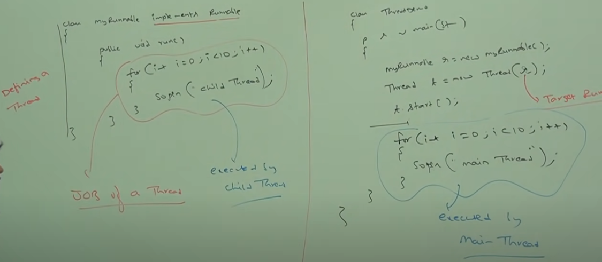
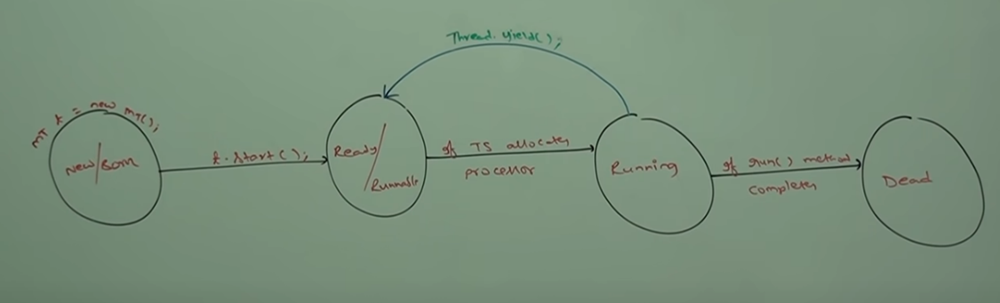

## Multithreading in Java
### What is multitasking?
Executing several tasks simultaneously is a concept of Multitasking. Multitasking is the ability of a computer's operating system to run several programs (or processes) concurrently on a single CPU.  This is done by switching from one program to another fast enough to create the appearance that all programs are executing simultaneously. There are two types of multitasking
1)	Process based multitasking.  
2)	Thread based multitasking.  

### Process based multitasking:  
Executing several tasks simultaneously where each task is a separate independent program(process) is called process-based multitasking.
Example: 
While typing a java program in Editor we can listen audio songs from same system at the same time we can download a file from browser all these tasks will be executed simultaneously and independent of each other hence it is processed based multitasking.
Processed based multitasking is best suitable at OS level.  


### Thread based multitasking:  
 Executing several tasks simultaneously where each task is a separate independent part of the same program is called thread-based Multitasking and each independent part is called a Thread.
Thread based multitasking is best suitable at programmatical level for Programmatic level.

The main objective of multitasking is to reduce response time of the system and improve performance of the system.
Main important application areas of multithreading are
1.	To develop multimedia graphics.
2.	To develop video games.
3.	To develop Web servers and Application servers   
And many more.

### What is a Thread?  
 A thread in Java is the direction or path that is taken while a program is being executed. Generally, all the programs have at least one thread, known as the main thread, that is provided by the JVM or Java Virtual Machine at the starting of the program's execution. At this point, when the main thread is provided, the main() method is invoked by the main thread.

Creating a Thread in Java.  
A Thread in java can be created in two ways:  
1. Extending **java.lang.Thread** class

    ```java
    // Definition of the thread
    class GFG extends Thread {
        // This part is JOB of the child thread
        public void run() {
            System.out.print("Welcome to Threads.");
    
            for (int i = 0; i < 10; i++) {
                System.out.println("Child Thread !!");
            }
        }
    }
    
    class ThreadsDemo {
              public static void main(String[] args) {
            
            MyThread t = new MyThread();// Thread instantiation
            
            t.start(); // starting of the thread
          
            // t.run();
            
            // At this point we have two threads one is Main thread and one is child thread
            
            // This part is always executed by main thread
            for (int i = 0; i < 10; i++) {
                System.out.println("Main Thread !!");
            }
              }
    }
    ```

  

### Thread Schedular  
It’s a part of JVM it is responsible to schedule threads i.e., if multiple threads are waiting to get the chance of execution, then in which order threads will be executed is decided by Thread schedular.
We can’t expect exact algorithm fallowed by Thread schedular it varies from JVM to JVM hence we can’t expect thread execution order and execute.
Hence whenever situation coms to MT then there is no guarantee for exact output but we can provide several possible outputs.

Different cases on Thread.  

1)	If we use **thread.start()** method a new child thread is created which is responsible for execution of run() method. Here we always have a chance to get different output because both child thread and main thread is executed.  
Responsibilities of start() method  
   * Register the Thread with the Thread Schedular.
   * Perform all the other mandatory activities.
   * Invoke **run()** method of Thread class.// start will always invoke run() with no arguments.
2)	If we override a **start()** method of Thread class then no new child thread is created
3)	If we use **thread.run()** method new child thread is not created and main thread executes run() method normally. Here output is always same because even run() is always executed by main thread.  


2)	Creating Thread by implementing Runnable interface.  
**Runnable interface:**  
Any class with instances that are intended to be executed by a thread should implement the Runnable interface. The Runnable interface has only one method, which is called **run()**.   
// Thread action is performed  
public void run()   
Benefits of creating threads :  
* When compared to processes, Java Threads are more lightweight; it takes less time and resources to create a thread.
* Threads share the data and code of their parent process.
* Thread communication is simpler than process communication.
* Context switching between threads is usually cheaper than switching between processes.

The Runnable interface is a **functional** interface defined in java.lang package. This interface contains a single abstract method, **run()** with no arguments. When an object of a class implementing this interface used to create a thread, then run() method has invoked in a thread that executes separately

  

```java
class MyRunnable implements Runnable {
	public void run() {
		System.out.print("Welcome to Threads.");

		for (int i = 0; i < 10; i++) {
			System.out.println("Child Thread !!");
		}
	}

}

class ThreadDemo {

	public static void main(String[] args) {
		MyRunnable runnable = new MyRunnable();
		// We need to pass the target runnable to invoke the run() method we want else
		// on start of the thread empty implementation of run() is called.
		Thread myThread = new Thread(runnable);

		myThread.start();

		for (int i = 0; i < 10; i++) {
			System.out.println("Main Thread !!");
		}

	}
}


```

If your class is extending the Thread class then it becomes a single thread which inherits the properties Thread class, so it'll be heavy. (When extending Thread class each of the threads creates unique object and associate with it, but when implementing Runnable, it shares the same object to multiple Threads).

Calling run() instead of start()  
The common mistake is starting a thread using run() instead of start() method.   
  Thread myThread = new Thread(MyRunnable());  
  myThread.run();  //should be start();  
The run() method is not called by the thread you created. Instead, it is called by the thread that created the myThread(Main Thread). 

`
Which is the best way to create a Thread?
Thread creation by extending Thread class: As we are extending a Thread class, we will not be able to inherit any other class and because of this we don’t have inheritance benefit in this approach.  
Thread creation by implementing Runnable Interface: Along with implementing Runnable we can also use extends to inherit any other classes so we have Inheritance benefit. Hence implementing Runnable is recommended to define a thread.
`

```java
Thread class Constructors

Thread t = new Thread();
Thread t = new Thread(Runnable impl);
Thread t = new Thread(String name);
Thread t = new Thread(Runnable impl,String name);
Thread t = new Thread(ThreadGroup g, String name);
Thread t = new Thread(ThreadGroup g, Runnable impl);
Thread t = new Thread(ThreadGroup g, Runnable impl,String name);
Thread t = new Thread(ThreadGroup g, Runnable impl,String name,long stackSize);

```

Getting and setting Name of a Thread  
1)	Every Thread in java has some name it may be default name generated by JVM or customized name provided by programmer.  
2)	We can get and set name of a Thread by using fallowing two methods of Thread class  
`Public final String getName();`  
`Public final void setName(String name);`
3)	`Thread.currentThread().getName()` is used to get the name of the current  executing thread.

```java
class M15 
{
	public static void main(String[] args) 
	{
		Thread t1 = Thread.currentThread();
		System.out.println("id:"+ t1.getId());//v cannot change the id of the thread
		
		System.out.println("name:"+ t1.getName());
		System.out.println("demon:"+ t1.isDaemon());
		System.out.println("priority:"+ t1.getPriority());
		t1.setPriority(10);
                t1.setPriority(11);// RE: IllegalArgumentException
		System.out.println("domain:"+ t1.isDaemon());
		t1.setDaemon(true);
		System.out.println("name:"+ t1.isDaemon());
	
	}
}

```

* setDemon method is used to convert a thread into demon
* We cannot convert main Thread into a demon thread.
* priority is an integer number with minimum value 1 and Maximum 10. Through set priority we can change the priority of the thread.public static int MIN_PRIORITY,public static int NORM_PRIORITY,public static int MAX_PRIORITY. Default priority only for the main thread is 5 but for all remaining thread the default priority is inherited from Parent.
* Thread schedular will use the priorities while allocation processor, thread which is having highest priority will get the chance first. If two threads having same priority then we can’t expect exact execution order it depends on thread schedular.

Prevent a thread execution: By using this fallowing three methods we can prevent a thread execution
1)	Yield()
2)	Join()
3)	Sleep()

**Yield Method:** Yield method causes to pause a current executing thread to give the chance for waiting threads of same priority. If there is no waiting or all waiting threads have low priority then same thread can continue its execution.  
If multiple threads are waiting with same priority which waiting thread will get a change? We can’t expect it depends on thread schedular.  





**Join():**   
If a thread wants to wait until completing some other thread then we should go for join method.
For example: if a Thread t1 wants to wait until completing t2 then t1 has to call t2.join(). If t1 executes t2.join() then immediately t1 will be entered into waiting state until t2 completes once t2 completes once then t1 can continue its execution.
Every join methods throws InterreptedException which is checked exception hence we need to handle either by using throws or try catch() block.
