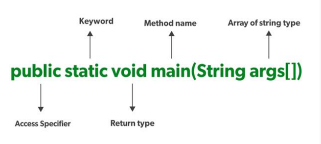

## Simple Java Program

Let’s look more closely at one of the simplest Java programs you can have— one that merely prints a message to console:
```java
public class FirstSample {
public static void main(String[] args) {
System.out.println("We will not use 'Hello, World!'");
 }
}
```

First and foremost, Java is case sensitive. If you made any mistakes in capitalization (such as typing Main instead of main), the program will not run. Now, let’s look at this source code line by line. The keyword public is called an access modifier; these modifiers control the level of access other parts of a program have to this code. The keyword class reminds you that everything in a Java program lives inside a class. Class is a container for the program logic that defines the behavior of an application. Classes are the building blocks with which all Java applications are built. 
<br>
Everything in a Java program must be inside a class. The next is name of the class FirstSample (Camel Case).
In Java programs, the point from where the program starts its execution or simply the entry point of Java programs is the main() method. Hence, it is one of the most important methods of Java and having a proper understanding of it is very important. The Java compiler or JVM looks for the main method when it starts executing a Java program. The signature of the main method needs to be in a specific way for the JVM to recognize that method as its entry point. If we change the signature of the method, the program compiles but does not execute.



Every word in the public static void main statement has got a meaning to the JVM.
1.	public: It is an Access modifier, which specifies from where and who can access the method. Making the main() method public makes it globally available. It is made public so that JVM can invoke it from outside the class as it is not present in the current class.
2.	static: It is a keyword that is when associated with a method, making it a class-related method. The main() method is static so that JVM can invoke it without instantiating the class. This also saves the unnecessary wastage of memory which would have been used by the object declared only for calling the main() method by the JVM.
3.	void: It is a keyword and is used to specify that a method doesn’t return anything. As the main() method doesn’t return anything, its return type is void. As soon as the main() method terminates, the java program terminates too. Hence, it doesn’t make any sense to return from the main() method as JVM can’t do anything with the return value of it.
4.	main: It is the name of the Java main method. It is the identifier that the JVM looks for as the starting point of the java program. It’s not a keyword.
5.	String[] args: It stores Java command-line arguments and is an array of type java.lang.String class. Here, the name of the String array is args but it is not fixed and the user can use any name in place of it. 

### Compiling and execution of program. <br>
You need to make the file name for the source code the same as the name of the public class, with the extension .
java appended. Thus, you must store this code in a file called **FirstSample.java**. 
(Again, case is important—don’t use firstsample.java). The, Java compiler automatically names the bytecode file 
FirstSample.class and stores it in the same directory as the source file. 
Finally, launch the program by issuing the following command: **java FirstSample**
(Remember to leave off the .class extension.) When the program executes, it simply displays the string 
'Hello, World!' on the console. When you use java ClassName to run a compiled program, 
the Java virtual machine always starts execution with the code in the main method in the class you indicate. 
(The term “method” is Java-speak for a function.) Thus, you must have a main method in the source of your class 
for your code to execute. You can, of course, add your own methods to a class and call them from the main method.

Next, turn your attention to this fragment:
```java
{
    System.out.println("We will not use 'Hello, World!'");
}
```
Braces mark the beginning and end of the body of the method. This method has only one statement in it. 
As with most programming languages, you can think of Java statements as sentences of the language. 
In Java, every statement must end with a semicolon. 
In particular, carriage returns do not mark the end of a statement, so statements can span multiple lines 
if need be. The body of the main method contains a statement that outputs a single line of text to the console.
Here, we are using the **System.out** object and calling its **println** method. 
Notice the periods used to invoke a method. Java uses the general syntax **object.method(parameters)** as its equivalent of a function call.

### Comments in java 

Comments in Java, as in most programming languages, do not show up in the executable program. 
Thus, you can add as many comments as needed without fear of bloating the code. 
Java has three ways of marking comments. The most common form is a //. 
Use this for a comment that runs from the // to the end of the line.
System.out.println("We will not use 'Hello, World!'");
// is this too cute?
When longer comments are needed, you can mark each line with a //, or you can use the /* and */ comment delimiters that let you block off a longer comment.
Finally, a third kind of comment is used to generate documentation automatically. This comment uses a /** to start and a */ to end.