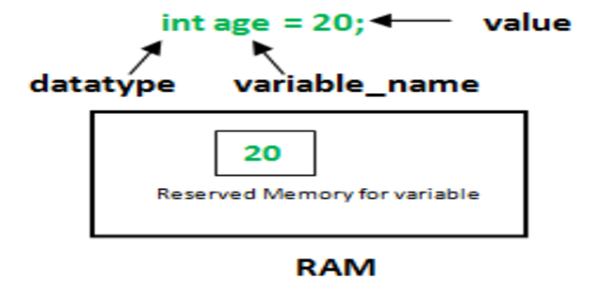

Java is statically typed and also a strongly typed language because, in Java, each type of data (such as integer, character, hexadecimal, packed decimal, and so forth) is predefined as part of the programming language and all constants or variables defined for a given program must be described with one of the data types.
Java has two categories in which data types are segregated
1.	Primitive Data Type: such as boolean, char, int, short, byte, long, float, and double
2.	Non-Primitive Data Type or Object Data type: such as String, Array, etc.

Types of Primitive Data Type.
Primitive data are only single values and have no special capabilities. There are 8 primitive data types.
1. **boolean**: Boolean data type represents only one bit of information either true or false, but the size of the boolean data type is virtual machine-dependent. Values of type boolean are not converted implicitly or explicitly (with casts) to any other type. But the programmer can easily write conversion code.
   <br> **Syntax**:
   **boolean booleanVar;**<br>
   **Size**: Virtual machine dependent<br>
   **Values**: Boolean such as true, false<br>
   **Default** Value: false  

2.	**byte**: The byte data type is an 8-bit signed two’s complement integer. The byte data type is useful for saving memory in large arrays.  

    **Syntax**: byte byteVar;  

    **Size**: 1 byte (8 bits)  

    **Values**: -128 to 127  

    **Default Value: 0**  
    

3. **short**: The short data type is a 16-bit signed two’s complement integer. Similar to byte, use a short to save memory in large arrays, in situations where the memory savings actually matters.  

    **Syntax**: short shortvar;  

    **Size**: 2 byte (16 bits)

    **Values**: -32, 768 to 32, 767 (inclusive)

    **Default Value: 0**


 4. **int**: It is a 32-bit signed two’s complement integer.  

    **Syntax**: int intVar;  

    **Size**: 4 byte ( 32 bits )  

    **Values**: -2, 147, 483, 648 to 2, 147, 483, 647 (inclusive)  

    **Default** Value: 0  


5.	**long**: The long data type is a 64-bit two’s complement integer.   
    **Syntax**: long longVar;  
    **Size**: 8 byte (64 bits)  
    **Values**: {-9, 223, 372, 036, 854, 775, 808} to {9, 223, 372, 036, 854, 775, 807} (inclusive)  
    **Note**: The default value is ‘0’.  

6.	**Float**: The float data type is a single-precision 32-bit IEEE 754 floating-point. Use a float (instead of double) if you need to save memory in large arrays of floating-point numbers.  
**Syntax**: float floatVar;  
**Size**: 4 byte (32 bits)  
**Values**: upto 7 decimal digits  
**Note**: The default value is ‘0.0’.  

7.	**Double**: The double data type is a double-precision 64-bit IEEE 754 floating-point. For decimal values, this data type is generally the default choice.  
**Syntax**: double doubleVar;  
**Size**: 8 bytes or 64 bits  
**Values**: Upto 16 decimal digits  
**Note**: The default value is taken as ‘0.0’.  

8.	**Char**: The char data type is a single 16-bit Unicode character.  
**Syntax**: char charVar;  
**Size**: 2 byte (16 bits)  
**Values**: ‘\u0000’ (0) to ‘\uffff’ (65535)  
**Note**: The default value is ‘\u0000’  

    You must be wondering why is the size of char 2 bytes in Java?  
    So, in other languages like C/C++ uses only ASCII characters, and to represent all ASCII characters 8-bits is 
    enough. But java uses the Unicode system not the ASCII code system and to represent the Unicode system 8 bits 
    is not enough to represent all characters so java uses 2 bytes for characters. Unicode defines a fully 
    international character set that can represent most of the world’s written languages. It is a unification of 
    dozens of character sets, such as Latin, Greeks, Cyrillic, Katakana, Arabic, and many more.

### Variables in Java:  
Variable in Java is a data container that saves the data values during Java program execution. Every variable is assigned a data type that designates the type and quantity of value it can hold. Variable is a memory location name of the data.
A variable is a name given to a memory location. It is the basic unit of storage in a program.  
- The value stored in a variable can be changed during program execution.
- A variable is only a name given to a memory location, all the operations done on the variable effects that memory location.
- In Java, all the variables must be declared before use.

**How to declare a variable?**  
Syntax: **data _type variable_name = value;**

1.	**data_type**: Type of data that can be stored in this variable. 
2.	**variable_name**: Name was given to the variable. 
3.	**value**: Any primitive literal value.

How to initialize variable:  
It can be perceived with the help of 3 components that are as follows:
- datatype: Type of data that can be stored in this variable.
- variable_name: Name given to the variable.
- value: It is the initial value stored in the variable.



    Example:  
    float simpleInterest; // Declaring float variable  
    int time = 10, speed = 20; // Declaring and Initializing integer variable  

**Rules for variable declaration in java:**  

1.	A variable name can consist of Capital letters A-Z, lowercase letters a-z digits 0-9, and two special characters such as _ underscore and $ dollar sign.
2.	The first character must not be a digit.
3.	Blank spaces cannot be used in variable names.
4.	Java keywords cannot be used as variable names.
5.	Variable names are case-sensitive.
6.	The maximum length of the variable is 64 characters.
7.	Variable names always should exist on the left-hand side of assignment operators.

Types of variables in java:  
Now let us discuss different types of variables which are listed as follows: 
1.	Local Variables
2.	Instance Variables
3.	Static Variables
Let us discuss the traits of every variable been up here in detail.  


Local Variables  
A variable defined within a block or method or constructor is called a local variable. 
  * These variables are created when the block is entered, or the function is called and destroyed after exiting from the block or when the call returns from the function.
  * The scope of these variables exists only within the block in which the variable is declared. i.e., we can access these variables only within that block.
  * Initialization of the local variable is mandatory before using it in the defined scope.

```java
/*package whatever //do not write package name here */
import java.io.*;

public class Example {

	public static void main(String[] args) {
		int var = 10; // Declared a Local Variable
		// This variable is local to this main method only
		System.out.println("Local Variable: " + var);
	}

}
Output
Local Variable: 10

```

**Instance Variables**  
Instance variables are non-static variables and are declared in a class outside any method, constructor, or block.   
  * As instance variables are declared in a class, these variables are created when an object of the class is created and destroyed when the object is destroyed.
  * Unlike local variables, we may use access specifiers for instance variables. If we do not specify any access specifier, then the default access specifier will be used.
  * Initialization of Instance Variable is not Mandatory. Its default value is 0
  * Instance Variable can be accessed only by creating objects.

```java
/*package whatever //do not write package name here */

	import java.io.*;

	class GFG {

		public String geek; // Declared Instance Variable

		public GFG()
		{ // Default Constructor

			this.geek = "Khawja Ghouse"; // initializing Instance Variable
		}
	        //Main Method
		public static void main(String[] args)
		{

			// Object Creation
			GFG name = new GFG();
			// Displaying O/P
			System.out.println("Geek name is: " + name.geek);
		}
	}

Output
Geek name is: Khawja Ghouse

```

 Static Variables:  

Static variables are also known as Class variables. 
  * These variables are declared similarly as instance variables. The difference is that static variables are declared using the static keyword within a class outside any method constructor or block.
  * Unlike instance variables, we can only have one copy of a static variable per class irrespective of how many objects we create.
  * Static variables are created at the start of program execution and destroyed automatically when execution ends.
  * Initialization of Static Variable is not Mandatory. Its default value is 0
  * If we access the static variable like the Instance variable (through an object), the compiler will show the warning message, which won’t halt the program. The compiler will replace the object name with the class name automatically.
  * If we access the static variable without the class name, the compiler will automatically append the class name.

Example: 
```java
/*package whatever //do not write package name here */

	import java.io.*;

	class GFG {

	public static String geek = "khwaja"; //Declared static variable

		public static void main (String[] args) {
			
		//geek variable can be accessed withod object creation
		//Displaying O/P
		//GFG.geek --> using the static variable
			System.out.println("Geek Name is : "+GFG.geek);
		}
         }
 Output
    Geek Name is : khwaja 
NOTE: Static local variables are not allowed

```
Constants:  
In Java, you use the keyword final to denote a constant. The keyword final indicates that you can assign to 
the variable once, and then its value is set once and for all. It is customary to name constants in all 
uppercase. It is probably more common in Java to create a constant so it’s available to multiple methods inside 
a single class. These are usually called class constants. Set up a class constant with the keywords static final.
Here is an example of using a class constant:

```java
public class Constants2 {
		public static final double CM_PER_INCH = 2.54;

		public static void main(String[] args) {
			double paperWidth = 8.5;
			double paperHeight = 11;
			System.out.println(
					"Paper size in centimeters: " + paperWidth * CM_PER_INCH + " by " + paperHeight * CM_PER_INCH);
		}
	}
    

```
Note that the definition of the class constant appears outside the main method. Thus, the constant can also be used in other methods of the same class. Furthermore, if the constant is declared, as in this example, public, methods of other classes can also use it.

**Type Conversion and Casting:**  


If the two types are compatible, then Java will perform the conversion automatically. For example, it is always 
possible to assign an **int value** to a **long variable**. However, not all types are compatible, and thus, 
not all type conversions are **implicitly** allowed. For instance, there is no automatic conversion defined 
from double to byte. Fortunately, it is still possible to obtain a conversion between incompatible types. 
To do so, you must use a cast, which performs an explicit conversion between incompatible types. Let’s look at both automatic type conversions and casting.  


**Java’s Automatic Conversions**  
When one type of data is assigned to another type of variable, an automatic type conversion will take place if the following two conditions are met:   
 * The two types are compatible. 
 * The destination type is larger than the source type.  

 When these two conditions are met, a widening conversion takes place. For example, the **int type** is always 
 large enough to hold all valid **byte values**, so no explicit cast statement is required. For widening 
 conversions, the numeric types, including integer and floating-point types, are compatible with each other. 
 However, there are no automatic conversions from the numeric types to char or boolean. 
 Also, char and boolean are not compatible with each other. As mentioned earlier, Java also performs an 
 automatic type conversion when storing a literal integer constant into variables of type byte, short, long, or char.

**Casting Incompatible Types**   
Although the automatic type conversions are helpful, they will not fulfill all needs. For example, what if you want to assign an int value to a byte variable? This conversion will not be performed automatically, because a byte is smaller than an int. This kind of conversion is sometimes called a narrowing conversion, since you are explicitly making the value narrower so that it will fit into the target type. To create a conversion between two incompatible types, you must use a cast. A cast is simply an explicit type conversion. 
It has this general form:   
**(target-type) value; // Here, target-type specifies the desired type to convert the specified value to.  
int a;  
byte b;  
// …    
b = (byte) a;**  
If the integer’s value is larger than the range of a byte, it will be reduced modulo (the remainder of an   
integer division by the) byte’s range.

**Automatic Type Promotion in Expressions:**  
In addition to assignments, there is another place where certain type conversions may occur: in expressions. To see why, consider the following. In an expression, the precision required of an intermediate value will sometimes exceed the range of either operand. For example, examine the following expression:  
byte a = 40;   
byte b = 50;   
byte c = 100;   
int d = a * b / c;  

The result of the intermediate term a * b easily exceeds the range of either of its byte operands. To handle this kind of problem, Java automatically promotes each byte, short, or char operand to int when evaluating an expression. This means that the subexpression a*b is performed using integers—not bytes. Thus, 2,000, the result of the intermediate expression, 50 * 40, is legal even though a and b are both specified as type byte. As useful as the automatic promotions are, they can cause confusing compile-time errors. For example, this seemingly correct code causes a problem:  

byte b = 50;  
 b = b * 2; // Error! Cannot assign an int to a byte!   

The code is attempting to store 50 * 2, a perfectly valid byte value, back into a byte variable. However, because the operands were automatically promoted to int when the expression was evaluated, the result has also been promoted to int. Thus, the result of the expression is now of type int, which cannot be assigned to a byte without the use of a cast. This is true even if, as in this particular case, the value being assigned would still fit in the target type. In cases where you understand the consequences of overflow, you should use an explicit cast, such as   
byte b = 50;  
b = (byte)(b * 2);  
 which yields the correct value of 100.


