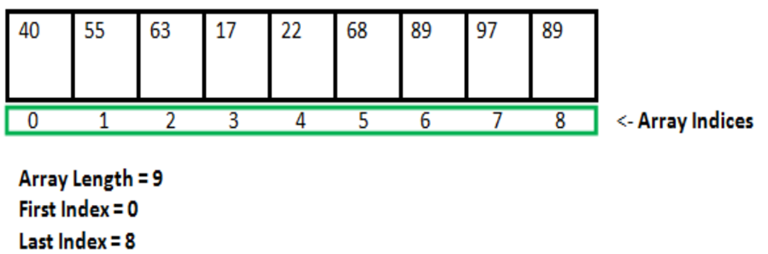

Arrays in Java  
An array in Java is a group of like-typed variables referred to by a common name. Following are some important points about Java arrays. 
 * In Java, all arrays are dynamically allocated. (discussed below)
 * Since arrays are objects in Java, we can find their length using the object property length. This is different from C/C++, where we find length using sizeof.
 * A Java array variable can also be declared like other variables with [] after the data type.
 * The variables in the array are ordered, and each has an index beginning from 0.
 * Java array can be also be used as a static field, a local variable, or a method parameter.
 * The size of an array must be specified by int or short value and not long.
 * The direct superclass of an array type is Object.
 * Every array type implements the interfaces Cloneable and java.io.Serializable.  

An array can contain primitives (int, char, etc.) and object (or non-primitive) references of a class depending on the definition of the array.



**Creating, Initializing, and Accessing an Array**  
**One-Dimensional Arrays:**   
The general form of a one-dimensional array declaration is   
type var-name[];  
OR  
type[] var-name;  
An array declaration has two components: the type and the name. type declares the element type of the array. 
The element type determines the data type of each element that comprises the array. 
Like an array of integers, we can also create an array of other primitive data types like char, float, double, 
etc., or user-defined data types (objects of a class). Thus, the element type for the array determines what 
type of data the array will hold.   
**Example:**  
// both are valid declarations  
int intArray[];   
or int[] intArray;   

Although the first declaration establishes that intArray is an array variable, no actual array exists. 
It merely tells the compiler that this variable (intArray) will hold an array of the integer type. 
To link intArray with an actual, physical array of integers, you must allocate one using new and assign 
it to intArray.

**Instantiating an Array in Java**  
When an array is declared, only a reference of an array is created. To create or give memory to the array, 
you create an array like this: The general form of new as it applies to one-dimensional arrays appears as 
follows:   
`var-name = new type [size];`

Here, type specifies the type of data being allocated, size determines the number of elements in the array, 
and var-name is the name of the array variable that is linked to the array. To use new to allocate an array, 
**you must specify the type and number of elements to allocate**.

Example:   
**int intArray[];    //declaring array  
intArray = new int[20];  // allocating memory to array  
OR   
int[] intArray = new int[20]; // combining both statements in one**  


The elements in the array allocated by new will automatically be initialized to zero (for numeric types), 
false (for boolean), or null (for reference types, which are described in a later chapter)  
**Accessing Java Array Elements using for Loop**  
Each element in the array is accessed via its index. The index begins with 0 and ends at (total array size)-1. 
All the elements of array can be accessed using Java for Loop.  
 ```java
 // accessing the elements of the specified array  
    for (int i = 0; i < arr.length; i++)  
      System.out.println("Element at index " + i + " : "+ arr[i]);  
```
Example:
```java
// Java program to illustrate creating an array
	// of integers, puts some values in the array,
	// and prints each value to standard output.

	class GFG
	{
		public static void main (String[] args)
		{		
		// declares an Array of integers.
		int[] arr;
			
		// allocating memory for 5 integers.
		arr = new int[5];
			
		// initialize the first elements of the array
		arr[0] = 10;
			
		// initialize the second elements of the array
		arr[1] = 20;
			
		//so on...
		arr[2] = 30;
		arr[3] = 40;
		arr[4] = 50;
			
		// accessing the elements of the specified array
		for (int i = 0; i < arr.length; i++)
			System.out.println("Element at index " + i +
										" : "+ arr[i]);		
		}
	}
Output
Element at index 0 : 10
Element at index 1 : 20
Element at index 2 : 30
Element at index 3 : 40
Element at index 4 : 50

```
What happens if we try to access elements outside the array size?  
JVM throws **ArrayIndexOutOfBoundsException** to indicate that the array has been accessed with an illegal index. 
The index is either negative or greater than or equal to the size of an array.

Multidimensional Arrays  
Multidimensional arrays are arrays of arrays with each element of the array holding the reference of other arrays. These are also known as Jagged Arrays. A multidimensional array is created by appending one set of square brackets ([]) per dimension.   
Examples:   
int[][] intArray = new int[10][20]; //a 2D array or matrix  
int[][][] intArray = new int[10][20][10]; //a 3D array  
**Class Objects for Arrays**  
Every array has an associated Class object, shared with all other arrays with the same component type.   

```java
// Java program to demonstrate
	// Class Objects for Arrays

	class Test
	{
		public static void main(String args[])
		{
			int intArray[] = new int[3];
			byte byteArray[] = new byte[3];
			short shortsArray[] = new short[3];
			
			// array of Strings
			String[] strArray = new String[3];
			
			System.out.println(intArray.getClass());
			System.out.println(intArray.getClass().getSuperclass());
			System.out.println(byteArray.getClass());
			System.out.println(shortsArray.getClass());
			System.out.println(strArray.getClass());
		}
	}

Output
class [I
class java.lang.Object
class [B
class [S
class [Ljava.lang.String;

```
Explanation: 
1.	The string “[I” is the run-time type signature for the class object “array with component type int.”
2.	The only direct superclass of an array type is java.lang.Object.
3.	The string “[B” is the run-time type signature for the class object “array with component type byte.”
4.	The string “[S” is the run-time type signature for the class object “array with component type short.”
5.	The string “[L” is the run-time type signature for the class object “array with component type of a Class.” The Class name is then followed.

**Array Members**  
Now, as you know that arrays are objects of a class, and a direct superclass of arrays is a class Object. The members of an array type are all of the following:
 * The public final field length, which contains the number of components of the array. Length may be positive or zero.
 * All the members inherited from class Object; the only method of Object that is not inherited is its clone method.
 * The public method clone(), which overrides the clone method in class Object and throws no checked exceptions.

In Java, you can clone arrays using the clone() method. The clone() method creates a shallow copy of the array, meaning it copies the elements of the array itself, but not any objects that the array references (if it's an array of objects). Here's how you can do it:
Cloning a Primitive Array

For an array of primitives, the clone() method works as expected:

```java

public class Main {
public static void main(String[] args) {
int[] originalArray = {1, 2, 3, 4, 5};
int[] clonedArray = originalArray.clone();

        // Print both arrays to verify the clone
        System.out.println("Original array: " + java.util.Arrays.toString(originalArray));
        System.out.println("Cloned array: " + java.util.Arrays.toString(clonedArray));
    }
}
```
Cloning an Array of Objects

For an array of objects, the clone() method creates a shallow copy. If the objects themselves are mutable, changes to the objects in the cloned array will affect the objects in the original array.

Here's an example with an array of objects:

```java

class Person {
String name;

    Person(String name) {
        this.name = name;
    }

    @Override
    public String toString() {
        return name;
    }
}

public class Main {
public static void main(String[] args) {
Person[] originalArray = {new Person("Alice"), new Person("Bob"), new Person("Charlie")};
Person[] clonedArray = originalArray.clone();

        // Print both arrays to verify the clone
        System.out.println("Original array: " + java.util.Arrays.toString(originalArray));
        System.out.println("Cloned array: " + java.util.Arrays.toString(clonedArray));

        // Modify an object in the cloned array
        clonedArray[0].name = "Alicia";

        // Print both arrays to show that the change affects both
        System.out.println("After modifying cloned array:");
        System.out.println("Original array: " + java.util.Arrays.toString(originalArray));
        System.out.println("Cloned array: " + java.util.Arrays.toString(clonedArray));
    }
}
```

Deep Cloning an Array of Objects

If you need a deep copy (where the objects themselves are also cloned), you'll need to manually clone each object:

```java

class Person implements Cloneable {
String name;

    Person(String name) {
        this.name = name;
    }

    @Override
    protected Person clone() throws CloneNotSupportedException {
        return (Person) super.clone();
    }

    @Override
    public String toString() {
        return name;
    }
}

public class Main {
public static void main(String[] args) {
try {
Person[] originalArray = {new Person("Alice"), new Person("Bob"), new Person("Charlie")};
Person[] clonedArray = new Person[originalArray.length];

            // Clone each object individually
            for (int i = 0; i < originalArray.length; i++) {
                clonedArray[i] = originalArray[i].clone();
            }

            // Print both arrays to verify the clone
            System.out.println("Original array: " + java.util.Arrays.toString(originalArray));
            System.out.println("Cloned array: " + java.util.Arrays.toString(clonedArray));

            // Modify an object in the cloned array
            clonedArray[0].name = "Alicia";

            // Print both arrays to show that the change does not affect the original array
            System.out.println("After modifying cloned array:");
            System.out.println("Original array: " + java.util.Arrays.toString(originalArray));
            System.out.println("Cloned array: " + java.util.Arrays.toString(clonedArray));
        } catch (CloneNotSupportedException e) {
            e.printStackTrace();
        }
    }
}
```

In this example, the Person class implements Cloneable, and the clone() method is overridden to provide a proper clone of each Person object. This way, modifying an object in the cloned array does not affect the original array.

