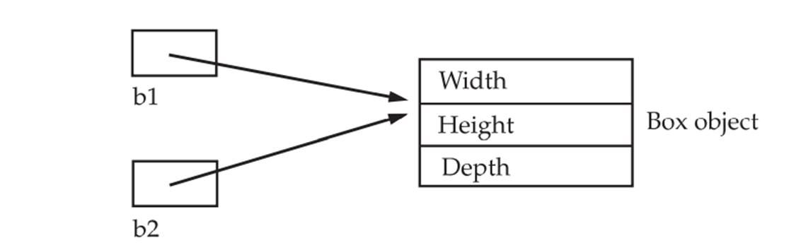
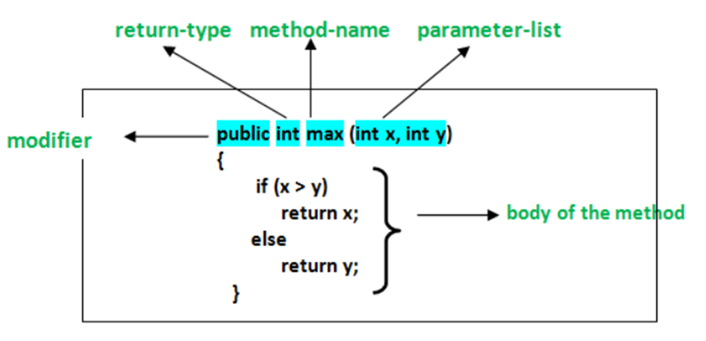

## Class Fundamentals

Class is a template/BluePrint for an object, and an object is an instance of a class. Because an object is an instance of a class, you will often see the two words object and instance used interchangeably.
The General Form of a Class
A class is declared by use of the class keyword. A simplified general form of a class definition is shown here:

A Java class is like a blueprint for creating objects. It defines the properties and behaviors that the objects created from it will have. Think of it like a recipe: the class specifies what ingredients (variables) and steps (methods) are needed to create a particular dish (object).  

```java
class ClassName { 
 type instance-variable1; 
 type instance-variable2;
 ... 
 type instance-variableN; 
type methodname1(parameter-list) { 
// body of method 
} 
type methodname2(parameter-list) { 
// body of method
 } 
 ... 
type methodnameN(parameter-list) { 
// body of method 
 }
}
```

The data, or variables, defined within a class are called instance variables. The code is contained within methods. Collectively, the methods and variables defined within a class are called members of the class.  

Variables defined within a class are called instance variables because each instance of the class (that is, each object of the class) contains its own copy of these variables. Thus, the data for one object is separate and unique from the data for another.  

All methods have the same general form as main( ), which we have been using thus far. However, most methods will not be specified as static or public. Notice that the general form of a class does not specify a main( ) method. Java classes do not need to have a main( ) method. You only specify one if that class is the starting point for your program. Further, some kinds of Java applications, such as applets, don’t require a main( ) method at all.  

**A simple Class**

Let’s begin our study of the class with a simple example. Here is a class called Box that defines three instance variables: width, height, and depth. Currently, Box does not contain any methods (but some will be added soon). 

```java
class Box { 
 double width; 
 double height; 
 double depth;
}
```
As stated, a class defines a new type of data. In this case, the new data type is called Box. You will use this name to declare objects of type Box. It is important to remember that a class declaration only creates a template; it does not create an actual object. Thus, the preceding code does not cause any objects of type Box to come into existence.
To actually create a Box object, you will use a statement like the following:


` Box mybox = new Box(); // create a Box object called mybox `

After this statement executes, mybox will be an instance of Box. As mentioned earlier, each time you create an instance of a class, you are creating an object that contains its own copy of each instance variable defined by the class. Thus, every Box object will contain its own copies of the instance variables width, height, and depth. To access these variables, you will use the dot (.) operator.
Here is a complete program that uses the Box class:

```java
/*
 * A program that uses the Box class. Call this file BoxDemo.java
 */
class Box {
	double width;
	double height;
	double depth;
}

//This class declares an object of type Box.
class BoxDemo {
	public static void main(String args[]) {
		Box mybox = new Box();
		double vol;
// assign values to mybox's instance variables
		mybox.width = 10;
		mybox.height = 20;
		mybox.depth = 15;
// compute volume of box
		vol = mybox.width * mybox.height * mybox.depth;
		System.out.println("Volume is " + vol);
	}
}

To run this program, you must execute BoxDemo.class. When you do, you will see the following output: 
Volume is 3000.0
```
Declaring Objects:

As just explained, when you create a class, you are creating a new data type. You can use this type to declare objects of that type. However, obtaining objects of a class is a two-step process. First, you must declare a variable of the class type. This variable does not define an object. Instead, it is simply a variable that can refer to an object. Second, you must acquire an actual, physical copy of the object and assign it to that variable. You can do this using the new operator. The new operator dynamically allocates (that is, allocates at run time) memory for an object and returns a reference to it. This reference is, more or less, the address in memory of the object allocated by new. This reference is then stored in the variable. Thus, in Java, all class objects must be dynamically allocated. Let’s look at the details of this procedure.  

In the preceding sample programs, a line similar to the following is used to declare an object of type Box:  

Box mybox = new Box();  

This statement combines the two steps just described. It can be rewritten like this to show each step more clearly:  
 Box mybox; // declare reference to object  
 mybox = new Box(); // allocate a Box object  

A Closer Look at new As just explained, the new operator dynamically allocates memory for an object.  
It has this general form:  
class-var = new classname ( );


The class name followed by parentheses specifies the constructor for the class. A constructor defines what occurs when an object of a class is created. Constructors are an important part of all classes and have many significant attributes. Most real-world classes explicitly define their own constructors within their class definition. However, if no explicit constructor is specified, then Java will automatically supply a default constructor. This is the case with Box. For now, we will use the default constructor.  

It is important to understand that new allocates memory for an object during run time.

Assigning Object Reference Variables:  

Object reference variables act differently than you might expect when an assignment takes place. For example, what do you think the following fragment does?  
Box b1 = new Box();  
 Box b2 = b1;   

You might think that b2 is being assigned a reference to a copy of the object referred to by b1. That is, you might think that b1 and b2 refer to separate and distinct objects. However, this would be wrong. Instead, after this fragment executes, **b1 and b2 will both refer to the same object**. The assignment of b1 to b2 did not allocate any memory or copy any part of the original object. It simply makes b2 refer to the same object as does b1. Thus, any changes made to the object through b2 will affect the object to which b1 is referring, since they are the same object. This situation is depicted here:



Although b1 and b2 both refer to the same object, they are not linked in any other way. For example, a subsequent assignment to b1 will simply unhook b1 from the original object without affecting the object or affecting b2.  
For example:  
Box b1 = new Box();   
Box b2 = b1;  
// ...  
 b1 = null;  
 Here, b1 has been set to null, but b2 still points to the original object.

### Introducing Methods 

This is the general form of a method:  
type name(parameter-list)   
{   
  // body of method   
}  
Here, type specifies the type of data returned by the method. This can be any valid type, including class types that you create. If the method does not return a value, its return type must be void. The name of the method is specified by name. This can be any legal identifier other than those already used by other items within the current scope. The parameter-list is a sequence of type and identifier pairs separated by commas. Parameters are essentially variables that receive the value of the arguments passed to the method when it is called. If the method has no parameters, then the parameter list will be empty. Methods that have a return type other than void return a value to the calling routine using the following form of the return statement: return value; Here, value is the value returned. Methods in Java allow us to reuse the code without retyping the code.

Method Declaration:  
In general, method declarations has six components:    
1.	Modifier: It defines the access type of the method i.e., from where it can be accessed in your application. In Java, there 4 types of access specifiers.   
 •	public: It is accessible in all classes in your application.  
 •	protected: It is accessible within the class in which it is defined and in its subclass/es  
 •	private: It is accessible only within the class in which it is defined.  
 •	default: It is declared/defined without using any modifier. It is accessible within the same class and package within which its class is defined.  
2.	The return type: The data type of the value returned by the method or void if does not return a value.
3.	Method Name: the rules for field names apply to method names as well, but the convention is a little different.
4.	Parameter list: Comma-separated list of the input parameters is defined, preceded with their data type, within the enclosed parenthesis. If there are no parameters, you must use empty parentheses ().
5.	Exception list: The exceptions you expect by the method can throw, you can specify these exception(s).
6.	Method body: it is enclosed between braces. The code you need to be executed to perform your intended operations.



Types of methods in Java:  
There are two types of methods in Java:  
1.	**Predefined Method**: In Java, predefined methods are the method that is already defined in the Java class libraries is known as predefined methods. It is also known as the standard library method or built-in method. We can directly use these methods just by calling them in the program at any point.   
2.	**User-defined Method**: The method written by the user or programmer is known as a user-defined method. These methods are modified according to the requirement.  
