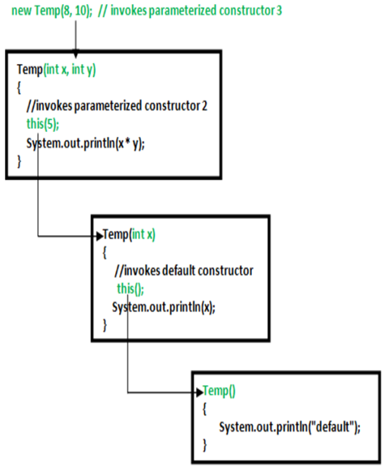
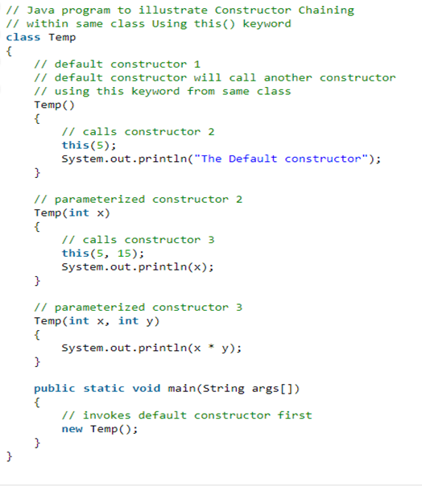

## Constructors in Java

A constructor in Java is a **special method** that is used to initialize objects. The constructor is called when an object of a class is created. It can be used to set initial values for object attributes. 
In Java, a constructor is a block of codes similar to the method. It is called when an instance of the class is created. At the time of calling the constructor, memory for the object is allocated in the memory. It is a special type of method which is used to initialize the object. Every time an object is created using the **new()** keyword, at least one constructor is called.

**Note**: It is not necessary to write a constructor for a class. It is because java compiler creates a default constructor if your class doesn’t have any.

How Constructors are Different From Methods in Java?  
* Constructors must have the same name as the class within which it is defined while it is not necessary for the method in Java.  
* Constructors do not return any type while method(s) have the return type or void if does not return any value.  
* Constructors are called only once at the time of Object creation while method(s) can be called any number of times.  

Now let us come up with the syntax for the constructor being invoked at the time of object or instance creation.

```java
class Geek
{   
  .......
  // A Constructor
  new Geek() {}
  .......
}

// We can create an object of the above class using the below statement. This statement calls above constructor.
Geek obj = new Geek(); 

```
Think of a Box. If we talk about a box class then it will have some class variables (say length, breadth, and height). But when it comes to creating its object(i.e Box will now exist in the computer’s memory), then can a box be there with no value defined for its dimensions. The answer is no. 
So constructors are used to assigning values to the class variables at the time of object creation, either explicitly done by the programmer or by Java itself (default constructor)  
When is a constructor called?

Each time an object is created using a new() keyword, at least one constructor (it could be the default constructor) is invoked to assign initial values to the data members of the same class. 
The rules for writing constructors are as follows:  
* Constructor(s) of a class must have the same name as the class name in which it resides.
* A constructor in Java cannot be abstract, final, static, or Synchronized.
* Access modifiers can be used in constructor declaration to control its access i.e., which other class can call the constructor.

Types of Constructors in java

Now is the correct time to discuss types of the constructor, so primarily there are two types of constructors in java:  
* No-argument constructor
* Parameterized Constructor

1.	**No-argument constructor**  
A constructor that has no parameter is known as the default constructor. If we don’t define a constructor in a class, then the compiler creates a default constructor(with no arguments) for the class. And if we write a constructor with arguments or no-arguments then the compiler does not create a default constructor.  
**Note**: Default constructor provides the default values to the object like 0, null, etc. depending on the type.

Example: 
```java
//Java Program to illustrate calling a no-argument constructor
import java.io.*;

class Geek {
	int num;
	String name;

	// this would be invoked while an object
	// of that class is created.
	Geek() { System.out.println("Constructor called"); }
}

class GFG {
	public static void main(String[] args)
	{
		// this would invoke default constructor.
		Geek geek1 = new Geek();
	// Default constructor provides the default
	// values to the object like 0, null
		System.out.println(geek1.name);
		System.out.println(geek1.num);
    }
}

Output
Constructor called
null
0
```
2.	**Parameterized Constructor**  
A constructor that has parameters is known as parameterized constructor. If we want to initialize fields of the class with our own values, then use a parameterized constructor.

```java
//Java Program to Illustrate Working of
//Parameterized Constructor

//Importing required inputoutput class
import java.io.*;

//Class 1
class Geek {
	// data members of the class.
	String name;
	int id;

	// Constructor would initialize data members
	// With the values of passed arguments while
	// Object of that class created
	Geek(String name, int id)
	{
		this.name = name;
		this.id = id;
	}
}

//Class 2
class GFG {
	// main driver method
	public static void main(String[] args)
	{
		// This would invoke the parameterized constructor.
		Geek geek1 = new Geek("adam", 1);
		System.out.println("GeekName :" + geek1.name
						+ " and GeekId :" + geek1.id);
	}
       }
	Output
	GeekName :adam and GeekId :1

```
**Overloading Methods:**  
In Java, it is possible to define two or more methods within the same class that share the same name, as long as their parameter declarations are different. When this is the case, the methods are said to be overloaded, and the process is referred to as method overloading. Method overloading is one of the ways that Java supports polymorphism. 

```java
//Java program to demonstrate working of method overloading in Java.

public class Sum {

	// Overloaded sum(). This sum takes two int parameters
	public int sum(int x, int y)
	{
		return (x + y);
	}

	// Overloaded sum(). This sum takes three int parameters
	public int sum(int x, int y, int z)
	{
		return (x + y + z);
	}

	// Overloaded sum(). This sum takes two double parameters
	public double sum(double x, double y)
	{
		return (x + y);
	}

	// Driver code
	public static void main(String args[])
	{
		Sum s = new Sum();
		System.out.println(s.sum(10, 20));
		System.out.println(s.sum(10, 20, 30));
		System.out.println(s.sum(10.5, 20.5));
	}
}
Output :
30
60
31.0

```

What if the exact prototype does not match with arguments.  
Ans.  
Priority wise, compiler take these steps:   
1.	Type Conversion but to higher type(in terms of range) in same family.
2.	Type conversion to next higher family(suppose if there is no long data type available for an int data type, then it will search for the float data type).

```java
class Demo {
	public void show(int x) {
		System.out.println("In int" + x);
	}

	public void show(String s) {
		System.out.println("In String" + s);
	}

	public void show(byte b) {
		System.out.println("In byte" + b);
	}
}

class UseDemo {
	public static void main(String[] args) {
		byte a = 25;
		Demo obj = new Demo();
		obj.show(a); // it will go to byte argument
		obj.show("hello"); // String
		obj.show(250); // Int
                obj.show('A'); // Since char is not available, so the datatype higher than char in           // terms of  range is int.
		obj.show("A"); // String
		obj.show(7.5); // since float datatype is not available and so it's higher
// datatype, so at this step their
// will be an error.
	}
}

```
We **cannot** overload by return type.   
We can have overloaded static methods.  
We **cannot** overload two methods in Java if they differ only by static keyword (number of parameters and types of parameters is same)  
Like other static methods, we can overload main() in Java.  
Overloading is an example of compiler time polymorphism and overriding is an example of run time polymorphism.  

**NOTE:**  
*   Only modifiers on constructors are public, default, protected and private.  
* 	If a used defines any constructor in a class then JVM will not add a default constructor.  
* 	Abstract class can contain constructor.  
* 	Default constructor access modifier is same as class modifier.  
* 	Default constructor will contain only one line of code i.e. super() that is no arg call.  
* 	In constructor call to super() must be always first statement.  
* 	Similarly call to this() in constructor must be always first statement. So we can either go with super() or this() we can’t use both on a same constructor. And we can use this() and Super() only in constructor not in methods.  
* 	Super and this are key words in java which are used to access instance members of super or current class members. We can’t use this in static area( static block or  static method)  
* 	Inheritance is not available to constructors.  

**Constructor Chaining:**   
Constructor chaining is the process of calling one constructor from another constructor with respect to current object. 
Constructor chaining can be done in two ways: 
 
* Within same class: It can be done using this() keyword for constructors in same class
* From base class: by using super() keyword to call constructor from the base class.

Constructor chaining occurs through inheritance. A sub class constructor’s task is to call super class’s constructor first. This ensures that creation of sub class’s object starts with the initialization of the data members of the super class. There could be any numbers of classes in inheritance chain. Every constructor calls up the chain till class at the top is reached.


Constructor Chaining within same class using **this()** keyword :





Output:  
75  
5  
The Default constructor  
NOTE: In above example default constructor is invoked at the end.

Rules of constructor chaining : 
1.	The this() expression should always be the first line of the constructor.
2.	There should be at-least be one constructor without the this() keyword (constructor 3 in above example).
3.	Constructor chaining can be achieved in any order.


**Constructor Chaining with super() keyword**  
If we want to call the constructor from the parent class, then we use the super keyword.
Thus when there is more than one class with the relationship of inheritance, we need to use the super keyword in the child class to call the constructor of the parent class.
We can call a constructor of the current class only with this(). For example:

```java
package com.techvidvan.constructorchaining;
class Parent {
  Parent() {
    System.out.println("Parent class default constructor");
  }
  Parent(int x) {
    System.out.println("Parent class one-argument constructor");
  }
}
class Child extends Parent {
  Child() {
    //by default the default constructor of Parent class is invoked
    System.out.println("Child class default constructor");
  }
  Child(int x) {
    super(); // default constructor of Parent class is invoked
    System.out.println("Child class one-argument constructor");
  }
}
public class SuperExample {
  public static void main(String arg[]) {
    Child obj1 = new Child();
    Child obj2 = new Child(10);
  }
}

Output:
Parent class default constructor
Child class default constructor
Parent class default constructor
Child class one-argument constructor

```