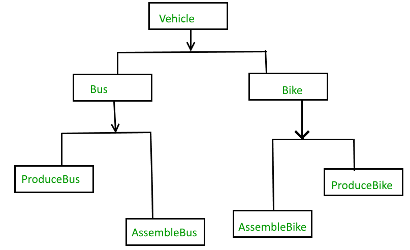

The **Bridge Design Pattern** is a structural design pattern that decouples an abstraction from its implementation, allowing the two to evolve independently. It is used to "bridge" the gap between an abstraction and its implementation, enabling flexibility and scalability.

---

### Key Concept

The Bridge pattern separates the **interface** (abstraction) from the **implementation**. The abstraction defines the high-level functionality, while the implementation handles the details. This separation makes it easier to modify or extend either side independently.

---

### Components of the Bridge Pattern

1. **Abstraction**: Defines the high-level interface for clients.
2. **Refined Abstraction**: Extends the `Abstraction` and may add additional operations.
3. **Implementor**: Defines the low-level interface for the implementation.
4. **Concrete Implementor**: Provides the concrete implementation of the `Implementor`.
5. **Client**: Interacts with the `Abstraction` without worrying about its implementation.

---

### When to Use

- You want to avoid a permanent binding between an abstraction and its implementation.
- Both the abstraction and implementation should be extensible through subclassing.
- Changes in the implementation should not impact the client code using the abstraction.
- You want to handle multiple dimensions of variation in your objects.

---

### Example

#### Scenario: Device Remote Control

You have different types of devices (TV, Radio) and different types of remotes (Basic, Advanced). The devices and remotes should be able to evolve independently.

#### Code Example

```java
// 1. Implementor
public interface Device {
    void turnOn();
    void turnOff();
    void setVolume(int volume);
}

// 2. Concrete Implementors
public class TV implements Device {
    @Override
    public void turnOn() {
        System.out.println("Turning on the TV");
    }

    @Override
    public void turnOff() {
        System.out.println("Turning off the TV");
    }

    @Override
    public void setVolume(int volume) {
        System.out.println("Setting TV volume to " + volume);
    }
}

public class Radio implements Device {
    @Override
    public void turnOn() {
        System.out.println("Turning on the Radio");
    }

    @Override
    public void turnOff() {
        System.out.println("Turning off the Radio");
    }

    @Override
    public void setVolume(int volume) {
        System.out.println("Setting Radio volume to " + volume);
    }
}

// 3. Abstraction
public abstract class RemoteControl {
    protected Device device;

    public RemoteControl(Device device) {
        this.device = device;
    }

    public abstract void turnOn();

    public abstract void turnOff();
}

// 4. Refined Abstraction
public class BasicRemote extends RemoteControl {
    public BasicRemote(Device device) {
        super(device);
    }

    @Override
    public void turnOn() {
        device.turnOn();
    }

    @Override
    public void turnOff() {
        device.turnOff();
    }
}

public class AdvancedRemote extends RemoteControl {
    public AdvancedRemote(Device device) {
        super(device);
    }

    @Override
    public void turnOn() {
        device.turnOn();
    }

    @Override
    public void turnOff() {
        device.turnOff();
    }

    public void setVolume(int volume) {
        device.setVolume(volume);
    }
}

// 5. Client
public class Client {
    public static void main(String[] args) {
        Device tv = new TV();
        RemoteControl basicRemote = new BasicRemote(tv);
        basicRemote.turnOn();
        basicRemote.turnOff();

        Device radio = new Radio();
        AdvancedRemote advancedRemote = new AdvancedRemote(radio);
        advancedRemote.turnOn();
        advancedRemote.setVolume(10);
        advancedRemote.turnOff();
    }
}
```

---

### Output

```
Turning on the TV
Turning off the TV
Turning on the Radio
Setting Radio volume to 10
Turning off the Radio
```

---

### Advantages

1. **Decouples Abstraction and Implementation**: Changes to one do not affect the other.
2. **Extensibility**: Easily add new abstractions or implementations without affecting existing code.
3. **Follows Single Responsibility Principle**: Separation of concerns between abstraction and implementation.

---

### Disadvantages

1. **Increased Complexity**: Adding layers of abstraction can make the code harder to understand.
2. **Overhead**: Introduces additional levels of indirection, which can increase runtime complexity.

---

### Real-World Examples

1. **JDBC Drivers**: The JDBC API is the abstraction, and database-specific drivers act as the implementations.
2. **GUI Frameworks**: Abstract components like buttons and their platform-specific implementations (Windows, Mac).
3. **Cross-Platform Systems**: Applications designed to work on different operating systems use a bridge to separate functionality from platform-specific code.

---

Without Bridge Design Pattern



With bridge design pattern
![[Image-3.4.2.png]]