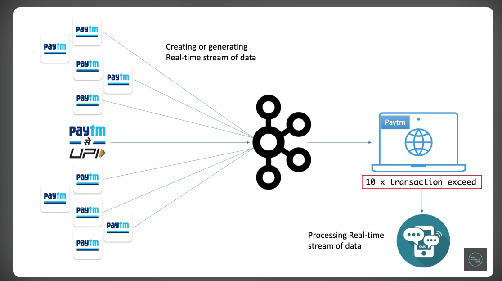
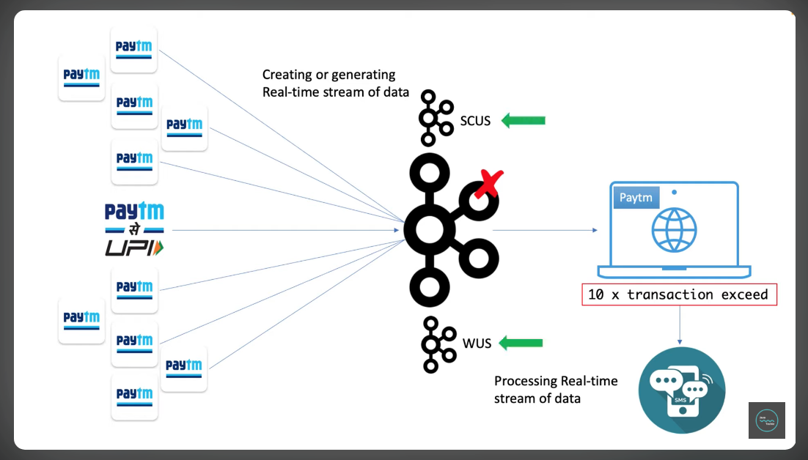
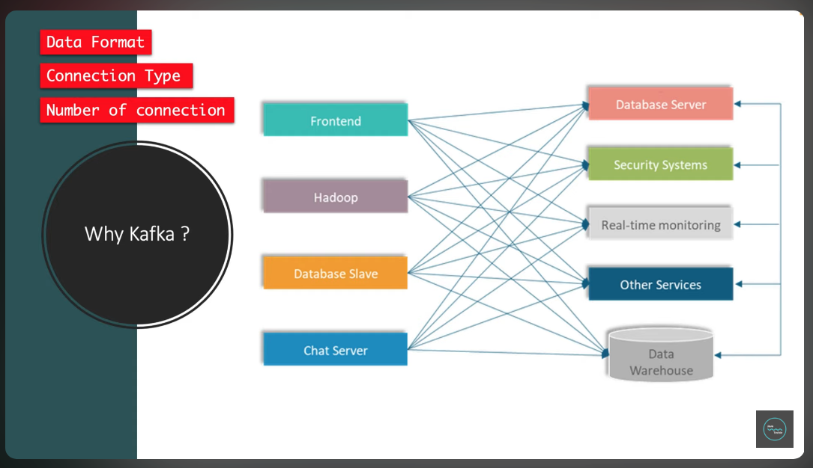
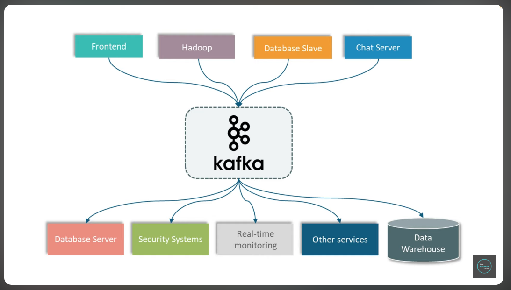

### What is Kafka?
Apache Kafka is an open-source **distributed event streaming platform** that facilitates real-time data processing. It enables applications to send and receive messages seamlessly, acting as a middleman to prevent data loss. Kafka's architecture supports a publish-subscribe model, allowing multiple applications to communicate efficiently while reducing connection complexities.

Understanding **event streaming** involves creating and processing real-time data streams. This is essential for applications that require instant data handling and analysis.
Kafka is called event streaming because it enables the continuous flow of events (data) in real time, allowing producers to send events and consumers to process them as they occur. It handles the storage, processing, and retrieval of these events efficiently in a distributed manner.

Consider the example of any Payment application.

Distributed  System

Kafka is called distributed because it operates as a cluster of brokers, spreading data across multiple servers for fault tolerance and scalability. This allows producers, consumers, and partitions to handle high-throughput messaging efficiently, even under heavy workloads.
As kafka is distribute  if in case any server goes down then any other server comes up to avoid the down time which increases the through put.

### Where does kafka comes from?

Kafka originated at LinkedIn in 2010, where it was developed to address the need for a reliable, scalable, and distributed messaging system. It was designed to handle large-scale event data, such as tracking user activity and operational metrics in real-time. The project was later open-sourced under the Apache Software Foundation, evolving into a widely used event streaming platform. Its name was inspired by the author Franz Kafka, reflecting the system's complexity and distributed nature.

Currently, Kafka is managed by the **Apache Software Foundation (ASF)** as an open-source project. It is actively maintained and developed by a global community of contributors under the ASF's governance. Additionally, **Confluent**, a company founded by the original creators of Kafka, provides enterprise support and extended features for Kafka users.

### Why do we need Kafka?

Let's consider the example of parcel delivery. I have a parcel addressed to me, and the postman comes to deliver it to my home. Unfortunately, I am not at home when he arrives, so he has to return the parcel. The postman tries delivering it two or three more times, but I am still unavailable. Eventually, he returns the parcel to the main office, and I lose the parcel. This could be critical information or an important package for me, but it's lost because there was no way to receive it while I was away.

To overcome this issue, I could install a **letterbox** near my door. Whenever I am not at home, the postman can leave the parcel in the letterbox, ensuring I can collect it later. In this scenario, the **letterbox acts as an intermediary** between the postman and me, ensuring no parcels are lost.

Now, let's relate this to a real-time system. Suppose we have two applications: **App1** and **App2**. If App1 wants to send data to App2 but App2 is unavailable (offline or not ready to receive), the data is lost—similar to how the parcel was lost when the postman couldn’t deliver it.

This is where **Kafka** comes into the picture. Kafka acts as a **letterbox** between the two applications. App1 can send data to Kafka, which stores it temporarily. When App2 becomes available, Kafka delivers the data to App2. This ensures no data is lost, even if one of the applications is unavailable at the time of delivery.

The need for a messaging system arises when applications must communicate reliably without losing data during downtime. Kafka fulfils this role effectively by storing messages until they can be retrieved.
In scenarios with multiple applications, managing numerous connections can become complex. Kafka simplifies communication and helps in handling diverse data formats from different applications smoothly.
As applications grow, challenges such as varying data formats and connection types can emerge. Kafka provides a robust solution to mitigate these issues and maintain efficient data flow.

Kafka centralizes message handling, decreasing the number of connections significantly compared to previous methods, which optimized resource usage and improved performance.
The Pub/Sub model in Kafka involves three main components: publisher, subscriber, and message broker, facilitating organized message distribution and retrieval.

