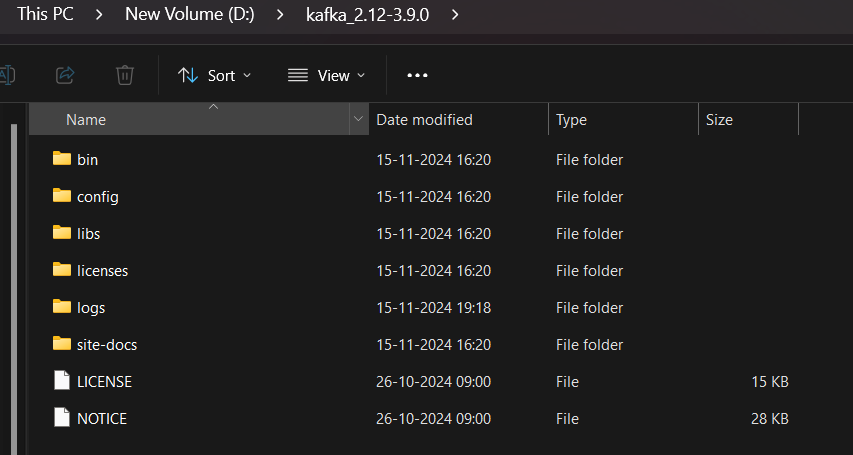

### **Prerequisites**

1. **Java**:  
    Kafka requires Java 8 or higher. Verify Java is installed:
    - If not installed, download and install the JDK from [Oracle](https://www.oracle.com/java/technologies/javase-downloads.html) or OpenJDK.
    
- **Download Kafka**:
	 1. Get the latest Kafka binary package from [https://kafka.apache.org/downloads](https://kafka.apache.org/downloads). Ensure the version is 2.8 or later (KRaft is fully supported in version 3.0 and beyond).

Extract the kafka Zip and follow the steps as shown below

### Steps for setting Kafka with Kraft

#### Generate the cluster ID

#### Set the Cluster ID generated above

#### To format log directories 
kafka-storage.bat format -t %KAFKA_CLUSTER_ID% -c ../../config/kraft/server.properties

Start the Kafka Server
To start kafka server kafka-server-start.bat ../../config/kraft/server.properties

#### Create topic 
kafka-topics.bat --create --topic first-kraft-topic --bootstrap-server localhost:9092

#### Produce the messages on topic 
`kafka-console-producer.bat --topic first-kraft-topic --bootstrap-server localhost:9092`
#### Consume the message on topic 

`kafka-console-consumer.bat --topic first-kraft-topic --from-beginning --bootstrap-server localhost:9092`