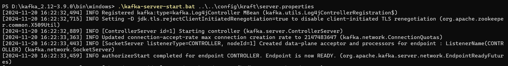
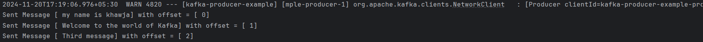
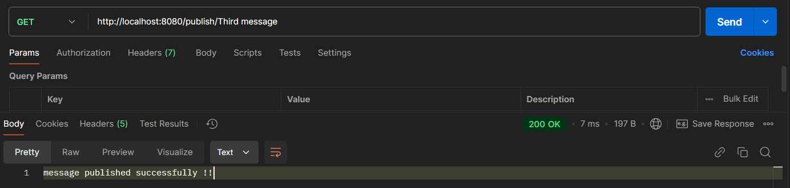
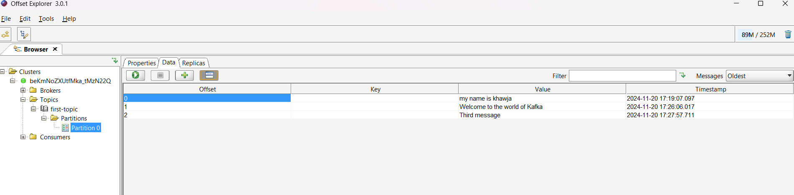

### Steps to make a kafka Producer.

1. Start the kafka with Kraft.
   
	 `.\kafka-server-start.bat ..\..\config\kraft\server.properties`
	
2. Update application properties with required Serialization properties 
```properties
spring.application.name=kafka-producer-example  
  
spring.kafka.bootstrap-servers=localhost:9092  
spring.kafka.consumer.group-id=my-kraft-group  
spring.kafka.consumer.auto-offset-reset=earliest  
  
  
spring.kafka.producer.key-serializer=org.apache.kafka.common.serialization.StringSerializer  
spring.kafka.producer.value-serializer=org.apache.kafka.common.serialization.StringSerializer  
spring.kafka.consumer.key-deserializer=org.apache.kafka.common.serialization.StringDeserializer  
spring.kafka.consumer.value-deserializer=org.apache.kafka.common.serialization.StringDeserializer
```


1. Design a service to produce a message.
   Add the web and Kafka dependency to the Spring Project
   
   ```java
   package com.khwaja.services;  
  
import org.springframework.beans.factory.annotation.Autowired;  
import org.springframework.kafka.core.KafkaTemplate;  
import org.springframework.kafka.support.SendResult;  
import org.springframework.stereotype.Service;  
  
import java.util.concurrent.CompletableFuture;  
  
@Service  
public class KafkaMessagePublisher {  
  
    private KafkaTemplate<String,Object> kafkaTemplate;  
  
    @Autowired  
    public KafkaMessagePublisher(KafkaTemplate<String,Object> kafkaTemplate){  
        this.kafkaTemplate = kafkaTemplate;  
    }  
  
    public void sendMessageToTopic(String message){  
        CompletableFuture<SendResult<String, Object>> feature = kafkaTemplate.send("first-topic", message);  
        feature.whenComplete(((result, throwable) -> {  
            if (throwable == null){  
                System.out.println("Sent Message [ "+message + "] with offset = [ "+  
                        result.getRecordMetadata().offset() + "]" );  
            }else {  
                System.out.println("Unable to send Message [ "+message + "] due to "+  
                        throwable.getMessage() );  
            }  
        }));  
  
    }  
  
 }
```
   
2. Design a controller that invokes the kafka publish service.
   
   ```java
   package com.khwaja.controller;  
  
import com.khwaja.services.KafkaMessagePublisher;  
import org.springframework.beans.factory.annotation.Autowired;  
import org.springframework.http.HttpStatus;  
import org.springframework.http.ResponseEntity;  
import org.springframework.web.bind.annotation.GetMapping;  
import org.springframework.web.bind.annotation.PathVariable;  
import org.springframework.web.bind.annotation.RestController;  
  
@RestController  
public class EvenPublisher {  
  
    private KafkaMessagePublisher messagePublisher;  
  
    @Autowired  
    public EvenPublisher(KafkaMessagePublisher kafkaMessagePublisher){  
        this.messagePublisher = kafkaMessagePublisher;  
    }  
  
    @GetMapping("/publish/{message}")  
    public ResponseEntity<?> publishResponse(@PathVariable String message){  
  
        try {  
            messagePublisher.sendMessageToTopic(message);  
            return ResponseEntity.ok("message published successfully !!");  
        } catch (Exception e) {  
            return ResponseEntity.status(HttpStatus.INTERNAL_SERVER_ERROR).build();  
        }  
    }  
}
```
3. Hit the URL with required message
   
   
   
   
   
    
    After publishing few messages we can check the details of the message stored Partion and Offset Value with Offset Explorer tool as shown below
	
	

	The default configuration applied by creating a topic by Spring is as shown below:
	
	 `Topic: first-topic      TopicId: qzJfP8KTQESDFk2rmsFaAw PartitionCount: 1       ReplicationFactor: 1    Configs: segment.bytes=1073741824`
    `Topic: first-topic      Partition: 0    Leader: 1       Replicas: 1     Isr: 1  Elr:    LastKnownElr:`
 If we need to create a topic with custom configuration please use below command
 
 `bin/kafka-topics.bat --bootstrap-server localhost:9092 --create --topic NewTopic --partitions 3 --replication-factor 1`


Make the modification in the KafkaPublisher to send multiple message which has a chance to send message to different partition even this can't be guaranteed.

```java
@GetMapping("/publish/{message}")  
public ResponseEntity<?> publishResponse(@PathVariable String message){  
  
    try {  
        for (int i = 0; i < 1000; i++) {  
            messagePublisher.sendMessageToTopic(message);  
        }  
        return ResponseEntity.ok("message published successfully !!");  
    } catch (Exception e) {  
        return ResponseEntity.status(HttpStatus.INTERNAL_SERVER_ERROR).build();  
    }  
}
```

This sends the same message to the multiple partition with their respective offset values.
