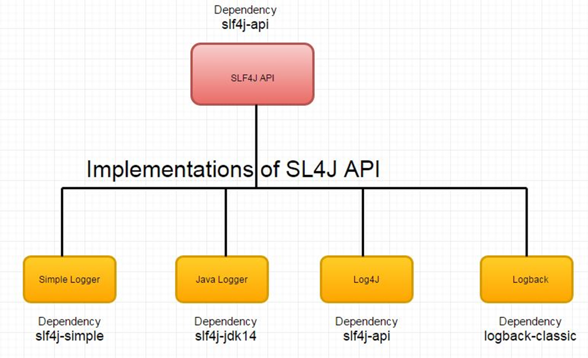

## **SL4J (Simple Logging Façade for Java)**

SLF4J provides an abstract logging API, allowing the end-user to plug-in the desired logging framework,  be it logback-classic, log4j, or java.util.logging, at deployment time. SLF4J is only a facade, meaning that it does not provide a complete logging solution. It provides a common interface for various Java loggers. So it is used with actual loggers which actually log the events. Examples of such loggers are Logback, Apache Commons Logging, JDK 1.4 Logging or Log4j. Simple Logging Facade for Java (SLF4J) is an abstraction of different logging frameworks (eg. log4j, java.util.logging, commons logging etc.). This gives the developer an opportunity to plug-in desired logging framework according to the requirement at deployment time without changing the code.




In logging frameworks like Log4j, SLF4J, and Logback, Appenders play a crucial role in determining where and how log messages are stored or displayed. Here's a detailed explanation:

### What is an Appender?

An Appender is a component of a logging framework responsible for directing log messages to a specific output destination. This could be:

- A console
- A file
- A database
- A remote server
- Or any other custom-defined location
  
  
### **How Logging Works with Appenders**

1. **Logger Generates Messages**:
    
    - The **Logger** is responsible for creating log messages, which have a specific log level (e.g., `INFO`, `DEBUG`, `ERROR`).
    - Example:
      
	```java
	Logger logger = LogManager.getLogger(MyClass.class);
	logger.info("This is an info message");
	```
2. **Log Messages Flow to Appenders**:
    
    - Log messages are passed to the configured **Appenders**.
    - The Appender determines the destination for the log message based on its configuration.
3. **Appenders Format and Write Messages**:
    
    - Before writing the log message, an Appender may use a **Layout** to format it.
    - For example, a `PatternLayout` might format the log message to include timestamps and other metadata.
4. **Filters (Optional)**:
    
    - Filters can be used in conjunction with Appenders to include or exclude specific log messages.

### **Log Levels and Their Priorities in Logging Frameworks**

In logging frameworks like **Log4j**, **Logback**, or **SLF4J**, log levels represent the severity of a log message. Each log level has a priority, and only log messages at or above the configured level are printed. Below are the common log levels, their priorities, and when to use them.

---

### **Log Levels (Ordered by Priority)**

|**Priority**|**Log Level**|**Description**|**When to Use**|
|---|---|---|---|
|**1**|**OFF**|Disables all logging.|Use when logging is explicitly disabled (rarely used in practice).|
|**2**|**FATAL**|Indicates a critical error that causes the application to crash or stop.|Use for unrecoverable errors, such as database corruption or system failure.|
|**3**|**ERROR**|Indicates a serious issue that prevents normal program execution but may not crash the application.|Use for exceptions or critical errors that require immediate attention (e.g., API call failures).|
|**4**|**WARN**|Indicates a potential issue or unexpected behavior that doesn't prevent execution but should be checked.|Use for scenarios like deprecated APIs, resource exhaustion, or retryable errors.|
|**5**|**INFO**|Provides general informational messages about the application's normal execution.|Use for startup messages, configuration details, or milestones in business logic.|
|**6**|**DEBUG**|Provides detailed diagnostic information to help debug an issue.|Use during development or troubleshooting to understand application behavior.|
|**7**|**TRACE**|Provides the most detailed information, typically showing method entry/exit and variable values.|Use for extremely fine-grained debugging, often in low-level components.|
|**8**|**ALL**|Enables all log messages.|Use when debugging and you want every possible message printed (rarely used in production).|

---

### **How Logging Works with Levels**

1. **Log Level Configuration**:
    - Each logger has a configured **log level** (e.g., `INFO`).
    - Only messages at or above the configured level are logged.
2. **Example Configuration**:
```xml
   <logger name="com.example" level="INFO" />
```
- In this case, log messages at `INFO`, `WARN`, `ERROR`, and `FATAL` levels are logged.
- Messages at `DEBUG` and `TRACE` levels are ignored.


