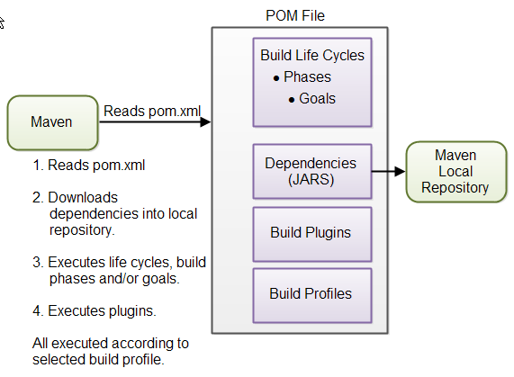

## Maven Overview - Core Concepts

Maven is centered around the concept of POM files (Project Object Model). A POM file is an XML representation of project resources like source code, test code, dependencies (external JARs used) etc. The POM contains references to all of these resources. The POM file should be located in the root directory of the project it belongs to.

Here is a diagram illustrating how Maven uses the POM file, and what the POM file primarily contains:

### Overview of Maven Core Concepts

#### **1. POM Files**
When you execute a Maven command, Maven uses a POM file to understand the project configuration and execute the command on the resources described within it.

#### **2. Build Life Cycles, Phases, and Goals**
The build process in Maven is split up into build life cycles, phases and goals. A build life cycle consists of a sequence of build phases, and each build phase consists of a sequence of goals. When you run Maven you pass a command to Maven. This command is the name of a build life cycle, phase or goal. If a life cycle is requested executed, all build phases in that life cycle are executed. If a build phase is requested executed, all build phases before it in the pre-defined sequence of build phases are executed too.

#### **3. Dependencies and Repositories**
One of the first goals Maven executes is to check the dependencies needed by your project. Dependencies are external JAR files (Java libraries) that your project uses. If the dependencies are not found in the local Maven repository, Maven downloads them from a central Maven repository and puts them in your local repository. The local repository is just a directory on your computer's hard disk. You can specify where the local repository should be located if you want to (I do). You can also specify which remote repository to use for downloading dependencies. All this will be explained in more detail later in this tutorial.

#### **4. Build Plugins**
Build plugins are used to insert extra goals into a build phase. If you need to perform a set of actions for your project which are not covered by the standard Maven build phases and goals, you can add a plugin to the POM file. Maven has some standard plugins you can use, and you can also implement your own in Java if you need to.

#### **5. Build Profiles**
Build profiles are used if you need to build your project in different ways. For instance, you may need to build your project for your local computer, for development and test. And you may need to build it for deployment on your production environment. These two builds may be different. To enable different builds you can add different build profiles to your POM files. When executing Maven you can tell which build profile to use.

