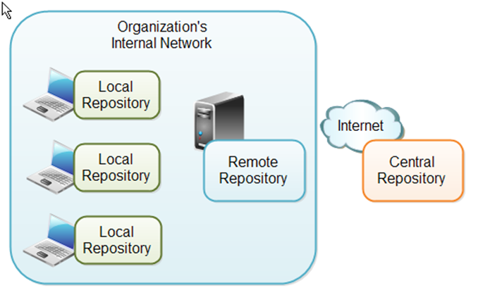
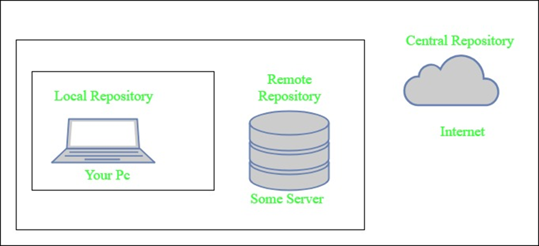

# Maven Dependencies and Repositories

In Maven, dependencies and repositories are fundamental concepts that streamline project management and ensure efficient handling of external libraries and resources.

---

## **1. Maven Dependencies**

### **What Are Dependencies?**
Dependencies are external libraries or JAR files required by a project to compile, run, or test the application. Maven automates the process of managing these dependencies by:
- Downloading them from remote repositories.
- Storing them in a local repository.
- Resolving and including transitive dependencies.

### **Declaring Dependencies in POM**
Dependencies are defined in the `pom.xml` file using the `<dependencies>` tag. Each dependency is specified with the following elements:

```xml
<dependency>
  <groupId>org.springframework</groupId>
  <artifactId>spring-core</artifactId>
  <version>5.3.10</version>
  <scope>compile</scope>
</dependency>
```

- **groupId**: The organization or project to which the dependency belongs.
- **artifactId**: The name of the library or module.
- **version**: The specific version of the library.
- **scope**: Defines the dependency's availability (e.g., `compile`, `test`, `provided`, `runtime`).

### **Dependency Scopes**
1. **compile** (default):
   - Available during all build phases.
2. **test**:
   - Available only during the `test` phase.
3. **provided**:
   - Available at compile time but not packaged (e.g., servlet APIs).
4. **runtime**:
   - Required for execution but not for compilation.

### **Transitive Dependencies**
- Maven automatically includes dependencies of your dependencies (transitive dependencies).
- Example:
  If `A` depends on `B`, and `B` depends on `C`, Maven resolves and includes both `B` and `C`.

### **Excluding Dependencies**
To exclude unwanted transitive dependencies, use the `<exclusions>` tag:

```xml
<dependency>
  <groupId>org.hibernate</groupId>
  <artifactId>hibernate-core</artifactId>
  <version>5.6.0</version>
  <exclusions>
    <exclusion>
      <groupId>org.jboss</groupId>
      <artifactId>jta</artifactId>
    </exclusion>
  </exclusions>
</dependency>
```

---

## **2. Maven Repositories**




### **What Are Repositories?**
Repositories are locations where Maven stores and retrieves dependencies. There are three types of repositories:

### **1. Local Repository**
A local repository is a directory on the developer's computer. This repository will contain all the dependencies Maven downloads. The same Maven repository is typically used for several different projects. Thus Maven only needs to download the dependencies once, even if multiple projects depends on them (e.g. Junit).

Your own projects can also be built and installed in your local repository, using the mvn install command. That way your other projects can use the packaged JAR files of your own projects as external dependencies by specifying them as external dependencies inside their Maven POM files.

By default Maven puts your local repository inside your user home directory on your local computer. However, you can change the location of the local repository by setting the directory inside your Maven settings file. Your Maven settings file is also located in your user-home/.m2 directory and is called settings.xml. Here is how you specify another location for your local repository:
- Stored on your local machine (default location: `~/.m2/repository`).
- Dependencies downloaded from remote repositories are cached here.

### **2. Central Repository**
The central Maven repository is a repository provided by the Maven community. By default, Maven looks in this central repository for any dependencies needed but not found in your local repository. Maven then downloads these dependencies into your local repository. You need no special configuration to access the central repository.

- Managed by the Maven community and serves as the default remote repository.
- URL: [https://repo.maven.apache.org/maven2](https://repo.maven.apache.org/maven2)

### **3. Remote Repositories**

A remote repository is a repository on a web server from which Maven can download dependencies, just like the central repository. A remote repository can be located anywhere on the internet, or inside a local network.

A remote repository is often used for hosting projects internal to your organization, which are shared by multiple projects. For instance, a common security project might be used across multiple internal projects. This security project should not be accessible to the outside world, and should thus not be hosted in the public, central Maven repository. Instead, it can be hosted in an internal remote repository.

Dependencies found in a remote repository are also downloaded and put into your local repository by Maven.

- Hosted by third parties or private organizations to store custom dependencies.
- Configured in the `pom.xml` or `settings.xml` file.

### **Configuring Repositories**
Repositories can be configured in the `pom.xml` file as follows:

```xml
<repositories>
  <repository>
    <id>custom-repo</id>
    <url>https://example.com/maven2</url>
  </repository>
</repositories>
```

### **Mirror Repositories**
To mirror all repository requests to a specific repository (e.g., a corporate repository), configure the `settings.xml` file:

```xml
<mirrors>
  <mirror>
    <id>central-mirror</id>
    <url>https://mirror.example.com/maven2</url>
    <mirrorOf>central</mirrorOf>
  </mirror>
</mirrors>
```




---

## **3. Dependency Resolution Workflow**
1. **Check Local Repository**:
   - Maven first checks if the dependency exists in the local repository.
2. **Fetch from Remote Repositories**:
   - If not found locally, Maven downloads it from the remote repository (central or custom).
3. **Cache Locally**:
   - The downloaded dependency is stored in the local repository for future use.

---

## **4. Common Maven Commands for Dependencies**

### **View Dependency Tree**
```bash
mvn dependency:tree
```
Displays the complete hierarchy of dependencies, including transitive dependencies.

### **Analyze Dependencies**
```bash
mvn dependency:analyze
```
Checks for unused or missing dependencies.

### **List Dependencies**
```bash
mvn dependency:list
```
Lists all declared dependencies in the project.

### **Download Sources**
```bash
mvn dependency:sources
```
Downloads source code for dependencies.

---

