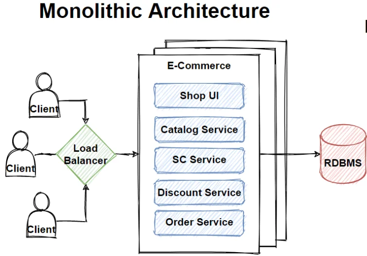

### Monolithic Architecture

#### 1. **Definition**

Monolithic architecture is a software design approach where all components of an application (UI, business logic, and data access) are combined into a single, self-contained unit. The application runs as one executable or deployment package.

---

#### 2. **Characteristics**

- **Single Codebase**: All modules share a single code repository.
- **Unified Deployment**: The entire application is packaged and deployed as a single unit.
- **Tight Coupling**: Components are interconnected, meaning changes in one module may affect others.
- **Centralized Data Management**: Typically uses a single database.

---

#### 3. **Advantages**

1. **Simplicity in Development**:
    
    - Developers work in a single codebase without worrying about distributed systems.
    - Easier to debug and test due to centralization.
2. **Straightforward Deployment**:
    
    - A single deployment unit simplifies the deployment process.
3. **Performance**:
    
    - Direct communication between components without network latency.
4. **Ease of Onboarding**:
    
    - New team members can quickly understand the application since it’s centralized.

---

#### 4. **Disadvantages**

1. **Scalability Issues**:
    
    - Scaling requires replicating the entire application, even if only one module needs more resources.
2. **Maintenance Challenges**:
    
    - As the application grows, the codebase becomes harder to manage and maintain.
    - Updates or bug fixes risk impacting the entire application.
3. **Deployment Bottlenecks**:
    
    - Small changes necessitate redeploying the entire application, leading to downtime.
4. **Technology Lock-in**:
    
    - Difficult to adopt new technologies as all modules are tightly integrated.
5. **Limited Fault Isolation**:
    
    - A failure in one component can bring down the entire application.

---

#### 5. **Use Cases**

Monolithic architecture is suitable for:

- **Small to Medium Applications**:
    - Startups or projects with limited scope and a small team.
- **Tightly Coupled Business Processes**:
    - Where all functionalities are interconnected.
- **Prototyping**:
    - Quickly developing a proof-of-concept application.

---

#### 6. **Example**

**E-commerce Application in a Monolith**:

- **Single Unit**:
    - User Interface (UI)
    - Order Processing
    - Inventory Management
    - Payment Processing
- **Single Database**:
    - All data for users, products, and orders is stored in a single relational database.

In such an application:

- A code change in the payment processing module could require the entire application to be redeployed.
- Scaling the order processing would mean scaling the entire system, leading to inefficient resource utilization.

---

#### 7. **Transitioning from Monolithic to Modern Architectures**

Monolithic systems often **become difficult to manage as businesses grow**. A common evolution is moving to **microservices architecture**, where each module (e.g., payment processing, inventory) is an independent service.

Would you like to explore **how to transition from monolith to microservices**, or dive deeper into real-world examples of monolithic systems?