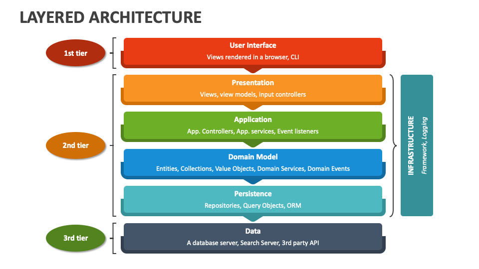

### Layered Architecture (N-Tier Architecture)

#### 1. **Definition**

Layered architecture organizes an application into distinct layers, each with a specific responsibility. These layers communicate with one another in a defined sequence, promoting separation of concerns and modularity.

---

#### 2. **Typical Layers**

1. **Presentation Layer (UI Layer)**:

    - Handles user interface and interaction.
    - Communicates with the business layer to fetch and display data.
2. **Business Logic Layer**:
    
    - Contains the core logic and rules of the application.
    - Processes user requests and enforces business rules.
    - Interacts with the data layer for persistence or retrieval.
3. **Data Access Layer**:
    
    - Manages database operations like CRUD (Create, Read, Update, Delete).
    - Encapsulates the logic for data access, ensuring consistency and security.
4. **Database Layer** (sometimes combined with Data Access Layer):
    
    - Stores the application's data.

---

#### 3. **Characteristics**

- **Hierarchical Communication**:
    - Layers communicate in a top-down or bottom-up manner (e.g., Presentation ↔ Business ↔ Data).
- **Loose Coupling**:
    - Each layer focuses on a specific aspect, reducing dependency.
- **Code Reusability**:
    - Logic is modular, allowing for reuse in different parts of the application.

---

#### 4. **Advantages**

1. **Separation of Concerns**:
    
    - Each layer has a well-defined responsibility, improving maintainability and readability.
2. **Scalability**:
    
    - Logical separation allows for individual scaling of layers, e.g., caching in the data layer or load balancers for the presentation layer.
3. **Ease of Testing**:
    
    - Layers can be tested independently.
4. **Modularity**:
    
    - Changes in one layer typically do not affect others, provided interfaces are maintained.
5. **Team Collaboration**:
    
    - Teams can work on different layers in parallel.

---

#### 5. **Disadvantages**

1. **Performance Overhead**:
    
    - Sequential communication between layers can lead to latency.
2. **Tight Layer Dependency**:
    
    - Layers can become tightly coupled if designed poorly, leading to a pseudo-monolithic structure.
3. **Complexity in Larger Applications**:
    
    - As the application grows, managing dependencies and logic across layers can become challenging.

---

#### 6. **Use Cases**

- **Enterprise Applications**:
    - Systems with well-defined user interaction, logic, and data storage layers.
- **Standard Web Applications**:
    - Websites or portals with clear separation of UI, logic, and database operations.
- **E-Commerce Platforms**:
    - Applications where shopping cart (business logic), product database (data layer), and user interfaces (presentation) are modularized.

---

#### 7. **Example**

**Banking Application with Layers**:

1. **Presentation Layer**:
    - Web or mobile interface where users check balances or transfer funds.
2. **Business Logic Layer**:
    - Rules like “cannot transfer more than account balance.”
3. **Data Access Layer**:
    - SQL queries or APIs to fetch and update account details in the database.
4. **Database Layer**:
    - Tables for storing user accounts, transactions, and logs.

---

#### 8. **Comparison with Monolithic Architecture**

While monolithic architecture bundles everything together, layered architecture provides logical separation within the monolith. However, it does not inherently solve issues like scaling or deployment complexities that arise in monoliths.

Would you like to explore **how layered architecture transitions into service-oriented or microservices architectures** or dive deeper into its practical implementation?