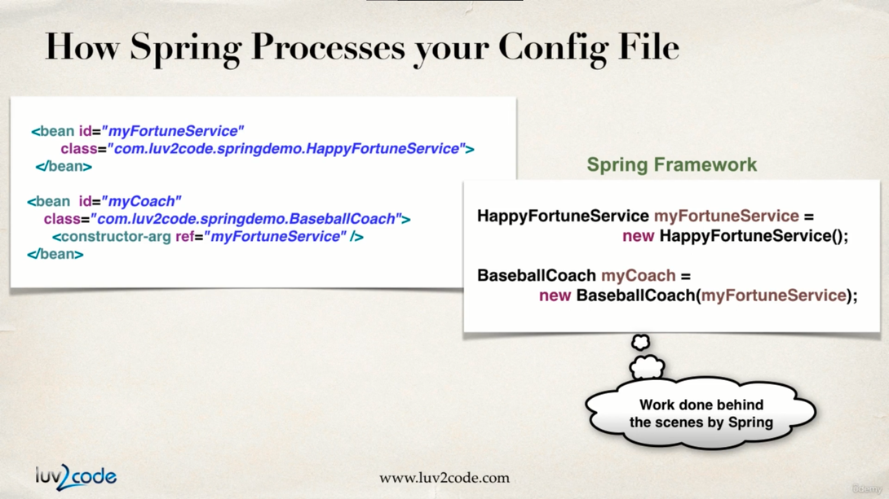

# Dependency Injection


Suppose we want a car to be specially built. So, we will talk to the mechanics at the factory about our requirement and they are the assemblers hence they will build the car and will deliver to us eventually.

Now while assembling the car the mechanic might take help from different departments for performing various tasks like putting tires, adding music system etc. This little help providers are known as service provider in spring world.


In the spring world we had a bean/object factory where with the help of config files we were able to fetch beans on demand. This bean we fetch on demand may further dependency on other helper objects for proper functioning.


So spring framework will help us fetching the object in demand plus it will create all the dependency objects by itself.

Previously we have seen the spring container’s function of creating and managing beans/objects, which is also known as *inversion of control*.

Now we will see the other job which is its ability to inject bean’s dependencies which is also known as *dependency injection*.


## Injection Types in Spring

We will cover the most used injection types in this course. Those are,

1. Constructor Injection
2. Setter Injection

We will also see “auto-wiring” in the annotations section.

### Constructor Injection

Let's look at the Development Process (constructor Injection):

1. Define the dependency Interface and class

   

2. Create a constructor in our class for injection

   

3. Configuring the dependency in the spring configuration file, consider the image below: 

   

   So, in an actual execution scenario when spring goes through our config.xml file it will invoke the constructor of `BaseBallCoach` class and with the constructor-injector-ref-token it will retrieve the object of the fortune service.

   

Consider the code below which depicts the above steps :

```xml
<!-- applicationContext.xml -->
<?xml version="1.0" encoding="UTF-8"?>
<beans xmlns="http://www.springframework.org/schema/beans"
	xmlns:xsi="http://www.w3.org/2001/XMLSchema-instance"
	xmlns:context="http://www.springframework.org/schema/context"
	xsi:schemaLocation="http://www.springframework.org/schema/beans
    http://www.springframework.org/schema/beans/spring-beans.xsd
    http://www.springframework.org/schema/context
    http://www.springframework.org/schema/context/spring-context.xsd">

	<!-- Define your beans here -->

	<bean id="myCoach" class="com.busybox.springdemo.TrackCoach">

		<!-- setup constructor injection -->
		<constructor-arg ref="myFortuneBean"></constructor-arg>
	</bean>

	<bean id="baseBallCoach"
		class="com.busybox.springdemo.BaseBallCoach">

		<!-- setup constructor injection -->
		<constructor-arg ref="myFortuneBean"></constructor-arg>
	</bean>

	<!-- dependency bean -->

	<bean id="myFortuneBean"
		class="com.busybox.springdemo.HappyFortuneService"></bean>

</beans>
```

```java
// FortuneService.java (service interface)

package com.busybox.springdemo;

public interface FortuneService {
	public String getFortune();
}

```

```java
// FortuneServiceImpl.java (service impl class)
package com.busybox.springdemo;

public class HappyFortuneService implements FortuneService {

	@Override
	public String getFortune() {
		return "today is your lucky day";
	}
}
```

```java
// BaseballCoach.java
package com.busybox.springdemo;

public class BaseBallCoach implements Coach {

	// define a private field for dependency
	private FortuneService fortuneService;

	// define a constructor for dependency injection
	public BaseBallCoach(FortuneService fortuneService) {
		this.fortuneService = fortuneService;
	}

	@Override
	public String getDailyWorkout() {
		return "spend 30 minutes in batting practice";
	}

	@Override
	public String getDailyFortune() {

		// use the fortuneService to get fortune
		return this.fortuneService.getFortune();
	}
}

```

```java
// TrackCoach.java
package com.busybox.springdemo;

public class TrackCoach implements Coach {

	private FortuneService fortuneService;

	TrackCoach(FortuneService fortuneService) {
		this.fortuneService = fortuneService;
	}

	@Override
	public String getDailyWorkout() {
		return "Run a hard 5k";
	}

	@Override
	public String getDailyFortune() {
		// TODO Auto-generated method stub
		return this.fortuneService.getFortune();
	}

}

```

```java
MyApp.java
package com.busybox.springdemo;

import org.springframework.context.support.ClassPathXmlApplicationContext;

public class MyApp {

	public static void main(String[] args) {
		
		// load the application config file
		ClassPathXmlApplicationContext context = new ClassPathXmlApplicationContext("applicationContext.xml");

		// retrieve the bean from spring container
		Coach coach1 = context.getBean("myCoach", Coach.class);
		Coach coach2 = context.getBean("baseBallCoach", Coach.class);
		
		// call methods on the bean
		System.out.println(coach1.getDailyWorkout()); // Run a hard 5k
		System.out.println(coach2.getDailyWorkout()); // spend 30 minutes in batting practice
		
		System.out.println(coach1.getDailyFortune()); // today is your lucky day
		System.out.println(coach2.getDailyFortune()); // today is your lucky day
		
 	// close the context
		context.close();
	}

}

```

### Setter Injection


This is where the spring framework will inject the dependency by calling the setter methods in our class.

Let's look at the development process : 

1. Creating setter methods in our class for Injection.
   

2. Configure the dependency injection in spring configuration file.

   

   

   This is what happens in the background :

   

   

   Here dependencies are installed by calling setter methods in our class.

   We will begin our code with creating one more class CricketCoach.java for demonstrating setter injection.

``` java
// Coach.java 
package com.busybox.setterInjection;

public interface Coach {
	public String getDailyWorkout();

	public String getDailyFortune();

}

```

```java
// BaseBallCoach.java 

package com.busybox.setterInjection;

public class BaseBallCoach implements Coach {

	// define a private field for dependency
	private FortuneService fortuneService;

	public BaseBallCoach() {
		
	}

	// define a setter method for dependency injection
	public void setFortuneService(FortuneService fortuneService) {
		this.fortuneService = fortuneService;
	}

	@Override
	public String getDailyWorkout() {
		return "spend 30 minutes in batting practice";
	}

	@Override
	public String getDailyFortune() {

		// use the fortuneService to get fortune
		return this.fortuneService.getFortune();
	}
}

```

```java
// TrackCoach.java

package com.busybox.setterInjection;

public class TrackCoach implements Coach {

	// define a private field for dependency
	private FortuneService fortuneService;

	public TrackCoach() {
		
	}

	// define a setter method for dependency injection
	public void setFortuneService(FortuneService fortuneService) {
		this.fortuneService = fortuneService;
	}

	@Override
	public String getDailyWorkout() {
		return "Run a hard 5k";
	}

	@Override
	public String getDailyFortune() {
		// TODO Auto-generated method stub
		return this.fortuneService.getFortune();
	}

}
```

```java
// CricketCoach.java
package com.busybox.setterInjection;

public class CricketCoach implements Coach {

	FortuneService fortuneService;

	public CricketCoach() {

	}

	public void setFortuneService(FortuneService fortuneService) {
		this.fortuneService = fortuneService;
	}

	@Override
	public String getDailyWorkout() {
		// TODO Auto-generated method stub
		return "bowl hard or Go HOME !!";
	}

	@Override
	public String getDailyFortune() {
		// TODO Auto-generated method stub
		return fortuneService.getFortune();
	}

}

```

```java
// FortuneService.java
package com.busybox.setterInjection;

public interface FortuneService {
	public String getFortune();
}

```

```java
// HappyFortuneService.java : 
package com.busybox.setterInjection;

public class HappyFortuneService implements FortuneService {

	@Override
	public String getFortune() {
		return "yes to your dreams !!";
	}
}

```

```java
// SetterInjectionDriver.java
package com.busybox.setterInjection;

import org.springframework.context.support.ClassPathXmlApplicationContext;

public class SetterInjectionDriver {

	public static void main(String[] args) {

		ClassPathXmlApplicationContext context = new ClassPathXmlApplicationContext(
				"applicationContextSetterInjection.xml");

		Coach trackCoach = context.getBean("myCoach", TrackCoach.class);
		Coach baseballCoach = context.getBean("baseBallCoach", BaseBallCoach.class);
		Coach cricketCoach = context.getBean("cricketCoach", CricketCoach.class);

		System.out.println(trackCoach.getDailyWorkout()); // Run a hard 5k
		System.out.println(trackCoach.getDailyFortune()); // yes to your dreams !!

		System.out.println(baseballCoach.getDailyWorkout()); //spend 30 minutes in batting practice
		System.out.println(baseballCoach.getDailyFortune()); // yes to your dreams !!

		System.out.println(cricketCoach.getDailyWorkout()); // bowl hard or Go HOME !!
		System.out.println(cricketCoach.getDailyFortune()); // yes to your dreams !!

		context.close();

	}

}

```

```xml
<!-- applicationContextSetterInjection.xml -->
<?xml version="1.0" encoding="UTF-8"?>
<beans xmlns="http://www.springframework.org/schema/beans"
	xmlns:xsi="http://www.w3.org/2001/XMLSchema-instance"
	xmlns:context="http://www.springframework.org/schema/context"
	xsi:schemaLocation="http://www.springframework.org/schema/beans
    http://www.springframework.org/schema/beans/spring-beans.xsd
    http://www.springframework.org/schema/context
    http://www.springframework.org/schema/context/spring-context.xsd">

	<!-- Define your beans here -->


	<!-- dependency bean -->

	<bean id="myFortuneBean"
		class="com.busybox.setterInjection.HappyFortuneService"></bean>

	<bean id="myCoach" class="com.busybox.setterInjection.TrackCoach">
		<!-- setup setter injection -->
		<property name="fortuneService" ref="myFortuneBean"></property>
	</bean>

	<bean id="baseBallCoach"
		class="com.busybox.setterInjection.BaseBallCoach">

		<!-- setup setter injection -->
		<property name="fortuneService" ref="myFortuneBean"></property>
	</bean>

	<bean id="cricketCoach"
		class="com.busybox.setterInjection.CricketCoach">

		<!-- set up setter injection -->
		<property name="fortuneService" ref="myFortuneBean"></property>
	</bean>

</beans>

```

### Injecting literals into class

In this section we will learn how to inject literal values into our spring objects.


Development Process : 

1. Create setter method in our class for injections
   

2. Configure the injection in the spring config file

   

   So in this example below we will be going to inject “emailAddress” and “phoneNumber” literal values into the CricketCoach spring object.
   
   In order to implement this we need to add additional `<property/>` to applicationContextSetterInjection.xml file as shown below : 

```xml
<!-- applicationContextSetterInjection.xml -->
<?xml version="1.0" encoding="UTF-8"?>
<beans xmlns="http://www.springframework.org/schema/beans"
	xmlns:xsi="http://www.w3.org/2001/XMLSchema-instance"
	xmlns:context="http://www.springframework.org/schema/context"
	xsi:schemaLocation="http://www.springframework.org/schema/beans
    http://www.springframework.org/schema/beans/spring-beans.xsd
    http://www.springframework.org/schema/context
    http://www.springframework.org/schema/context/spring-context.xsd">

	<!-- Define your beans here -->


	<!-- dependency bean -->

	<bean id="myFortuneBean"
		class="com.busybox.setterInjection.HappyFortuneService"></bean>

	<bean id="myCoach" class="com.busybox.setterInjection.TrackCoach">
		<!-- setup setter injection -->
		<property name="fortuneService" ref="myFortuneBean"></property>
	</bean>

	<bean id="baseBallCoach"
		class="com.busybox.setterInjection.BaseBallCoach">

		<!-- setup setter injection -->
		<property name="fortuneService" ref="myFortuneBean"></property>
	</bean>

	<bean id="cricketCoach"
		class="com.busybox.setterInjection.CricketCoach">

		<!-- set up setter injection -->
		<property name="fortuneService" ref="myFortuneBean"></property>

		<!-- injection for email id literal value -->
		<property name="emailAddress" value="busyboxhere@gmail.com"></property>

		<!-- injection for phone number literal value -->
		<property name="phoneNumber" value="8847848036"></property>
	</bean>

</beans>

```

Then for setter injection we need to add Setter’s to our target class CricketCoach.java : 

```java
CricketCoach.java 

package com.busybox.setterInjection;

public class CricketCoach implements Coach {

	private FortuneService fortuneService;
	private String phoneNumber;
	private String emailAddress;

	public CricketCoach() {

	}

	public void setFortuneService(FortuneService fortuneService) {
		this.fortuneService = fortuneService;
	}

	public String getPhoneNumber() {
		return phoneNumber;
	}	

	public void setPhoneNumber(String phoneNumber) {
		this.phoneNumber = phoneNumber;
	}

	public String getEmailAddress() {
		return emailAddress;
	}

	public void setEmailAddress(String emailAddress) {
		this.emailAddress = emailAddress;
	}

	@Override
	public String getDailyWorkout() {
		// TODO Auto-generated method stub
		return "bowl hard or Go HOME !!";
	}

	@Override
	public String getDailyFortune() {
		// TODO Auto-generated method stub
		return fortuneService.getFortune();
	}

}
```

Now if we instantiate the above class in the driver class ( SetterInjectionDriver.java ), we will be able to print values with the help of getters.

```java
HelloSpringApp.java : 

package com.busybox.setterInjection;

import org.springframework.context.support.ClassPathXmlApplicationContext;

public class SetterInjectionDriver {

	public static void main(String[] args) {

		ClassPathXmlApplicationContext context = new ClassPathXmlApplicationContext(
				"applicationContextSetterInjection.xml");

		Coach trackCoach = context.getBean("myCoach", TrackCoach.class);
		Coach baseballCoach = context.getBean("baseBallCoach", BaseBallCoach.class);
		CricketCoach cricketCoach = context.getBean("cricketCoach", CricketCoach.class);

		System.out.println(trackCoach.getDailyWorkout());
		System.out.println(trackCoach.getDailyFortune());

		System.out.println(baseballCoach.getDailyWorkout());
		System.out.println(baseballCoach.getDailyFortune());

		System.out.println(cricketCoach.getDailyWorkout());
		System.out.println(cricketCoach.getDailyFortune());
		
		System.out.println(cricketCoach.getEmailAddress()); // busyboxhere@gmail.com
		System.out.println(cricketCoach.getPhoneNumber()); // 8847848036

		context.close();

	}

}

```

For the CricketCoach example with Setter Injection, why do we use the CricketCoach class instead of the

Coach interface?

The getTeam() method is only defined in the CricketCoach class. It is not part of the Coach interface.

As a result, you would need the following code:

    CricketCoach theCricketCoach = context.getBean("myCricketCoach", CricketCoach.class); 

The Coach interface has two methods: getDailyWorkout and getDailyFortune

The CricketCoach class has four methods: getDailyWorkout, getDailyFortune, getEmailAddress and getPhoneNumber

When you retrieve a bean from the Spring container using the Coach interface:

    Coach theCricketCoach = context.getBean("myCricketCoach", Coach.class); 

You only have access to the methods defined in the Coach interface: getDailyWorkout and getDailyFortune. Even though the actual implementation has additional methods, you only have visibility to methods that are defined at the Coach interface level.

When you retrieve a bean from the Spring container using the CricketCoach class:

    CricketCoach theCricketCoach = context.getBean("myCricketCoach", CricketCoach.class); 

You have access to the methods defined in the Coach interface: getDailyWorkout and getDailyFortune.

ALSO, you have access to the additional methods defined in the CricketCoach class: getTeam, setTeam.

The bottom line is it depends on how you retrieve the object and assign it ... that determines the visibility you have to the methods.

### Injecting values from a properties file

So far, we have learned how to inject literal values as dependency. So far, the injected values are hard coded in the *applicationContextSetterInjection.xml* file.

How ever, there is a way we can inject dependency from a properties file.

Development Process : 

1. create property file containing data 

   

   As a first step we will start with creating the “sport.properties” file. 
   
   Always remember don't provide any quotes to the properties file to string values.

```
emailAddress = anupamacharya25@gmail.com
phoneNumber = 8847848036
```

2. Load the Properties file in the spring config file 
   

3. Reference values from properties file
   

Then we will reference the properties file from the applicationConfig.xml file and inject the dependency.


```xml
<!-- applicationContext.xml -->
<?xml version="1.0" encoding="UTF-8"?>
<beans xmlns="http://www.springframework.org/schema/beans"
	xmlns:xsi="http://www.w3.org/2001/XMLSchema-instance"
	xmlns:context="http://www.springframework.org/schema/context"
	xsi:schemaLocation="http://www.springframework.org/schema/beans
    http://www.springframework.org/schema/beans/spring-beans.xsd
    http://www.springframework.org/schema/context
    http://www.springframework.org/schema/context/spring-context.xsd">

	<!-- Define your beans here -->


	<!-- dependency bean -->

	<bean id="myFortuneBean"
		class="com.busybox.setterInjection.HappyFortuneService"></bean>

	<bean id="myCoach" class="com.busybox.setterInjection.TrackCoach">
		<!-- setup setter injection -->
		<property name="fortuneService" ref="myFortuneBean"></property>
	</bean>

	<bean id="baseBallCoach"
		class="com.busybox.setterInjection.BaseBallCoach">

		<!-- setup setter injection -->
		<property name="fortuneService" ref="myFortuneBean"></property>
	</bean>

	<!-- load the property file -->
	<context:property-placeholder
		location="classpath:sport.properties" />
	<bean id="cricketCoach"
		class="com.busybox.setterInjection.CricketCoach">

		<!-- set up setter injection -->
		<property name="fortuneService" ref="myFortuneBean"></property>

		<!-- injection for email id literal value -->
		<!-- <property name="emailAddress" value="busyboxhere@gmail.com"></property> -->
		<property name="emailAddress" value="${emailAddress}"></property>

		<!-- injection for phone number literal value -->
		<!-- <property name="phoneNumber" value="8847848036"></property> -->
		<property name="phoneNumber" value="${phoneNumber}"></property>

	</bean>

</beans>
```

As we can see the literal values are now reference with “${}” notation, where we access the key from the properties file.

Now as we make this injection in the “cricketCoach” bean, we will look at the corresponding class. This class follows setter injection.

```java
// CricketCoach.java

package com.busybox.setterInjection;

public class CricketCoach implements Coach {

	private FortuneService fortuneService;
	private String phoneNumber;
	private String emailAddress;

	public CricketCoach() {

	}

	public void setFortuneService(FortuneService fortuneService) {
		this.fortuneService = fortuneService;
	}

	public String getPhoneNumber() {
		return phoneNumber;
	}

	public void setPhoneNumber(String phoneNumber) {
		this.phoneNumber = phoneNumber;
	}

	public String getEmailAddress() {
		return emailAddress;
	}

	public void setEmailAddress(String emailAddress) {
		this.emailAddress = emailAddress;
	}

	@Override
	public String getDailyWorkout() {
		// TODO Auto-generated method stub
		return "bowl hard or Go HOME !!";
	}

	@Override
	public String getDailyFortune() {
		// TODO Auto-generated method stub
		return fortuneService.getFortune();
	}

}

```

And in the end, we call methods on our beans in “SetterInjectionDriver.java” file.

```java
package com.busybox.setterInjection;

import org.springframework.context.support.ClassPathXmlApplicationContext;

public class SetterInjectionDriver {

	public static void main(String[] args) {

		ClassPathXmlApplicationContext context = new ClassPathXmlApplicationContext(
				"applicationContextSetterInjection.xml");

		Coach trackCoach = context.getBean("myCoach", TrackCoach.class);
		Coach baseballCoach = context.getBean("baseBallCoach", BaseBallCoach.class);
		CricketCoach cricketCoach = context.getBean("cricketCoach", CricketCoach.class);

		System.out.println(trackCoach.getDailyWorkout());
		System.out.println(trackCoach.getDailyFortune());

		System.out.println(baseballCoach.getDailyWorkout());
		System.out.println(baseballCoach.getDailyFortune());

		System.out.println(cricketCoach.getDailyWorkout());
		System.out.println(cricketCoach.getDailyFortune());
		
		System.out.println(cricketCoach.getEmailAddress());
		System.out.println(cricketCoach.getPhoneNumber());

		context.close();

	}

}

// output :

// Run a hard 5k

// yes to your dreams !!

// spend 30 minutes in batting practice

// yes to your dreams !!

// bowl hard or Go HOME !!

// yes to your dreams !!

// anupamacharya25@gmail.com

// 8093796383
```

Well in the context of dependency injection we saw a compilation error for missing default constructor for the classes we asked spring to instantiate. Well here is the answer :

When you don’t define any constructor in your class, compiler defines default one for you, however when you declare any constructor (in your example you have already defined a parameterized constructor), compiler doesn’t do it for you.

Since you have defined a constructor in class code, compiler didn’t create default one. While creating object you are invoking default one, which doesn’t exist in class code. Then the code gives an compilation error.