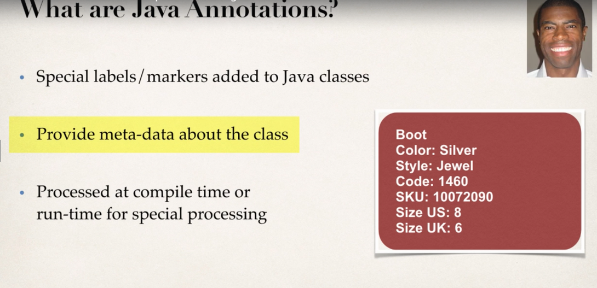
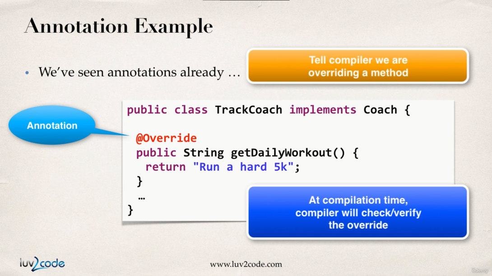
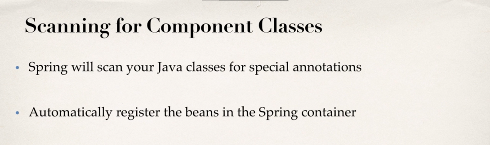

# Spring configuration with Java Annotations

## Introduction

In this section we will learn how to configure spring with java Annotation.

What are java Annotations?
1.	Special labels/markers added to java classes.
2.	They provide meta data about the class.
3.	They are processed either at compile time or at run time for special processing



We can simply see the red color box which is a hypothetical shoe box contains some meta data about the item inside it.



So after using the `@override` annotation if we are not overriding a method correctly then we are going to receive compile time errors.


So basically, if we are configuring around 30 beans imagine the hard work we need to do. In stead we can make use of Annotations to reduce the work load.

Spring will be looking for classes with special spring annotations, if it finds one then it will register that class inside bean container.



## Development Process

1. Enable component scanning in spring config file.
   

```xml
<!-- applicationContext.xml : -->

<?xml version="1.0" encoding="UTF-8"?>
<beans xmlns="http://www.springframework.org/schema/beans"
	xmlns:xsi="http://www.w3.org/2001/XMLSchema-instance"
	xmlns:context="http://www.springframework.org/schema/context"
	xsi:schemaLocation="http://www.springframework.org/schema/beans
    http://www.springframework.org/schema/beans/spring-beans.xsd
    http://www.springframework.org/schema/context
    http://www.springframework.org/schema/context/spring-context.xsd">

<!-- add entry to enable component scanning -->
	<context:component-scan base-package="com.busybox.spring.anotations"></context:component-scan>
</beans>

```

2. Add the `@component` annotation to our java classes.

   

```java
// TennisCoach.java 
package com.busybox.spring.anotations;

import org.springframework.stereotype.Component;

@Component("tennisCoach")
public class TennisCoach implements Coach {

	@Override
	public String getDailyWorkout() {
		return "Learn to Swing your racket";	
	}
}

```

3. Retrieve the beans from the spring container.

   

```java
SpringAnnotationDriver.java : 

package com.busybox.spring.anotations;

import org.springframework.context.support.ClassPathXmlApplicationContext;

public class SpringAnnotationDriver {

	public static void main(String[] args) {

		// read spring config file
		ClassPathXmlApplicationContext context = new ClassPathXmlApplicationContext("applicationContext.xml");

		// get the bean from spring container
		Coach tennisCoach = context.getBean("tennisCoach", Coach.class);

		// call a method on the bean
		System.out.println(tennisCoach.getDailyWorkout()); //Learn to Swing your racket
		
		// close the context
		context.close();
	}

}
```

### @Component and Default Bean ID


So far we have learned how we will have to pass a *beanId* in the `@Component` decorator so what we can retrieve the bean from the spring container later on.

How ever this work of specifying bean container we can out source to spring. So spring will generate the default *beanId* for the class itself.


And the default generated beanId is going to be the camel case format of the component class name.


```java
TennisCoach.java : 
package com.busybox.spring.anotations;

import org.springframework.stereotype.Component;

@Component
public class TennisCoach implements Coach {

	@Override
	public String getDailyWorkout() {
		return "Learn to Swing your racket";				
	}
}
```

And everything else remains the same. But `@Component("tennisCoach")` becomes `@Component`

## Spring DI with Java Annotation & Auto wiring

In this section we will learn dependency injection with java annotation and auto wiring.

In the previous sections we have already used this example in constructor injection and setter injection way but we in this section we will implement this example in spring annotation and auto wiring way.


How the auto wiring is going to work?

So spring will scan for our components and during that it will get to know the component class requires a service as a dependency. Then it will look for any class which will implementing the service interface, if so then it will inject the class which implements the service interface.


In the spring auto wiring dependency process, we have 3 types of injection types :

1. Constructor Injection
2. Setter Injection
3. Field Injection

### Annotation Constructor Injection Development process :

1. Define the service interface and the class which implements it.
   

```java
// FortuneService.java 

package com.busybox.spring.anotations;

public interface FortuneService {
	public String getDailyFotune();
}
```

```java
// FortuneServiceImpl.java  

package com.busybox.spring.anotations;

import org.springframework.stereotype.Component;

@Component
public class FotuneServiceImpl implements FortuneService {

	@Override
	public String getDailyFotune() {
		// TODO Auto-generated method stub
		return "well some good Fortune !!";
	}

}

```

```java
// Coach.java 
package com.busybox.spring.anotations;

public interface Coach {

	public String getDailyWorkout();

	public String getDailyFortune();
}

```

2. Create a constructor in our class for injections.

   

```java
// TennisCoach.java 

package com.busybox.spring.anotations;

import org.springframework.beans.factory.annotation.Autowired;
import org.springframework.stereotype.Component;

@Component
public class TennisCoach implements Coach {

	FortuneService fortuneService;

	@Autowired
	public TennisCoach(FortuneService fortuneService) {
		this.fortuneService = fortuneService;
	}

	@Override
	public String getDailyWorkout() {
		return "Learn to Swing your racket";
	}

	@Override
	public String getDailyFortune() {

		return this.fortuneService.getDailyFotune();
	}
}

```

3. Configure the dependency with `@Autowired` annotation.
   

As of [Spring Framework 4.3](https://docs.spring.io/spring-framework/reference/core/beans/annotation-config/autowired.html), an `@Autowired` annotation on such a constructor is no longer necessary if the target bean only defines one constructor to begin with. However, if several constructors are available, at least one must be annotated to teach the container which one to use.

```java
// SpringAnnotationDriver.java 

package com.busybox.spring.anotations;

import org.springframework.context.support.ClassPathXmlApplicationContext;

public class SpringAnnotationDriver {

	public static void main(String[] args) {

		// read spring config file
		ClassPathXmlApplicationContext context = new ClassPathXmlApplicationContext("applicationContext.xml");

		// get the bean from spring container
		Coach tennisCoach = context.getBean("tennisCoach", Coach.class);

		// call a method on the bean
		System.out.println(tennisCoach.getDailyWorkout()); // Learn to Swing your racket
		System.out.println(tennisCoach.getDailyFortune()); // well some good Fortune !!

		// close the context
		context.close();
	}

}

```

### Setter Injection using Spring Annotation and Autowiring

In this section we will be discussing setter injection with annotation and auto wiring.

In this type of injection we inject the dependencies by calling the setter methods in our class.

#### Development Process for DI with spring annotation and autowiring : 

1. Create setter method in your class for injections.

   

2.	Configure the DI with @Autowired annotation

```java
// TennisCoach.java

package com.busybox.spring.anotations;

import org.springframework.beans.factory.annotation.Autowired;
import org.springframework.stereotype.Component;

@Component
public class TennisCoach implements Coach {

	FortuneService fortuneService;

	public TennisCoach(FortuneService fortuneService) {

	}

	@Autowired
	public void setFortuneService(FortuneService fortuneService) {
		this.fortuneService = fortuneService;
	}

	@Override
	public String getDailyWorkout() {
		return "Learn to Swing your racket";
	}

	@Override
	public String getDailyFortune() {

		return this.fortuneService.getDailyFotune();
	}
}

```


Now there is also some crazy cool feature made available from spring, For setter Injection it does not only have to be the setter method which initializes the dependency service. It can be any method but it must receive the `@Autowired` annotation

```java
// TennisCoach.java 
package com.busybox.spring.anotations;

import org.springframework.beans.factory.annotation.Autowired;
import org.springframework.stereotype.Component;

@Component
public class TennisCoach implements Coach {

	FortuneService fortuneService;

	public TennisCoach(FortuneService fortuneService) {

	}

	/*
	 * @Autowired public void setFortuneService(FortuneService fortuneService) {
	 * this.fortuneService = fortuneService; }
	 */

	// using normal method inside the class to initialize the dependency
	@Autowired
	public void initFortuneService(FortuneService fortuneService) {
		this.fortuneService = fortuneService;
	}

	@Override
	public String getDailyWorkout() {
		return "Learn to Swing your racket";
	}

	@Override
	public String getDailyFortune() {

		return this.fortuneService.getDailyFotune();
	}
}

```

```java
// SpringAnnotationDriver.java 

package com.busybox.spring.anotations;

import org.springframework.context.support.ClassPathXmlApplicationContext;

public class SpringAnnotationDriver {

	public static void main(String[] args) {

		// read spring config file
		ClassPathXmlApplicationContext context = new ClassPathXmlApplicationContext("applicationContext.xml");

		// get the bean from spring container
		Coach tennisCoach = context.getBean("tennisCoach", Coach.class);

		// call a method on the bean
		System.out.println(tennisCoach.getDailyWorkout()); // Learn to Swing your racket
		System.out.println(tennisCoach.getDailyFortune()); // well some good Fortune !!

		// close the context
		context.close();
	}

}

```

### Field Injection using Annotation & Autowiring

In this section we will be learning Field Injection with Annotation & Autowiring.

In this way we will directly inject the dependency to the class field (even to private variables). This is accomplished by *Java Reflection API*.

#### Development Process for Field Injection : 

1.	`@Autowired` annotation is applied directly on the field holding the dependency. No Setter methods are required in this case.


```java
// TennisCoach.java
package com.busybox.spring.anotations;

import org.springframework.beans.factory.annotation.Autowired;
import org.springframework.stereotype.Component;

@Component
public class TennisCoach implements Coach {
	
	// field Injection
	@Autowired
	FortuneService fortuneService;

	public TennisCoach(FortuneService fortuneService) {

	}

	@Override
	public String getDailyWorkout() {
		return "Learn to Swing your racket";
	}

	@Override
	public String getDailyFortune() {

		return this.fortuneService.getDailyFotune();
	}
}
```

### Annotation Autowiring & Qualifiers

So previously spring was automatically injecting the bean for the service implementation class with the help of `@Autowired` annotation regardless of the injection type used (Constructor, setter & field injection).

But the problem arises when there are more than one class implementing the service interface. Now spring will face ambiguity in choosing the correct Service Implementation class. We will cover below how to tackle with this exact situation.


So now in order to solve this problem we need to use the `@Qualifier(requested_Service_BeanId)` annotation where we explicitly tell spring which Service class to use while creating bean for `TennisCoach` Class.


```java
// TennisCoach.java 

package com.busybox.spring.anotations;

import org.springframework.beans.factory.annotation.Autowired;
import org.springframework.beans.factory.annotation.Qualifier;
import org.springframework.stereotype.Component;

@Component
public class TennisCoach implements Coach {

	@Autowired
	@Qualifier("fortuneServiceImpl")
	FortuneService fortuneService;

	public TennisCoach() {

	}

	@Override
	public String getDailyWorkout() {
		return "Learn to Swing your racket";
	}


	@Override
	public String getDailyFortune() {
		return this.fortuneService.getDailyFotune();
	}
}
```

Except from this everything remains the same.

### Annotations - Default Bean Names - The Special Case

In general, when using Annotations, for the default bean name, Spring uses the following rule. 

If the annotation's value doesn't indicate a bean name, an appropriate name will be built based on the short name of the class (with the first letter lower-cased). 

For example: `HappyFortuneService` becomes `happyFortuneService`

However, for the special case of when BOTH the first and second characters of the class name are upper case, then the name is NOT converted.


For example, if there is a Service class RESTFortuneService `RESTFortuneService` will become `RESTFortuneService`

No conversion since the first two characters are upper case.

Behind the scenes, Spring uses the **Java Beans Introspector** to generate the default bean name. Here's a screenshot of the documentation for the key method.


### Using @Qualifier with Constructors

`@Qualifier` is a nice feature, but it is tricky when used with Constructors.

The syntax is much different from other examples and not exactly intuitive.  Consider this the "deep end of the pool" when it comes to Spring configuration LOL :-)

You have to place the `@Qualifier` annotation inside of the constructor arguments. 

Here's an example from our classroom example. I updated it to make use of constructor injection, with `@Autowired` and `@Qualifier`. Make note of the code in bold below:

```java
package com.luv2code.springdemo;

import org.springframework.beans.factory.annotation.Autowired;
import org.springframework.beans.factory.annotation.Qualifier;
import org.springframework.stereotype.Component;

@Component
public class TennisCoach implements Coach {
	private FortuneService fortuneService;

	// define a default constructor
	public TennisCoach() {
		System.out.println(">> TennisCoach: inside default constructor");
	}

	@Autowired
	public TennisCoach(@Qualifier("randomFortuneService") FortuneService theFortuneService) {
		System.out.println(">> TennisCoach: inside constructor using @autowired and @qualifier");

		fortuneService = theFortuneService;
	}


	@Override
	public String getDailyWorkout() {
		return "Practice your backhand volley";
	}

	@Override
	public String getDailyFortune() {
		return fortuneService.getFortune();
	}
}
```

For detailed documentation on using @Qualifier with Constructors, see this link in the [Spring Reference Manual](https://docs.spring.io/spring/docs/current/spring-framework-reference/core.html#beans-autowired-annotation-qualifiers)

### @Qualifier with Setter Injection

You can use similar syntax with Setter Injection. You can use `@Qualifier` in method arguments line, such as,

```java
@Autowired
public void setFortuneService(@Qualifier("randomFortuneService") FortuneService theFortuneService) {
		System.out.println(">> TennisCoach: inside setFortuneService() method");
		this.fortuneService = theFortuneService;
}
```

You can also use the `@Qualifier` above the method name. For example, here's the syntax

```java
@Autowired
@Qualifier("randomFortuneService")
public void setFortuneService(FortuneService theFortuneService) {
		System.out.println(">> TennisCoach: inside setFortuneService() method");
		this.fortuneService = theFortuneService;
}
```

### Inject properties file using Java annotations

1. Create a properties file to hold your properties. It will be a name value pair.  

New text file:  src/sport.properties

``` properties
name = Rick Sanchez
profession = Mad Scientit
```

Note the location of the properties file is very important. It must be stored in src/sport.properties

2. Load the properties file in the XML config file.

File: applicationContext.xml

Add the following lines: `<context:property-placeholder location="classpath:sport.properties"/>`

This should appear just after the `<context:component-scan .../>` line

```xml
<?xml version="1.0" encoding="UTF-8"?>
<beans xmlns="http://www.springframework.org/schema/beans"
	xmlns:xsi="http://www.w3.org/2001/XMLSchema-instance"
	xmlns:context="http://www.springframework.org/schema/context"
	xsi:schemaLocation="http://www.springframework.org/schema/beans
    http://www.springframework.org/schema/beans/spring-beans.xsd
    http://www.springframework.org/schema/context
    http://www.springframework.org/schema/context/spring-context.xsd">

	<!-- add entry to enable component scanning -->
	<context:component-scan
		base-package="com.busybox.spring.anotations"></context:component-scan>

	<!-- Inject property File -->
	<context:property-placeholder
		location="classpath:sport.properties" />
</beans>

```

3. Inject the properties values

```java
package com.busybox.spring.anotations;

import org.springframework.beans.factory.annotation.Autowired;
import org.springframework.beans.factory.annotation.Qualifier;
import org.springframework.beans.factory.annotation.Value;
import org.springframework.stereotype.Component;

@Component
public class TennisCoach implements Coach {

	@Autowired
	@Qualifier("fortuneServiceImpl")
	FortuneService fortuneService;

	@Value("${name}")
	private String name;

	@Value("${profession}")
	private String profession;

	public TennisCoach() {

	}

	public String getName() {
		return name;
	}

	public String getProfession() {
		return profession;
	}

	@Override
	public String getDailyWorkout() {
		return "Learn to Swing your racket";
	}

	@Override
	public String getDailyFortune() {

		return this.fortuneService.getDailyFotune();
	}

}

```


```java
SpringAnnotationDriver.java : 
package com.busybox.spring.anotations;

import org.springframework.context.support.ClassPathXmlApplicationContext;

public class SpringAnnotationDriver {

	public static void main(String[] args) {

		// read spring config file
		ClassPathXmlApplicationContext context = new ClassPathXmlApplicationContext("applicationContext.xml");

		// get the bean from spring container
		TennisCoach tennisCoach = context.getBean("tennisCoach", TennisCoach.class);

		// call a method on the bean
		System.out.println(tennisCoach.getDailyWorkout());
		System.out.println(tennisCoach.getDailyFortune());

		// print values referenced from properties file
		System.out.println(tennisCoach.getName()); // Rick Sanchez
		System.out.println(tennisCoach.getProfession()); // Mad Scientist
		
		// close the context
		context.close();
	}

}

```

## Bean Scopes with Annotations

In this section we will be learning bean scopes with annotations.


```java
// TennisCoach.java 
package com.busybox.spring.anotations;

import org.springframework.beans.factory.annotation.Autowired;
import org.springframework.beans.factory.annotation.Qualifier;
import org.springframework.beans.factory.annotation.Value;
import org.springframework.context.annotation.Scope;
import org.springframework.stereotype.Component;

@Component
@Scope("singleton") // this is not required as by default beans are singleton
public class TennisCoach implements Coach {

	@Autowired
	@Qualifier("fortuneServiceImpl")
	FortuneService fortuneService;

	@Value("${name}")
	private String name;

	@Value("${profession}")
	private String profession;

	public TennisCoach() {

	}

	public String getName() {
		return name;
	}

	public String getProfession() {
		return profession;
	}

	@Override
	public String getDailyWorkout() {
		return "Learn to Swing your racket";
	}

	@Override
	public String getDailyFortune() {

		return this.fortuneService.getDailyFotune();
	}

}


```

```java
SpringAnnotationScopesDriver.java : 
package com.busybox.spring.anotations;

import org.springframework.context.support.ClassPathXmlApplicationContext;

public class SpringAnnotationScopesDriver {

	public static void main(String[] args) {

		// load spring config file
		ClassPathXmlApplicationContext context = new ClassPathXmlApplicationContext("applicationContext.xml");

		// retrieve bean from spring container
		Coach tennisCoach1 = context.getBean("tennisCoach", Coach.class);
		Coach tennisCoach2 = context.getBean("tennisCoach", Coach.class);

		// check to see if two TennishCoach beans are same
		System.out.println("are beans equal : " + (tennisCoach1 == tennisCoach2));

		// memory location for tennisCoach1
		System.out.println("memory Location for tennisCoach1 : "+tennisCoach1);
		
		// memory location for tennisCoach2
		System.out.println("memory Location for tennisCoach2 : "+tennisCoach2);
	}

}

// output : 
// are beans equal : true
// memory Location for tennisCoach1 : com.busybox.spring.anotations.TennisCoach@5e17553a
// memory Location for tennisCoach2 : com.busybox.spring.anotations.TennisCoach@5e17553a


```


```java
// TennisCoach.java  
package com.busybox.spring.anotations;

import org.springframework.beans.factory.annotation.Autowired;
import org.springframework.beans.factory.annotation.Qualifier;
import org.springframework.beans.factory.annotation.Value;
import org.springframework.context.annotation.Scope;
import org.springframework.stereotype.Component;

@Component
@Scope("prototype")
public class TennisCoach implements Coach {

	@Autowired
	@Qualifier("fortuneServiceImpl")
	FortuneService fortuneService;

	@Value("${name}")
	private String name;

	@Value("${profession}")
	private String profession;

	public TennisCoach() {

	}

	/*
	 * @Autowired public void setFortuneService(FortuneService fortuneService) {
	 * this.fortuneService = fortuneService; }
	 */

	/*
	 * // using normal method inside the class to initialize the dependency
	 * 
	 * @Autowired public void initFortuneService(FortuneService fortuneService) {
	 * this.fortuneService = fortuneService; }
	 */

	public String getName() {
		return name;
	}

	public String getProfession() {
		return profession;
	}

	@Override
	public String getDailyWorkout() {
		return "Learn to Swing your racket";
	}

	@Override
	public String getDailyFortune() {

		return this.fortuneService.getDailyFotune();
	}

}

```

```java
// SpringAnnotationScopesDriver.java 
package com.busybox.spring.anotations;

import org.springframework.context.support.ClassPathXmlApplicationContext;

public class SpringAnnotationScopesDriver {

	public static void main(String[] args) {

		// load spring config file
		ClassPathXmlApplicationContext context = new ClassPathXmlApplicationContext("applicationContext.xml");

		// retrieve bean from spring container
		Coach tennisCoach1 = context.getBean("tennisCoach", Coach.class);
		Coach tennisCoach2 = context.getBean("tennisCoach", Coach.class);

		// check to see if two TennishCoach beans are same
		System.out.println("are beans equal : " + (tennisCoach1 == tennisCoach2));

		// memory location for tennisCoach1
		System.out.println("memory Location for tennisCoach1 : "+tennisCoach1);
		
		// memory location for tennisCoach2
		System.out.println("memory Location for tennisCoach2 : "+tennisCoach2);
	}

}

// output : 
// are beans equal : false
// memory Location for tennisCoach1 : com.busybox.spring.anotations.TennisCoach@56dc1551
// memory Location for tennisCoach2 : com.busybox.spring.anotations.TennisCoach@102cec62

```

## Bean Life Cycle Methods – with Annotations


### Development Process 

1. Define your methods for init and destroy


2. Add annotations : `@PostConstruct` and `@PreDestroy`


Special Note about `@PostConstruct` and `@PreDestroy` Method Signatures

I want to provide additional details regarding the method signatures of @PostContruct and @PreDestroy methods.

Access modifier - The method can have any access modifier (public, protected, private)

Return type - The method can have any return type. However, "void' is most commonly used. If you give a return type just note that you will not be able to capture the return value. As a result, "void" is commonly used.

Method name - The method can have any method name.

Arguments - The method can not accept any arguments. The method should be no-arg.

Now from all of the available injection types available in the world one might have a question about which injection type to choose. The straight forward answer to that question is to go for any kind of injection types and staying consistent across the project.


```java
// TennisCoach.java
package com.busybox.spring.anotations;

import javax.annotation.PostConstruct;
import javax.annotation.PreDestroy;

import org.springframework.beans.factory.annotation.Autowired;
import org.springframework.beans.factory.annotation.Qualifier;
import org.springframework.beans.factory.annotation.Value;

import org.springframework.stereotype.Component;

@Component
//@Scope("singleton")
public class TennisCoach implements Coach {

	@Autowired
	@Qualifier("fortuneServiceImpl")
	FortuneService fortuneService;

	@Value("${name}")
	private String name;

	@Value("${profession}")
	private String profession;

	public TennisCoach() {
		System.out.println("TennisCoach() no-arg constructor");
	}

	/*
	 * @Autowired public void setFortuneService(FortuneService fortuneService) {
	 * this.fortuneService = fortuneService; }
	 */

	/*
	 * // using normal method inside the class to initialize the dependency
	 * 
	 * @Autowired public void initFortuneService(FortuneService fortuneService) {
	 * this.fortuneService = fortuneService; }
	 */

	public String getName() {
		return name;
	}

	public String getProfession() {
		return profession;
	}

	@Override
	public String getDailyWorkout() {
		return "Learn to Swing your racket";
	}

	@Override
	public String getDailyFortune() {

		return this.fortuneService.getDailyFotune();
	}

	// define bean init method
	@PostConstruct
	public void beanInitHook() {
		System.out.println("beanInitHook()");
	}

	// define bean destroy method
	@PreDestroy
	public void beanDestroyHook() {
		System.out.println("beanDestroyHook()");
	}

}
// output:
// TennisCoach() no-arg constructor
// beanInitHook()
// are beans equal : true
// memory Location for tennisCoach1 : com.busybox.spring.anotations.TennisCoach@6f63b475
// memory Location for tennisCoach2 : com.busybox.spring.anotations.TennisCoach@6f63b475
// beanDestroyHook()
```