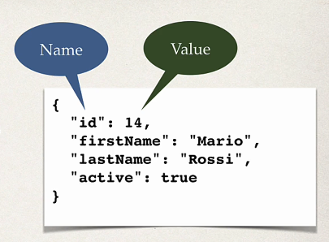
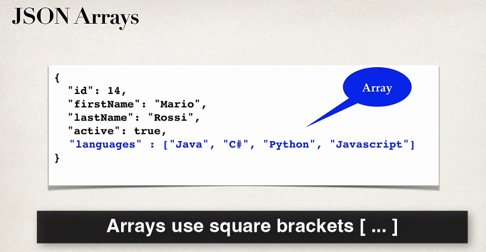

## JSON basics
What is JSON?
JavaScript Object Notation. Lightweight data format for storing and exchanging data, it's just a plain text.
The nice thing about JSON is its Language Independent it's not only for JavaScript you can use with any other programming language: Java, C#, Python etc.

Simple JSON example
Curly braces define objects in JOSN. We have Object members that are name / value pairs. These name value pair are delimited by colons.
```JSON
{
	"id":14,
	"firstName": "Khawja",
	"lastName": "Ghouse",
	"active": true
}
```

The name is always in double quotes.


Whatever we have on left hand side of the colons will always be in double quotes.
JSON Values: whatever we have on the right side of the colon, we can have different types of values.

Nested JSON Objects, as we can nest with any other object we can do the same even with JSON, with any level of deep.


There is also support for arrays in JSON.



