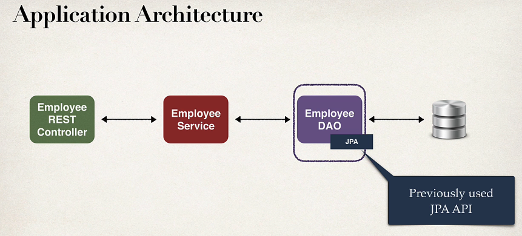
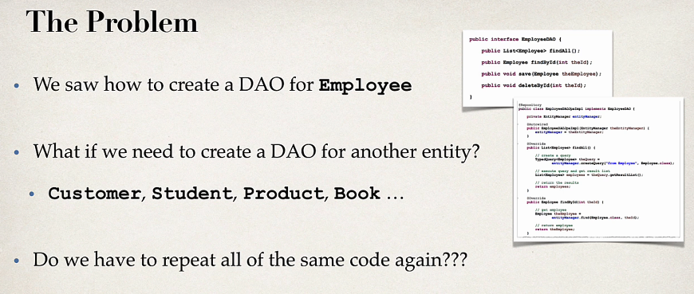
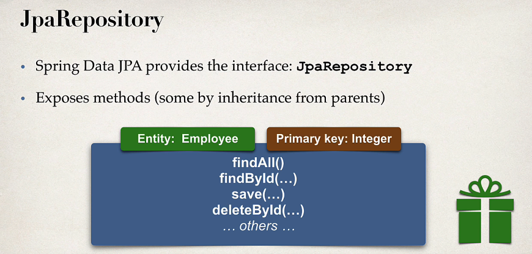
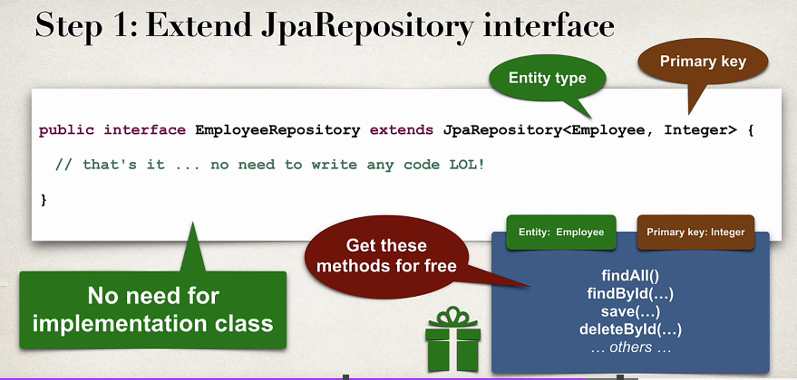
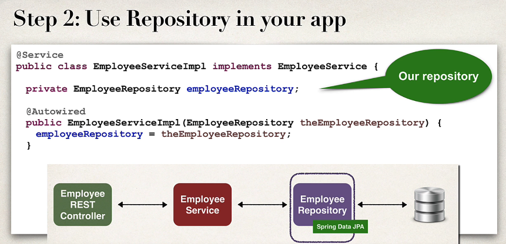
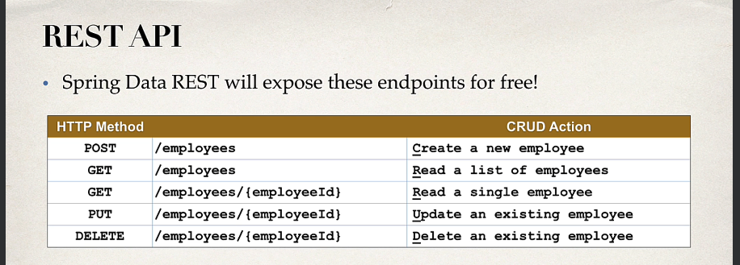

Before using Spring Boot Data JPA we were using JPA API (Entity Manager)

Now we will shift over Spring Data JPA for backend DAO. The below, mentioned points are problems when we were using
EntityManager

One thing we have noticed while creating DAO's if we look at one method find by ID in above image most of the code is
same the only difference is entity type and primary key.
If we have to do the same with Product or Student or Customer the only difference is entity type and id other than this
everything is same. To do this for other entities it feels like copy and paste to do again and again for all other
entities. So, there should be an easier way.

**Hence, the solution is Spring Data JPA !!**

In this create a DAO, just plug in your entity type and primary key. Spring will give you the CRUD implementation for
FREE. It helps in minimize boilerplate DAO code.

