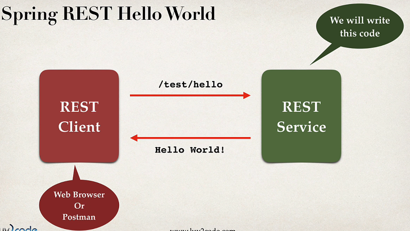
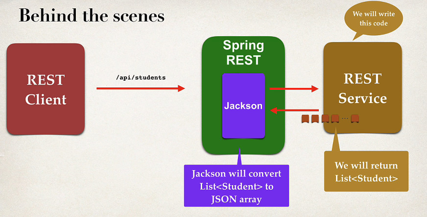
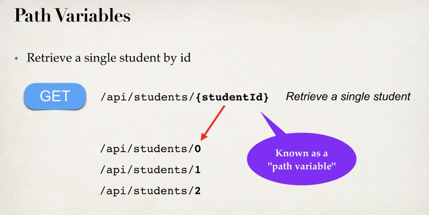
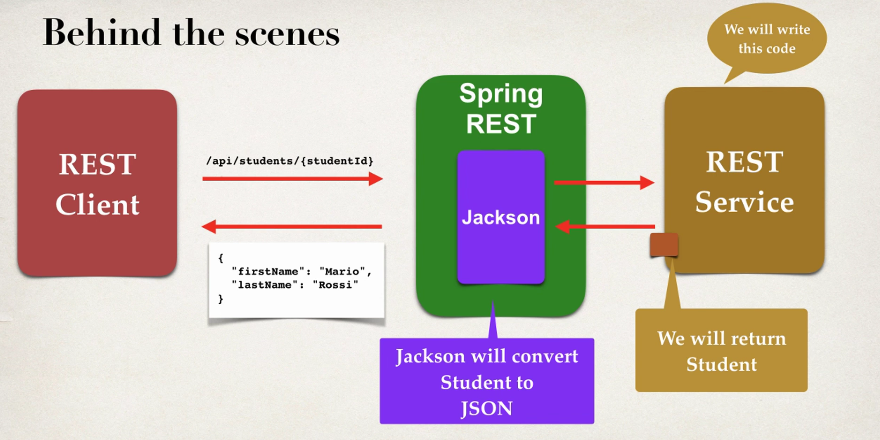

In Spring Framework, `@RestController` is an annotation used to define a RESTful web service. It combines `@Controller` and `@ResponseBody`, two other annotations, into a single convenient annotation.

Here's what each of these annotations does:

1. **`@Controller`**: This annotation marks a class as a Spring MVC controller. It's responsible for handling web requests.
    
2. **`@ResponseBody`**: This annotation is used to bind a method return value to the web response body. It indicates that whatever is returned from the method should be directly written to the HTTP response body, rather than being interpreted as a view name.

**@RequestMapping**:
- This annotation is a general-purpose annotation used to map web requests to handler methods of Spring MVC and Spring WebFlux.
- It can be **applied at the class level and/or method level**.
- You can specify various attributes such as path, method, headers, consumes, produces, etc., to narrow down the mapping.
- Example:
```java
@Controller
@RequestMapping("/api")
public class MyController {

    @RequestMapping(value = "/hello", method = RequestMethod.GET)
    public String hello() {
        return "Hello, World!";
    }
}
```

**@GetMapping**:

- This annotation is a specialization of `@RequestMapping` for handling HTTP GET requests.
- It's more concise and readable than `@RequestMapping(method = RequestMethod.GET)`.
- It can only be **applied at the method level**.
- Example:
```java
@Controller
@RequestMapping("/api")
public class MyController {

    @GetMapping("/hello")
    public String hello() {
        return "Hello, World!";
    }
}

```

JAVA JSON Data Binding
Data Binding is a process of converting JSON data to a Java POJO


Data Binding is also known as Mapping / serialization or deserialization / Marshalling or Unmarshalling.

	JSON Data Binding with Jakson Project behind the scenes.

**Jakson handles data binding between JSON and Java Pojo( Spring boot starter web => automatically includes dependencies for Jakson)**


**@PathVariable**
Path variables are a mechanism in Spring Boot that allow you to extract dynamic values from the URL path and use them within your controller methods. This makes your applications more flexible and RESTful by enabling you to define endpoints that accept specific data in the URL itself.


- You create a template in the request mapping using curly braces `{}` to represent the variable part of the URL.
- Annotate the corresponding method parameter in your controller with `@PathVariable`
```java
@RestController
@RequestMapping("/users")
public class UserController {

    @GetMapping("/{id}")
    public User getUser(@PathVariable Long id) {
        // Logic to retrieve user based on ID
        return user;
    }
}
```

- By default, path variables are required. If a required path variable is missing in the request, Spring Boot throws an exception. You can make it optional using `@PathVariable(required = false)`.
- You can specify a custom name for the path variable using `@PathVariable("customName")`.
- You can use multiple path variables in the same request mapping and method.
  
