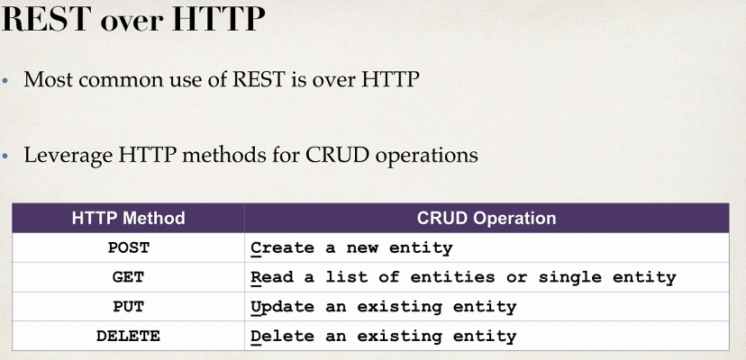
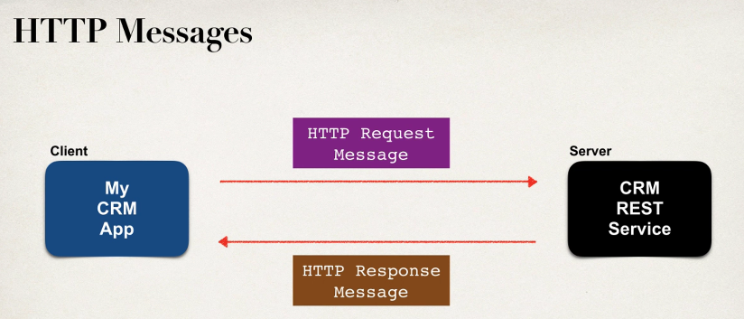
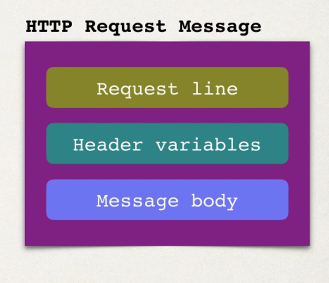
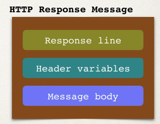

Most common use of REST is over HTTP. Leverage HTTP methods for CRUD operations.

Request Line : The HTTP command
Header variables : Request Metadata
Message body: contents of message

Request Line : Server protocol and status code.
Header variables : Response Metadata
Message body: contents of message(Response)

## MIME Content type
The message type is described by MIME content type.
	**Multipurpose Internet Mail-Extension**

Basic Syntax: type/sub-type
Examples: 
	text/html, text/plain 
Its the information that's returned back to the client and the client can render accordingly or process on it accordingly. So some example here, if you return back text/html to web browser, a web browser will render that based on html tag, if we passed the text/plain then web browser will simply show you the plain text.

We also have particulars for RESTful clients, like application/json, application/xml..

## Client Tool
We need a client tool to send http request to the REST web services / API's

There are plenty of tools available: curl, **Postman**, etc
