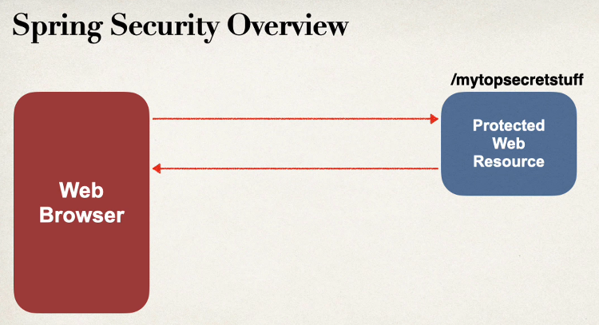
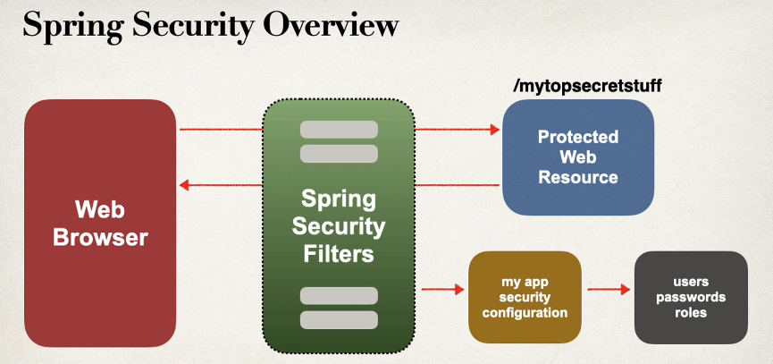
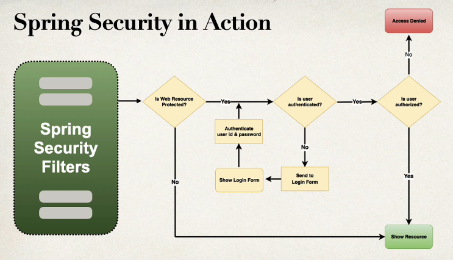
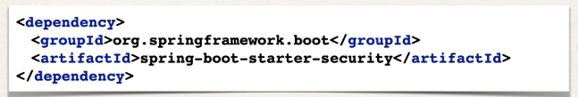
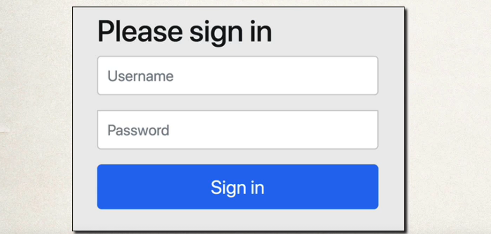

## Spring Security Model

- Spring security defines a framework for security.
- Implemented using separate filters in the background.
- We can make use of declarative security or programmatic security.

## Spring Security with Servlet Filters

1. Servlet filters are used to pre-process or post-process web requests.
2. Servlet filters can route web requests based on security logic.
3. Spring provides a bulk of security functionality with servlet filters.

Let's get into the more details by understanding through diagrams


We have web browser on the left and protected web Resources on the right, when the browser attempting to access
**/mytopsecretstuff** and get the results.



This is where the spring security filters comes in the play. These spring security filters intercept those requests
pre-process them and then see if the user can access that particular resource. Spring security will look at your
apllication
security configuration and also looks at the users, password and roles on the databases see if this, users are
authenticated
and also gives their authorised web resources this all happens in the background.

### Spring Security in Action



<p>We have these Spring Security filters, and then, basically, we'll say, "Hey, is this web resource protected?" Yes. Then, "Is this user authenticated?" If they're not authenticated, then we'll send them to the login form, show that login form, and then take the user ID and password and authenticate it. We'll check to see if this user ID and password is valid based on the information we have stored in our system. Then, if they pass a test, so they're authenticated, then we check, "Is this user authorized? Do they have authorization to access this resource?" Now, just like at your job, right, you have a security badge, or at your university, you have a student ID that can get you into the main building. However, you may not be able to access all the rooms in the building. It all depends on your access level or your authorization role. Just because you have a good user ID and password, that doesn't mean you have access to everything. There's still additional levels of security in place, and Spring has support for this using security roles. If you don't have the given role, then it says access denied, or if you do have the given role, then it'll actually show you the resource and then give you access to this secure site. Basically, the security here is in place to keep the bad guys out and also allow the good folks inside.</p>

## Security Concepts

### 1. Authentication

    This basically handles checking the user ID and password with the credentials that are stored in your app or in your database.

### 2. Authorization

    Here we check to see if the user has an authorized role.

## Enable Spring Security in your spring boot project

1. Edit **pom.xml** and add **spring-boot-starter-security** <br>
   
2. This will automatically secure all the endpoints for application.

No additional coding is required at this point. However, we'll learn about customizing the configuration a little bit
later. And once we run our application and we access our app, then our application is secured. As a result, Spring
Security will prompt us to log in. Now, by default, the username is user, and the generated password is in the
application logs.


### Spring Security Configuration

- you can override default user name and generated password
  ```properties
    spring.security.user.name=khawja
    spring.security.user.password=sdfsdfsdf
    ```

As mentioned earlier, there are different techniques for defining users, passwords, and roles. You can make use of
in-memory authentication. You can also use JDBC to define users, passwords, and roles in a database. There's support for
LDAP. You can also use your own custom plugin, your own authentication, and authorization coding, and there's plenty of
others out there.