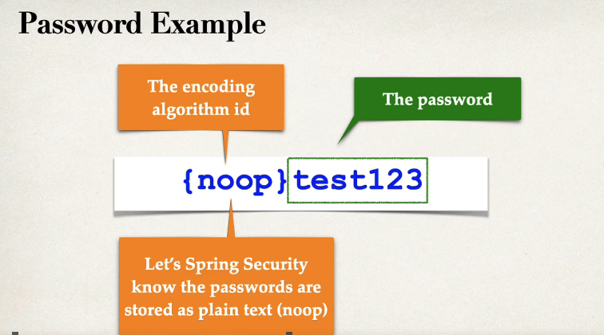
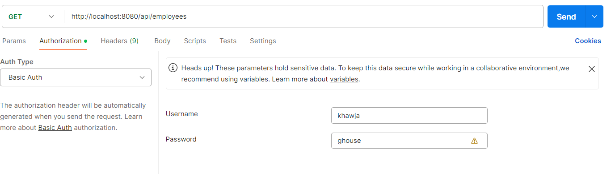
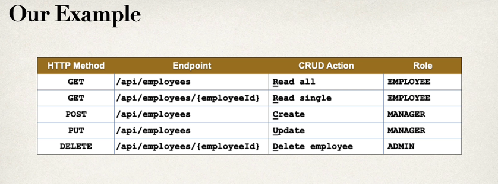
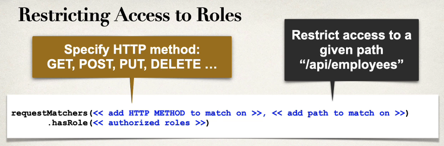
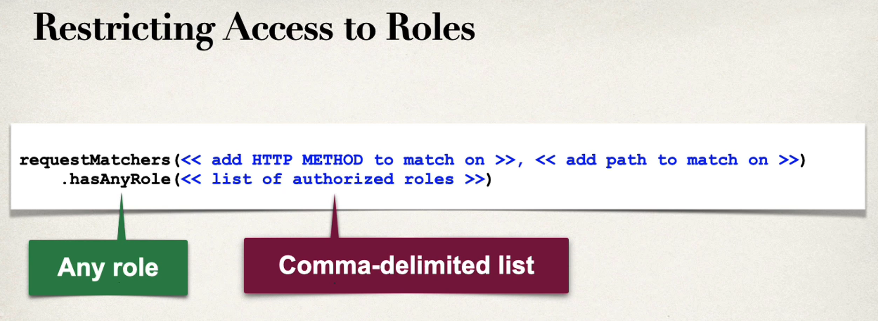
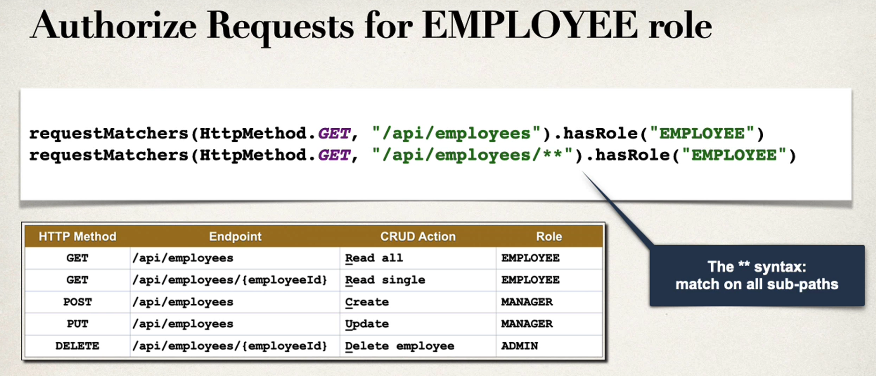
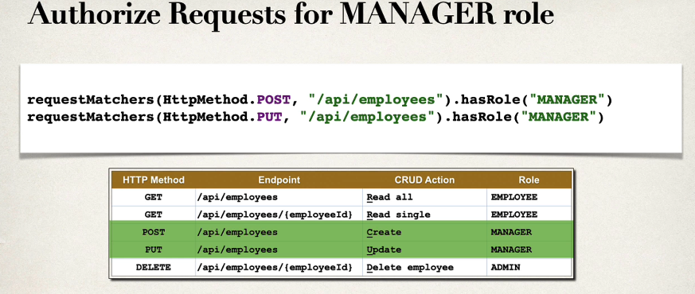
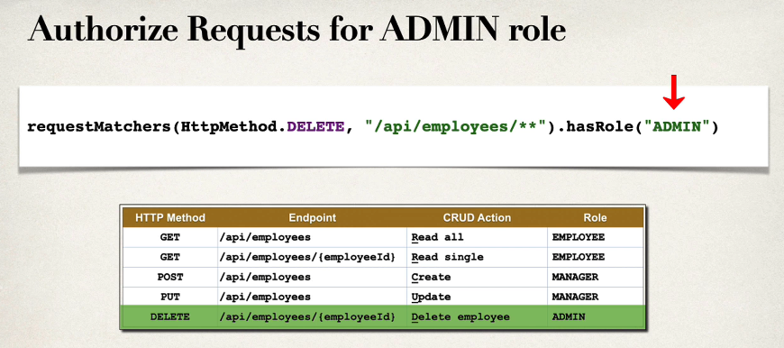

### Development Guid
1. Create Spring Security Configuration (@Configuration)
2. Add user,passwords and roles.

Spring Security, password stored using a specific format

| ID       | Description            |
|----------|----------------------- |
| noop     | Plain text password    |
| bcrypt   | BCrypt password hashing |


Example 
**SecurityConfig**
```java
package com.skg.spring.security;

import org.springframework.context.annotation.Bean;
import org.springframework.context.annotation.Configuration;
import org.springframework.security.core.userdetails.User;
import org.springframework.security.core.userdetails.UserDetails;
import org.springframework.security.provisioning.InMemoryUserDetailsManager;

@Configuration
public class SecurityConfig {

    @Bean
    public InMemoryUserDetailsManager userDetailsManager() {
        UserDetails khawja = User.builder().username("khawja")
                .password("{noop}ghouse")
                .roles("EMPLOYEE")
                .build();
        UserDetails ghouse = User.builder().username("ghouse")
                .password("{noop}ghouse")
                .roles("EMPLOYEE,MANAGER")
                .build();
        UserDetails nadeem = User.builder().username("nadeem")
                .password("{noop}ghouse")
                .roles("EMPLOYEE,MANAGER,ADMIN")
                .build();

        return new InMemoryUserDetailsManager(khawja, ghouse, nadeem);
    }
}

```
    Note: Since we have defined the users and password here, Spring boot will not use the user/password from the application.properties



**Restricting URL's based on Roles<br>**


**Syntax of restricting access to roles, single role**


**For multiple Roles <br>**


**Endpoint available for EMPLOYEE Role**


**Authorised Request for MANAGER role**


**Authorised requests for ADMIN role**



```java
@Bean
public SecurityFilterChain filterChain(HttpSecurity http) throws Exception {
    http.authorizeHttpRequests(configure ->
            configure
                    .requestMatchers(HttpMethod.GET,"/api/employees").hasRole("EMPLOYEE")
                    .requestMatchers(HttpMethod.GET,"/api/employees/**").hasRole("EMPLOYEE")
                    .requestMatchers(HttpMethod.POST,"/api/employees").hasRole("MANAGER")
                    .requestMatchers(HttpMethod.PUT,"/api/employees").hasRole("MANAGER")
                    .requestMatchers(HttpMethod.DELETE,"/api/employees/**   ").hasRole("ADMIN")
    );

    // use http  Basic authentication
    http.httpBasic(Customizer.withDefaults());

    // disable Cross Site Request Forgrey (CSRF)
    // in general, not required for stateless REST API's that uses POST PUT DELETE and GET

    http.csrf(csrf-> csrf.disable());

    return http.build();
}
```

## Database support in Spring Security 