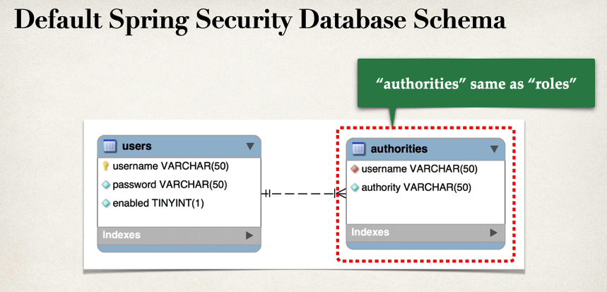

### Development Guid
1. Create Spring Security Configuration (@Configuration)
2. Add user,passwords and roles.

Spring Security, password stored using a specific format

| ID       | Description            |
|----------|----------------------- |
| noop     | Plain text password    |
| bcrypt   | BCrypt password hashing |


Example 
**SecurityConfig**
```java
package com.skg.spring.security;

import org.springframework.context.annotation.Bean;
import org.springframework.context.annotation.Configuration;
import org.springframework.security.core.userdetails.User;
import org.springframework.security.core.userdetails.UserDetails;
import org.springframework.security.provisioning.InMemoryUserDetailsManager;

@Configuration
public class SecurityConfig {

    @Bean
    public InMemoryUserDetailsManager userDetailsManager() {
        UserDetails khawja = User.builder().username("khawja")
                .password("{noop}ghouse")
                .roles("EMPLOYEE")
                .build();
        UserDetails ghouse = User.builder().username("ghouse")
                .password("{noop}ghouse")
                .roles("EMPLOYEE,MANAGER")
                .build();
        UserDetails nadeem = User.builder().username("nadeem")
                .password("{noop}ghouse")
                .roles("EMPLOYEE,MANAGER,ADMIN")
                .build();

        return new InMemoryUserDetailsManager(khawja, ghouse, nadeem);
    }
}

```
    Note: Since we have defined the users and password here, Spring boot will not use the user/password from the application.properties


**Restricting URL's based on Roles<br>**


**Syntax of restricting access to roles, single role**


**For multiple Roles <br>**


**Endpoint available for EMPLOYEE Role**


**Authorised Request for MANAGER role**


**Authorised requests for ADMIN role**


```java
@Bean
public SecurityFilterChain filterChain(HttpSecurity http) throws Exception {
    http.authorizeHttpRequests(configure ->
            configure
                    .requestMatchers(HttpMethod.GET,"/api/employees").hasRole("EMPLOYEE")
                    .requestMatchers(HttpMethod.GET,"/api/employees/**").hasRole("EMPLOYEE")
                    .requestMatchers(HttpMethod.POST,"/api/employees").hasRole("MANAGER")
                    .requestMatchers(HttpMethod.PUT,"/api/employees").hasRole("MANAGER")
                    .requestMatchers(HttpMethod.DELETE,"/api/employees/**   ").hasRole("ADMIN")
    );

    // use http  Basic authentication
    http.httpBasic(Customizer.withDefaults());

    // disable Cross Site Request Forgrey (CSRF)
    // in general, not required for stateless REST API's that uses POST PUT DELETE and GET

    http.csrf(csrf-> csrf.disable());

    return http.build();
}
```

## Database support in Spring Security 

So far, our user accoount were hard coded in java source code. Now let's with adding user details in database.
Spring Security can read user account information from database. By default, you have to follow Spring Security's predefined table schemas.
We also have a option of customizing the table schemas. It's useful if you have custom tables specific to your project, for this it will be are
responsibility for developing the code to access the data JDBC/JPA/Hibernate etc.

Development process
1. Develop SQL script to set up the database tables.
2. Add database support to our project using the Maven POM file.
3. Creating JDBC properties file.
4. Update Spring Security Configuration use JDBC.

Default Spring Security Database Schemas


Step 1. Developing SQL script to set up the database tables

```mysql-sql
USE `employee_directory`;

DROP TABLE IF EXISTS `authorities`;
DROP TABLE IF EXISTS `users`;
--
-- Table structure for table `users`
--

CREATE TABLE `users` (
  `username` varchar(50) NOT NULL,
  `password` varchar(50) NOT NULL,
  `enabled` tinyint NOT NULL,
  PRIMARY KEY (`username`)
) ENGINE=InnoDB DEFAULT CHARSET=latin1;

--
-- Inserting data for table `users`
--

INSERT INTO `users` 
VALUES 
('john','{noop}test123',1),
('mary','{noop}test123',1),
('susan','{noop}test123',1);


--
-- Table structure for table `authorities`
--

CREATE TABLE `authorities` (
  `username` varchar(50) NOT NULL,
  `authority` varchar(50) NOT NULL,
  UNIQUE KEY `authorities_idx_1` (`username`,`authority`),
  CONSTRAINT `authorities_ibfk_1` FOREIGN KEY (`username`) REFERENCES `users` (`username`)
) ENGINE=InnoDB DEFAULT CHARSET=latin1;

--
-- Inserting data for table `authorities`
--

INSERT INTO `authorities` 
VALUES 
('john','ROLE_EMPLOYEE'),
('mary','ROLE_EMPLOYEE'),
('mary','ROLE_MANAGER'),
('susan','ROLE_EMPLOYEE'),
('susan','ROLE_MANAGER'),
('susan','ROLE_ADMIN');
```
NOTE: authorities are same as ROLES. Internally Spring security uses **ROLES_** prefix to get the ROLE.

STEP 2. Add database support to our project using the Maven POM file.
```xml
<dependency>
    <groupId>com.mysql</groupId>
    <artifactId>mysql-connector-j</artifactId>
    <scope>runtime</scope>
</dependency>
```
STEP 3. Creating JDBC properties file

STEP 4. Update Spring Security Configuration use JDBC.
    
```java
package com.skg.spring.security;

import org.springframework.context.annotation.Bean;
import org.springframework.context.annotation.Configuration;
import org.springframework.http.HttpMethod;
import org.springframework.security.config.Customizer;
import org.springframework.security.config.annotation.web.builders.HttpSecurity;
import org.springframework.security.core.userdetails.User;
import org.springframework.security.core.userdetails.UserDetails;
import org.springframework.security.provisioning.InMemoryUserDetailsManager;
import org.springframework.security.provisioning.JdbcUserDetailsManager;
import org.springframework.security.provisioning.UserDetailsManager;
import org.springframework.security.web.SecurityFilterChain;

import javax.sql.DataSource;

@Configuration
public class SecurityConfig {
// Used for adding User and roles details with In memorry
/*@Bean
public InMemoryUserDetailsManager userDetailsManager() {
UserDetails khawja = User.builder().username("khawja")
.password("{noop}ghouse")
.roles("EMPLOYEE")
.build();
UserDetails ghouse = User.builder().username("ghouse")
.password("{noop}ghouse")
.roles("EMPLOYEE,MANAGER")
.build();
UserDetails nadeem = User.builder().username("nadeem")
.password("{noop}ghouse")
.roles("EMPLOYEE,MANAGER,ADMIN")
.build();

        return new InMemoryUserDetailsManager(khawja, ghouse, nadeem);
    }*/

    // No more Hard coded use the support for JDBC
    @Bean
    public UserDetailsManager userDetailsManager(DataSource dataSource){
        return new JdbcUserDetailsManager(dataSource);
    }

    @Bean
    public SecurityFilterChain filterChain(HttpSecurity http) throws Exception {
        http.authorizeHttpRequests(configure ->
                configure
                        .requestMatchers(HttpMethod.GET,"/api/employees").hasRole("EMPLOYEE")
                        .requestMatchers(HttpMethod.GET,"/api/employees/**").hasRole("EMPLOYEE")
                        .requestMatchers(HttpMethod.POST,"/api/employees").hasRole("MANAGER")
                        .requestMatchers(HttpMethod.PUT,"/api/employees").hasRole("MANAGER")
                        .requestMatchers(HttpMethod.DELETE,"/api/employees/**   ").hasRole("ADMIN")
        );

        // use http  Basic authentication
        http.httpBasic(Customizer.withDefaults());

        // disable Cross Site Request Forgrey (CSRF)
        // in general, not required for stateless REST API's that uses POST PUT DELETE and GET
        http.csrf(csrf-> csrf.disable());

        return http.build();
    }
    }
```

Note: Making the changes in the table anypoint of time don't need to restart the application as Spring does query execute evrttime.