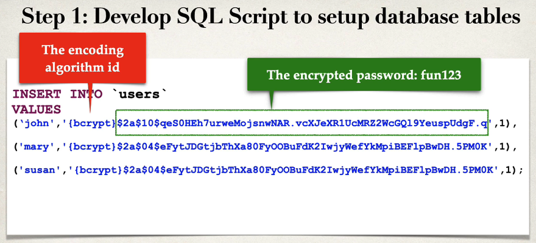
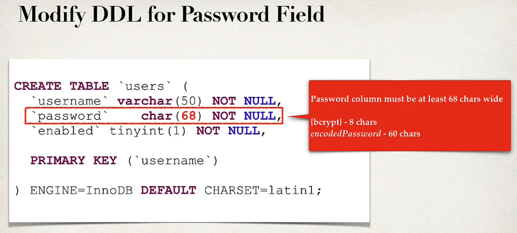
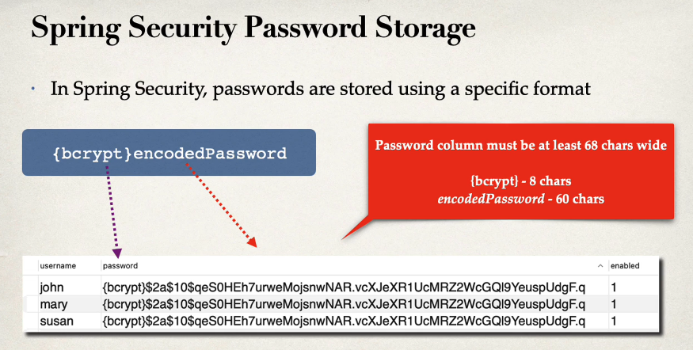

### Spring Security Password Encryption

So far, our user password has been stored in PlainTxt. This is okay for getting started and understanding but not okay for 
Production and real time projects.

The best practice is to store the password in encrypted format. The recommended algorithm by spring is **bcrypt**. Bcrypt algorithm
performs one-way encrypted hashing and add the random  salt to the password for additional protection it also supports to 
defeat brute force attacks.

How to get a Bcrypt Password
1. Use a website utility to perform the encryption.
2. Write JAVA code to perform the encryption.

For the first option use [Bcrypt_Calculator](https://www.bcryptcalculator.com/encode)

Development process
1) Updated the passwords with bcrypt encrypted.
   
2) Modify the DDL for password field, length should be 68.
    

**Bcrypt Password Explained**  

Spring Security Login Process
1. Retrieve password from db for user 
2. Read the encoding algorithm id (bcrypt etc)
3. For case of bcrypt, encrypt plain text password from login form (using salt from db password)
4. Compare encrypted password from login form With encrypted password from db
5. If there is a match, login successful 
6. If no match, login not successful.

# NOTE: Password from db is never decrypted because bcrypt is one-way encryption algorithm 