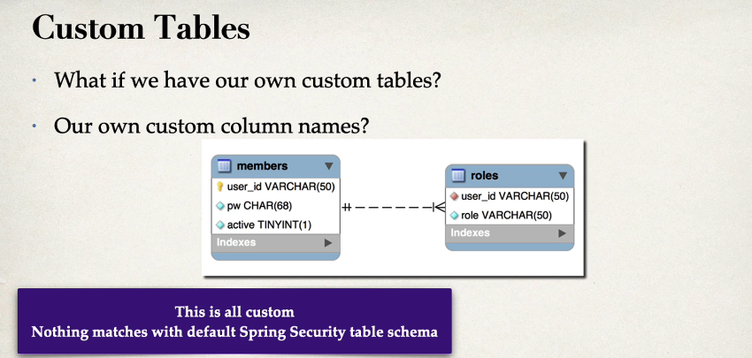

### Let's work on Spring Security to use Custom tables.

So far, we have used the default Spring Security Database Schema. And remember I said you to use the exact same table names 
and the exact same column names. That works okay, but you may have thought internally that this is a bit restrictive. 
Also, you may have thought, what if we have our own custom tables, like our own names?

Let's try with different tables, check the below image where we have **members** and **roles** table as our custom tables.


Steps to update the Spring to use customised schemas.
1. Tell Spring how to query your custom tables.
2. provide a query to find the user by username.
3. provide query to find authorities / roles by username.

Development process
1. Create our custom tables with SQL
   ```mysql-sql
   USE `employee_directory`;

   DROP TABLE IF EXISTS `roles`;
   DROP TABLE IF EXISTS `members`;

   --
   -- Table structure for table `members`
   --

   CREATE TABLE `members` (
   `user_id` varchar(50) NOT NULL,
   `pw` char(68) NOT NULL,
   `active` tinyint NOT NULL,
   PRIMARY KEY (`user_id`)
   ) ENGINE=InnoDB DEFAULT CHARSET=latin1;
   
   --
   -- Inserting data for table `members`
   --
   -- NOTE: The passwords are encrypted using BCrypt
   --
   -- A generation tool is avail at: https://www.luv2code.com/generate-bcrypt-password
   --
   -- Default passwords here are: fun123
   --
   
   INSERT INTO `members`
   VALUES
   ('john','{bcrypt}$2a$10$qeS0HEh7urweMojsnwNAR.vcXJeXR1UcMRZ2WcGQl9YeuspUdgF.q',1),
   ('mary','{bcrypt}$2a$10$qeS0HEh7urweMojsnwNAR.vcXJeXR1UcMRZ2WcGQl9YeuspUdgF.q',1),
   ('susan','{bcrypt}$2a$10$qeS0HEh7urweMojsnwNAR.vcXJeXR1UcMRZ2WcGQl9YeuspUdgF.q',1);
   
   
   --
   -- Table structure for table `authorities`
   --
   
   CREATE TABLE `roles` (
   `user_id` varchar(50) NOT NULL,
   `role` varchar(50) NOT NULL,
   UNIQUE KEY `authorities5_idx_1` (`user_id`,`role`),
   CONSTRAINT `authorities5_ibfk_1` FOREIGN KEY (`user_id`) REFERENCES `members` (`user_id`)
   ) ENGINE=InnoDB DEFAULT CHARSET=latin1;
   
   --
   -- Inserting data for table `roles`
   --
   
   INSERT INTO `roles`
   VALUES
   ('john','ROLE_EMPLOYEE'),
   ('mary','ROLE_EMPLOYEE'),
   ('mary','ROLE_MANAGER'),
   ('susan','ROLE_EMPLOYEE'),
   ('susan','ROLE_MANAGER'),
   ('susan','ROLE_ADMIN');

   ```
2. Update Spring Security Configuration
   - provide a query to find the user by username.
   - provide query to find authorities / roles by username.